# Fundamentals of Remote Sensing

网络研讨会可随时查看。它们提供了有关遥感基础知识的基本信息，并且通常是其他ARSET培训的先决条件。

学习目标： 

参加者将熟悉卫星轨道，类型，分辨率，传感器和处理水平。除了对遥感的概念理解外，与会者还将能够阐明其优点和缺点。参与者还将对NASA卫星，传感器，数据，工具，门户网站以及环境监控和管理中的应用有基本的了解。

听众： 
这些培训适用于以前没有遥感经验的专业人员。

注册信息： 
该网络研讨会系列是免费的，但是您必须在观看记录之前为每个会话进行注册。 

Session 1：遥感基础

遥感的一般概述及其在灾难，健康与空气质量，土地，水资源和野火管理中的应用。

[Take this Online Training >>](https://attendee.gotowebinar.com/register/5274323579896872193)

Session 2A：用于土地管理和野火应用的卫星，传感器，数据和工具

用于土地管理和野火的遥感的特定卫星，传感器和资源。其中包括：土地覆盖图和产品，火灾探测产品，探测土地覆盖变化以及NDVI和EVI。[查看»](https://attendee.gotowebinar.com/register/6820484318131013122)

- [演示幻灯片](https://arset.gsfc.nasa.gov/sites/default/files/land/webinars/Fundamentals/Fundamentals_RS_Session2_Land_Final.pdf)

Session 2B：水资源管理的卫星，传感器和地球系统模型

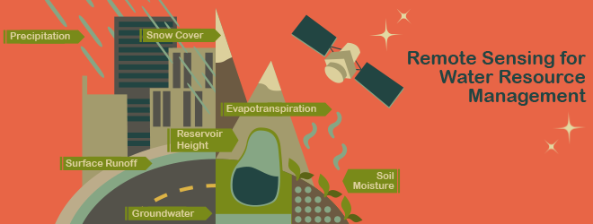

水资源管理，有关卫星和传感器的概述，有关地球系统模型的概述以及水资源管理的数据和工具。[查看»](http://attendee.gotowebinar.com/register/323711996899257090)

- [演示幻灯片（英语）»](https://arset.gsfc.nasa.gov/sites/default/files/water/Water-Resources/Fund.of%20RS%20-%20Session2B-Water%20Resources.pdf)

Session 2C：水生遥感基础知识

有关卫星和传感器的概述，以及用于水生环境管理的数据和工具。 [查看»](https://attendee.gotowebinar.com/register/8572559390997629442)

- [演示幻灯片](https://arset.gsfc.nasa.gov/sites/default/files/users/fundamentals/fundamentals-aquatic-web.pdf)
- [演讲者脚本](https://arset.gsfc.nasa.gov/sites/default/files/users/fundamentals/Fundamentals_script.pdf)

以上涉及的应用领域： [空气质量](https://arset.gsfc.nasa.gov/airquality),[所有](https://arset.gsfc.nasa.gov/all),[灾难](https://arset.gsfc.nasa.gov/disasters),[土地](https://arset.gsfc.nasa.gov/land),[水](https://arset.gsfc.nasa.gov/water),[野火](https://arset.gsfc.nasa.gov/wildfires)

可用语言： [英语](https://arset.gsfc.nasa.gov/available-languages/english)

关键字：[保护](https://arset.gsfc.nasa.gov/topics/conservation),[火与烟](https://arset.gsfc.nasa.gov/topics/fires-and-smoke),[洪水](https://arset.gsfc.nasa.gov/topics/flooding),[土地覆盖和土地利用变化（LCLUC）](https://arset.gsfc.nasa.gov/topics/land-cover-and-land-use-change-lcluc),[卫星影像](https://arset.gsfc.nasa.gov/topics/satellite-imagery),[工具类](https://arset.gsfc.nasa.gov/topics/tools),[植被指数](https://arset.gsfc.nasa.gov/topics/vegetation-indices),[水质](https://arset.gsfc.nasa.gov/topics/water-quality)

更多内容查看原网站：https://arset.gsfc.nasa.gov/webinars/fundamentals-remote-sensing

本节需要注册才能学习，按照上述链接注册即可，很快可进入学习。

目标是了解卫星遥感的基础知识，包括卫星轨道，类型，分辨率，传感器和处理级别。课程还将涵盖NASA的地球观测卫星，传感器，数据，工具，门户网站及其在环境监控和管理中的应用。如果没有一次完成课程，则可能无法保存进度。所以要腾出时间，一次性完成。

遥感从远处获取有关物体的信息。照片是遥感的一种非常常见的形式。有多种收集数据的方式，并且根据应用使用不同的传感器。需要什么信息？多少细节？多久需要一次数据？

卫星携带用于测量来自地球大气系统的电磁辐射的仪器或传感器。

地球从太阳接收的能量称为电磁辐射。 

如图所示，该辐射被地球的大气层或表面反射，吸收和发射。 

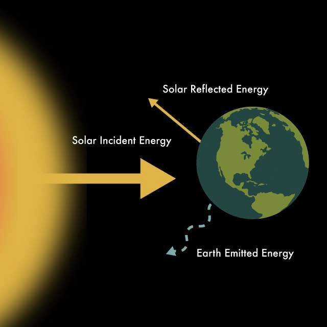

卫星传感器经过校准，可以检测沿电磁频谱的各种波长，通常包括可见光。波长和频率的关系可以参考：[电磁波的波长、频率和电磁波谱](https://zhuanlan.zhihu.com/p/76652324)。简述下，波的基本公式：$v=\lambda * f$，电磁波的波速是一个非常有名的物理学常数：光速，各波段光谱波长和频率的关系可见下图

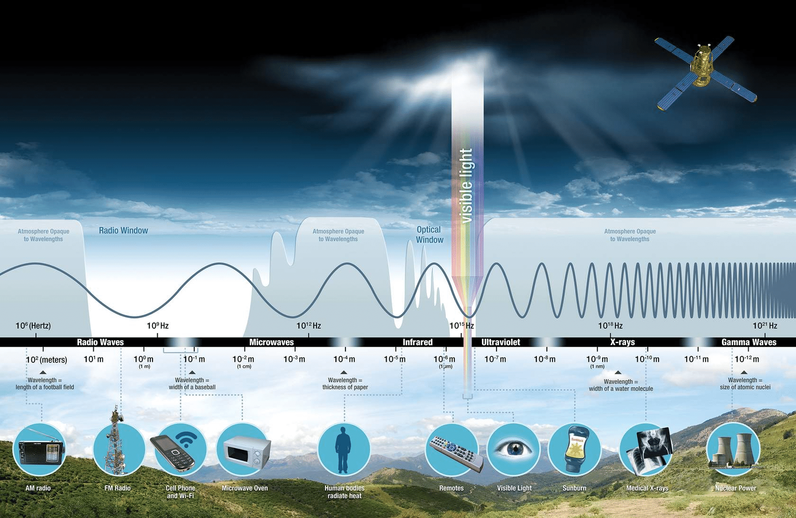

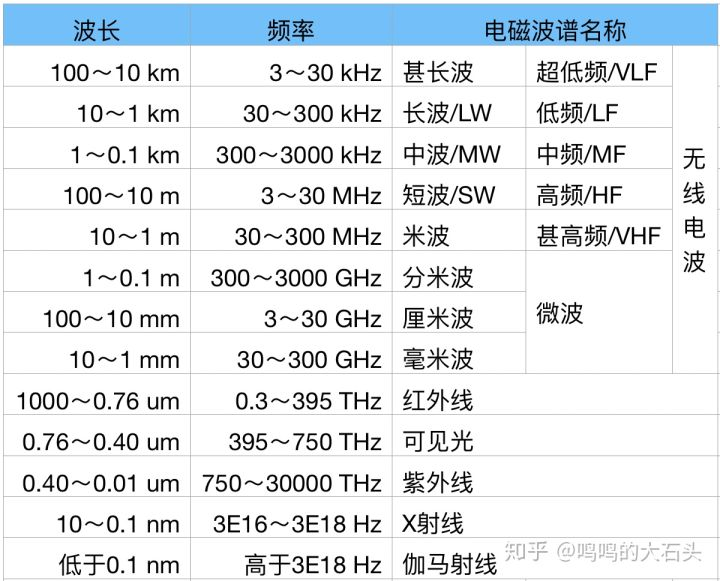

不同的材料会反射和吸收不同波长的电磁辐射。因此，可以查看传感器检测到的反射波长，确定反射出的材料的类型。这被称为光谱特征。在下图中，比较百分比反射率与地球表面不同成分的反射波长之间的关系。 

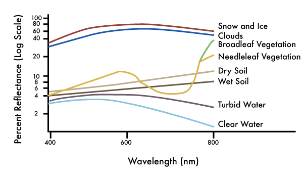

- 植被：健康的植被吸收蓝色和红色波长，但反射绿色和红外线。 由于看不到红外线，因此我们将健康的植被视为绿色。
- 水：与较短的可见波长（蓝色）相比，更长的可见波长（绿色和红色）和近红外辐射被水吸收的更多，因此水通常看起来是蓝色或蓝绿色的。如果水的上层有沉淀物，则水会变亮。
- 大气层：通过使用电磁辐射光谱与大气相互作用的方式，卫星能够提供有关大气成分的信息。这包括可能导致空气污染，云和降水的微粒的存在。

整个过程如下图所示：

太阳发出辐射，有些辐射与大气相互作用，当卫星检测到这些辐射时，可以评估可能引起大气干扰的原因。

有些辐射穿过大气层并击中目标表面，例如森林，水域或建筑区域。不同的物质会在不同的波长下反射，发射和吸收。

- 植被将某些波长的太阳辐射反射回卫星的传感器，反射波长的变化可能导致任何可能发生的土地覆被变化方面的信息
- 水发射的辐射主要时蓝绿色光谱，这些反射波长的变化可以提供有关水位变化，水中是否有藻类生长等方面的数据
- 草，农作物和裸露的土壤将不同类型的辐射反射到卫星的传感器
- 路面和建筑物反射的光波长均不同于天然物质，这样，卫星就可以手机某个地区的发展情况的数据

卫星传感器可以检测反射的辐射。

卫星携带传感器或仪器。传感器的名称通常是首字母缩写词，可以包括卫星的名称。

比如NASA的Aqua卫星，上面有很多传感器：

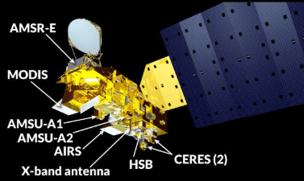

不同的卫星有不同的特性，比如：

- 轨道：低地球轨道或对地静止轨道
    - 对地静止卫星(Geostationary orbit)：卫星通常在赤道上方约36,000公里，旋转周期与地球相同，每天多次观察，空间覆盖范围有限-观测值始终在同一区域，比如：天气或通讯卫星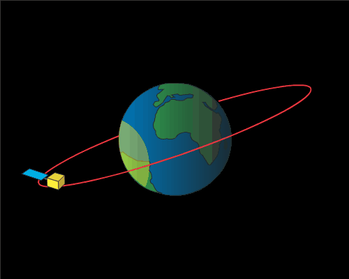 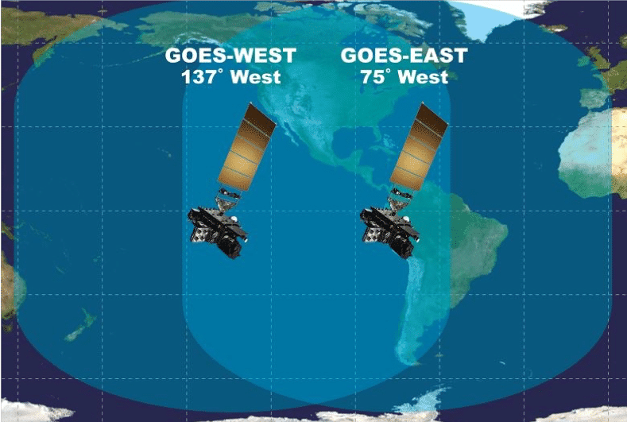
    - 低地球轨道(Low Earth Orbit (LEO)):相对于地球在160-2,000 km处移动的圆形轨道-可以是极地轨的也可以是非极地的，不太频繁的测量，大（全球）空间覆盖，比如（极地轨）：Landsat或Terra 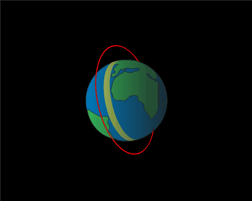
        - 极地轨道:提供全球覆盖，测量频率可以从每天1次测量到每月1次变化。比如极地卫星：2005年2月15日，NASA Terra轨道轨迹样本。 
        - 非极轨道:不提供全球覆盖，测量频率可以每隔几个小时变化到几个星期。
- 能量：被动与主动，收集遥感数据的方式有两种：被动和主动遥感。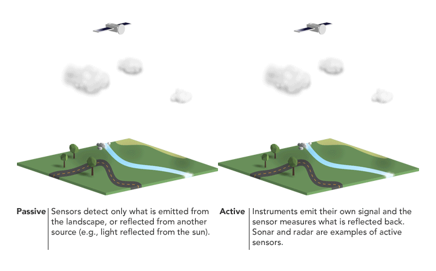
    - 被动遥感：取决于重力的变化或地球反射和发射的辐射。例如，Grace卫星可测量地球重力的变化。Landsat，Terra＆Aqua上的MODIS传感器以及Aqua的AIRS传感器都依赖于地球反射和发射的辐射的变化来获取数据。范例：Landsat，MODIS（Terra / Aqua），AIRS（Aqua），GRACE 
    - 主动 遥感：一种仪器发送辐射束并测量其返回。例如： Radar(雷达), LIDAR(激光雷达)
- 太阳和地面光谱：可见光，UV，IR，微波...
- 测量技术：扫描；非扫描；成像仪；发声器
- 分辨率类型和质量：Spatial, Temporal, Spectral, Radiometric。分辨率取决于卫星轨道配置和传感器设计。不同的传感器具有不同的分辨率。 
    - 空间分辨率：空间分辨率是卫星图像中像素所覆盖的地理区域。通常，空间分辨率越高，单个像素覆盖的区域越少。 下图显示了不同空间分辨率下的同一图像：（从左到右）1 m，10 m和30 m。图片来源：csc.noaa.gov 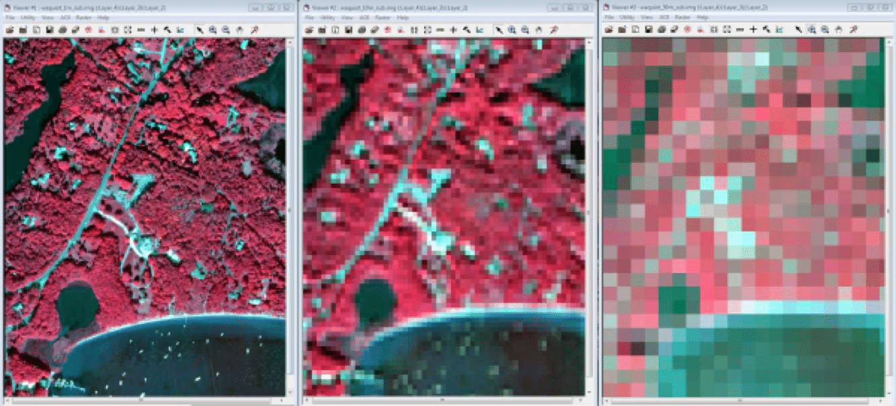
    - 时间分辨率:时间分辨率是卫星的重访时间。这是卫星第二次以相同视角对相同区域成像的时间。这取决于卫星和传感器的功能，卫星路径的重叠以及卫星的纬度。一些卫星具有更高的时间分辨率，因为：
        - 他们能够操控他们的传感器
        - 在高纬度地区，它们的重叠越来越多
        
      如图显示了来自NASA的土壤水分主/被动卫星的雷达图像路径，高纬度区域比赤道区域的成像频率更高，这是因为随着轨道路径在两极附近越来越靠近，重叠程度不断增加。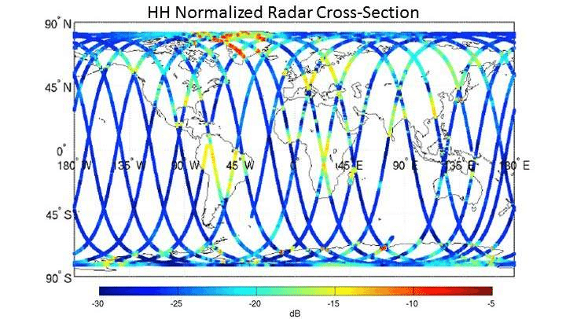
    - 光谱分辨率：光谱分辨率描述了传感器检测精细波长间隔的能力。仪器沿着电磁光谱检测不同的波长范围，称为波段。波长范围越窄，光谱分辨率越好。更多，更精细的光谱通道可实现对地球表面不同部分的遥感。例子：
        - Landsat（7-11波段）
        - MODIS（36波段）
        - AVIRIS（256波段）
    - 辐射分辨率：辐射分辨率描述了传感器区分能量（或辐射）差异的能力。辐射分辨率越好，传感器对能量的微小差异越敏感。它由多种因素决定，其中最主要的是饱和辐射率-检测器可以测量的“最亮”的东西-以及如何量化辐射率测量值（转换为数字位流）。
        - 12位传感器，共4,096级：MODIS，MISR
        - 10位传感器，1,024级：AVHRR
        - 8位传感器，256级：Landsat TM
        - 6位传感器，64级：Landsat MSS
    
      图像显示同一场景在不同级别上的外观。从左到右：2位，4位和8位，可以看到随着分辨率越来越高，更多细节能被看到。图片和文字来源：美国宇航局地球观测站 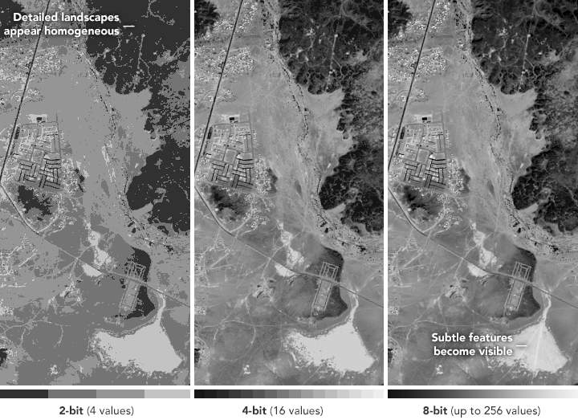
- 应用：天气，海洋颜色，土地制图，空气质量，辐射预算等。

卫星数据处理级别是我们在使用数据时需要留意的一个概念。卫星数据有不同处理阶段（或级别）的可用，从卫星收集的原始数据到可视化信息的成品。NASA从卫星获取数据并进行处理，以使其更广泛地用于各种应用。NASA使用一组术语来指代其执行的处理级别： 

- 级别0和1是time-referenced（时间基准的）原始仪器数据，这是最难使用的。 
- 级别2是已通过计算机算法（称为 retrieval）将级别1数据转换为地球物理量。该数据是geo-referenced and calibrated（地理参考和校准的）。 
- 3级 是2级数据已映射到统一的时空网格上并进行了质量控制。 
- 级别4 是已与模型或其他仪器数据组合在一起的级别3数据。

3＆4级数据是最容易使用的。

比如SMAP数据各级情况：

- 1级产品（L1C）包含按开尔文表示并由SMAP辐射计获取的校准，按地理位置，按时间顺序排列的亮度温度。该产品是另一种1级亮度温度产品的网格版本。这些示例中的图像来自2017年8月30日哈维飓风发生后的美国德克萨斯州。 
- 该2级土壤水分产品可以测量土壤顶部5 cm处的土壤水分，以体积表示，单位为cm3 / cm3。这是使用SMAP的无源微波辐射计亮度温度观测值检索得到的。将此产品重新采样到固定在地球上的整体圆柱形36 km等面积可扩展地球网格，版本2.0（EASE-Grid 2.0） 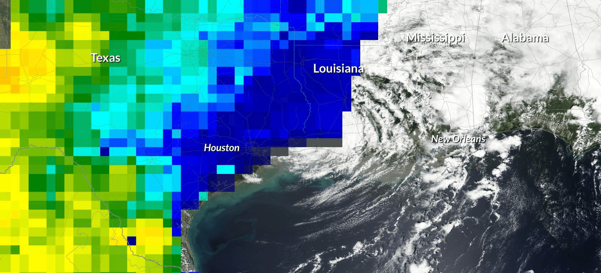
- 该3级土壤湿度产品可提供SMAP被动微波辐射计得出的每日土壤湿度的综合估算值。将SMAP L波段土壤水分数据重新采样到EASE-Grid 2.0。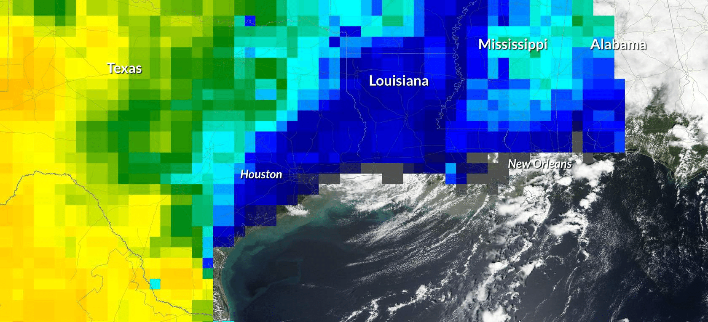
- 土地表面模型用于估计根区水平（1米以下）的土壤湿度。通过将土壤水分吸收到土地表面模型中获得估算值。然后使用EASE-Grid 2.0投影对其进行网格化。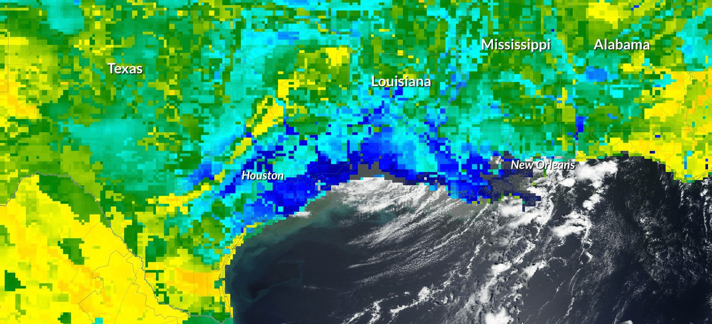

了解了可用的数据级别以及如何访问它们，就可以将其应用于实际问题中。以下示例显示了飓风登陆之前SMAP的土壤湿度数据，飓风期间来自GPM的降水数据以及合成孔径雷达（SAR）数据，以制作洪水代理地图（flood proxy map）来估算飓风之后的洪水。 

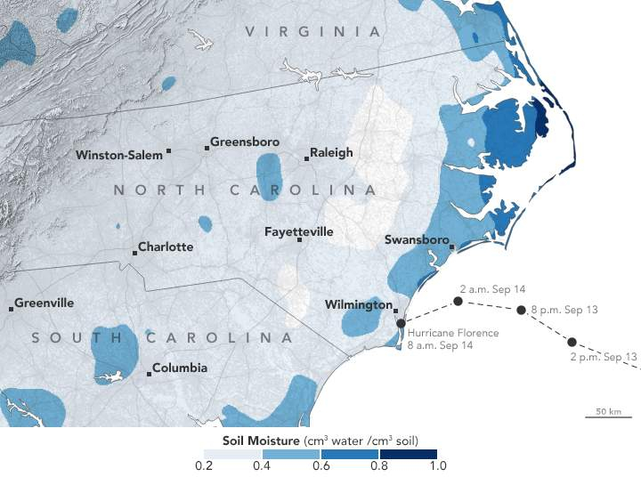 飓风登陆前，土壤湿度

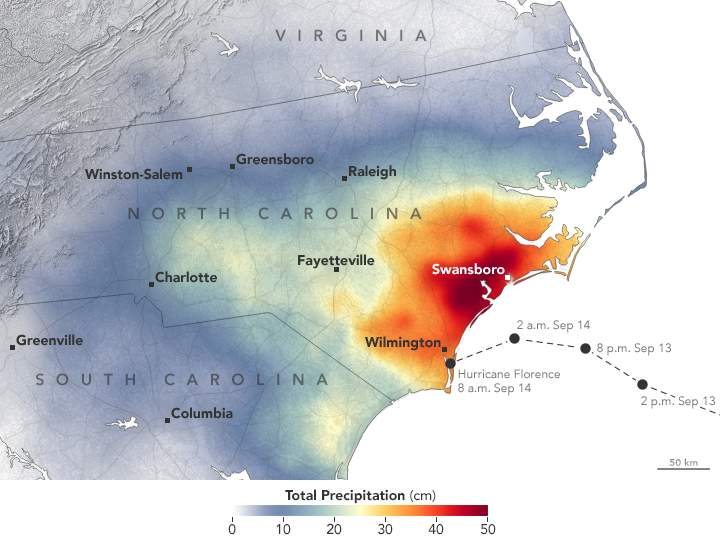 GPM IMERG 测量的几日累计降雨估计

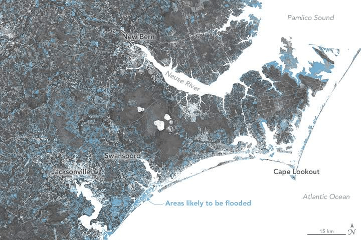 使用sentinel-1卫星数据生成的洪水代理地图，突出现实了可能被洪水淹没的区域

NASA卫星图像，产品和模型可以不同的方式用于各种应用程序。比如洪水地图：2017年，哈维飓风的降雨量下降了创纪录水平-特别是在德克萨斯州休斯顿附近的地区。卫星数据可以帮助检测易发洪水区域和监测洪水。 

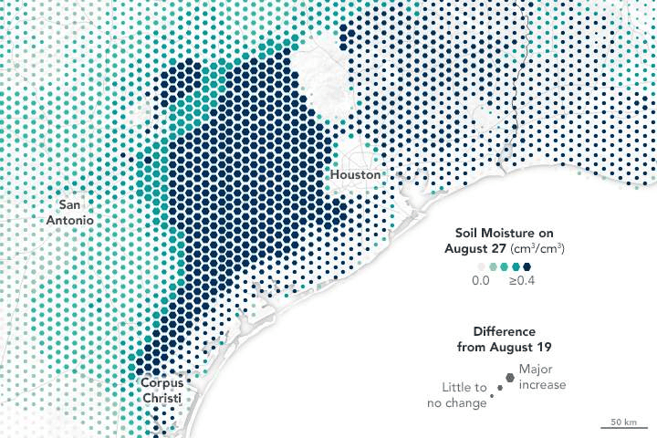

上方的地图显示了8月27日德克萨斯州南部的土壤状况，与8月19日的观测值相比，地图上的颜色代表了土壤表层水分的含量，最暗的颜色代表了饱和或接近饱和的土壤。每个六边形的大小代表哈维（Harvey）活动中间的几天里，土壤湿度的变化程度。请注意，休斯顿本身的数据很少，因为该区域的大部分区域都被不透水的表面（道路，建筑物和基础设施）覆盖。图片来源：[NASA地球观测站](https://earthobservatory.nasa.gov/NaturalHazards/view.php?id=90864)

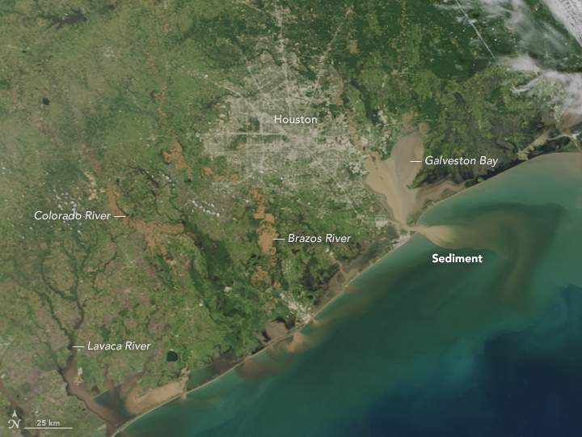

2017年8月31日，美国宇航局Terra卫星上的中分辨率成像光谱仪（MODIS）捕获了德克萨斯州海岸和休斯顿市区的这张图像。请注意棕色的河流和海湾，那里充满了飓风哈维带来的洪水。沿着海岸，内陆的泥泞，充满泥沙的水流涌入了墨西哥湾，而墨西哥湾也被无情的风暴搅动了。图片来源：[NASA EarthObservatory](https://earthobservatory.nasa.gov/images/90866/texas-waters-run-brown-after-harvey)

ARSET培训参与者使用的一种工具是世界资源研究所的全球森林观察（GFW）。GFW使用NASA Landsat和MODIS数据来绘制全球森林的损失和收益图。 

再比如干旱监测：科学家使用GRACE卫星数据来绘制地下水和土壤湿度的地图。此数据用于得出浅层地下水干旱指标图，如下所示。

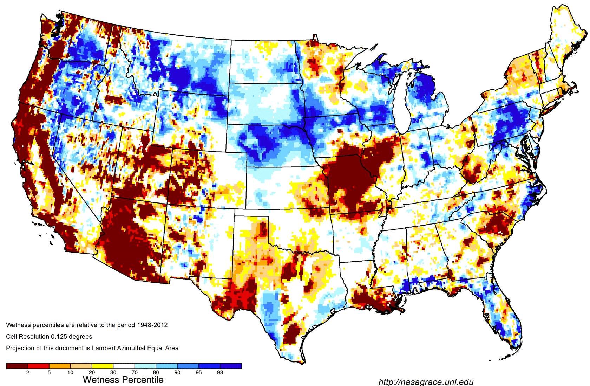

还有传染病风险：由蚊子引起的 Rift Valley 发烧 在大范围降雨，大量降雨和高于平均水平的降雨后爆发。洪水可以提供理想的蚊子栖息地，也会使植被绿化。基于MODIS的归一化植被指数 数据可以帮助科学家确定条件适合爆发的地区。

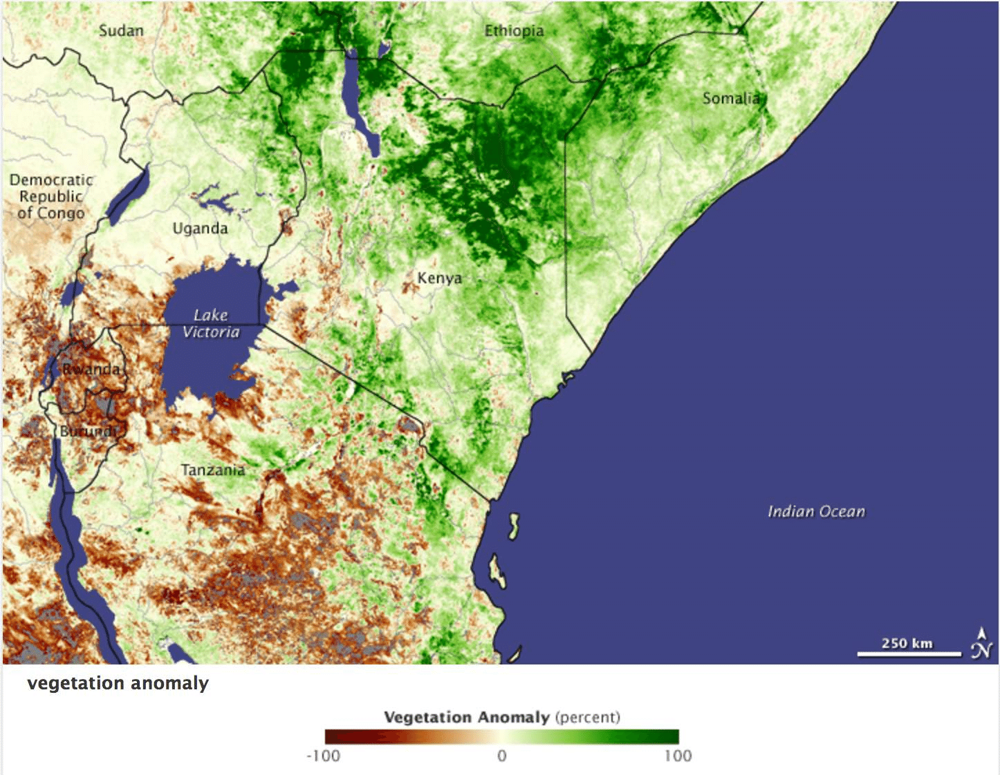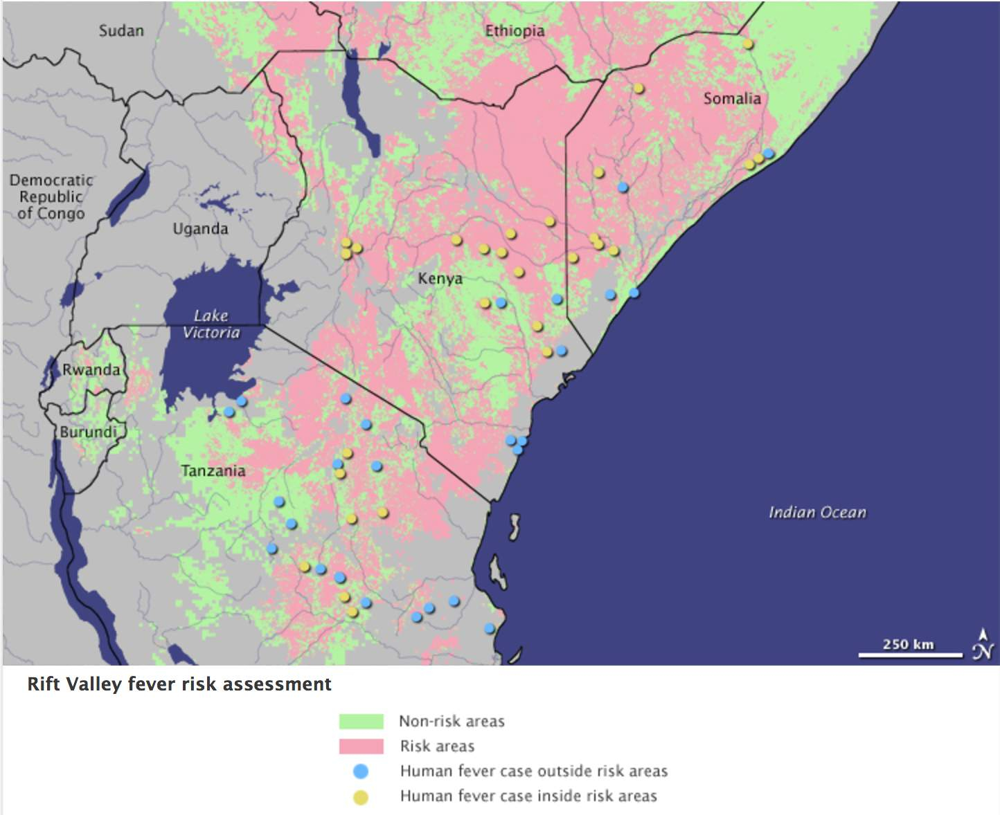

遥感的利弊：

- 优点：
    1. 在没有地面测量的地方提供信息
    2. 提供全球一致的观测
    3. 可以为放置地面传感器的位置提供指导
    4. 提供对我们星球的持续监控
- 缺点：
    1. 同时获得高光谱，空间，时间和辐射分辨率非常困难：空间分辨率低的卫星往往具有较高的时间分辨率，空间分辨率高的卫星往往具有较低的时间分辨率
    2. 各种格式的大量数据可能导致更多的时间处理
    3. 应用卫星数据可能需要其他处理，可视化和其他工具

以上就是一些关于遥感的基本概念。