# Satellites, Sensors, and Earth Systems Models for Water Resources Management

结合自己日常所需，暂时跳过session 2A，重点来看看session 2B.

首先，还是先进行注册，然后就可以看到视频了，下载幻灯片可以更好地查看内容。

首先，是水资源管理的基本概念。

最基本的就是水循环了：

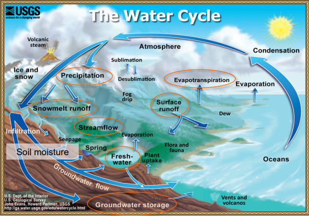

注意其中的变量。对于一个流域，降水是fresh water的主源，蒸散发是fresh water向大气的损失，径流是另一种流出流域的形式。地表可用fresh water(W)平衡公式：

W=(precipitation + runoff in the region)-(evaporation/evaportranspiration + runoff outflow + infiltration)

在水资源不同的应用场景下需要的fresh water的成分也不完全一样，比如：

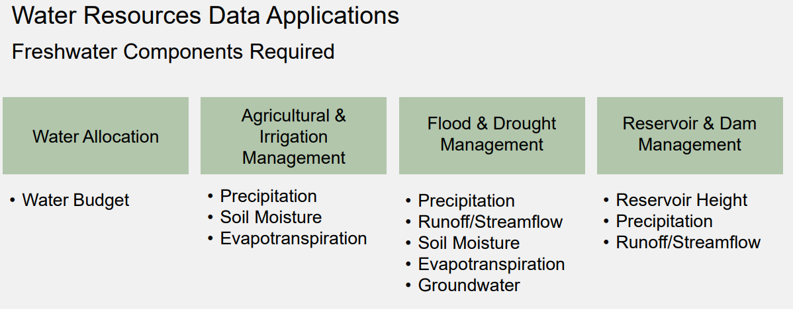

对于fresh water的这些成分，遗憾的是并不是所有都可以很容易地直接观测到，比如：

- 蒸散发
- 径流
- water vapor transport

所以NASA 会结合可以通过卫星观测的指标和ESM（地球系统模型）一起来获取fresh water的各个组成，提供小时，日，季节和多年等不同时间尺度的信息：

- Rain
- Soil Moisture
- Snow and Ice
- Temperature
- Humidty
- Winds
- Surface Radiation
- Ground Water
- Vegetation Index
- Evapotranspiration
- Runoff

上述成分中，黑色字体表示来自卫星和模型，绿色表示来自卫星观测，红色表示来自同化卫星观测的大气-陆地模型。

## Satellites, Sensors for Water Resources Management

接下来是了解用于水资源观测的卫星到底有哪些，这里是NASA的卫星：

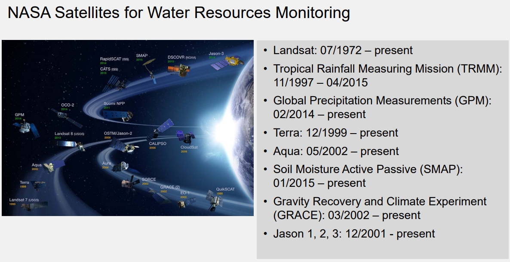

这些卫星被单独或联合使用来获取上面提到的各组成的数据。每个卫星都携带了一个或多个包含特定波段的传感器来观测地球物理量，具体到水资源的变量，可以参考下图：

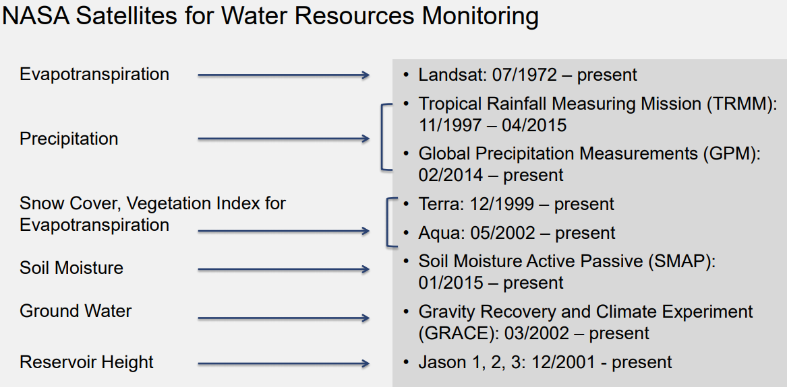

LandSat 是时间最长的卫星观测任务，最早从1972年开始就有第一代了，具体可参考下图：

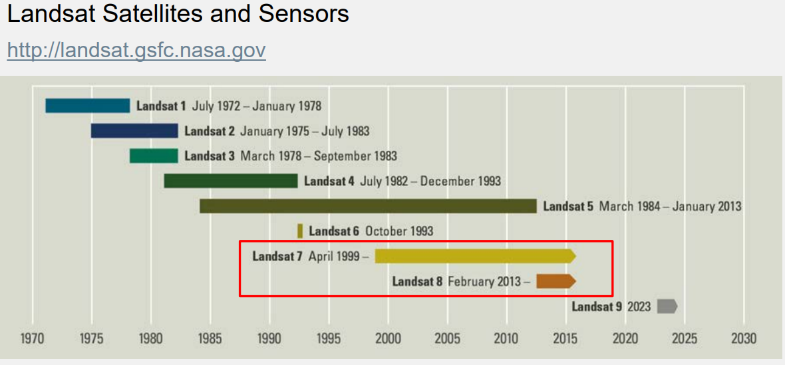

LandSat7（极地轨）的传感器称为Enhanced Thematic Mapper(ETM+)，有8个波段（blue-green,green,red,reflected & thermal IR, panchromatic），空间覆盖是全球的，swath是185km，空间分辨率有：15m（band 8）,30m(bands 1-5, 7),60m(band 6)，时间覆盖是1999年4月15至今，重仿时间是16天。

Landsat8（极地轨）的传感器叫Operational Land Imager（OLI），有9个波段（blue-green,green,red,near IR, shortwave and thermal IR），空间覆盖全球，swath 185km，空间分辨率 15m(band 8), 30m(bands 1-7, 9)，时间范围是2013年2月11至今，重访期16天。

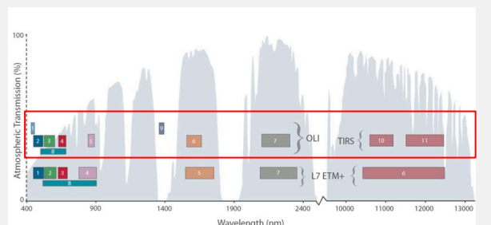

上图中红框左侧是OLI各波段，红框下面是ETM+各个波段。

Landsat在水资源中可以用于获取**地表温度**和**land cover**(land cover有益于计算蒸散发)。

可以在[USGS Earth Explorer](https://earthexplorer.usgs.gov/)， [USGS Global Visualization Viewer](https://glovis.usgs.gov/), [USGS Landsatlook Viewer](https://landsatlook.usgs.gov/viewer.html)等获取Landsat Images和Spectral Reflectance 数据。

TRMM 卫星及传感器是NASA和JAXA的联合任务，非极地低倾角轨，高度约350km，2001年8月23日后升至403km，空间覆盖是一天16个轨的南北纬35度之间热带区，重访期是11-12小时，每日观测时间在变，传感器是TMI, PR, VIRS, LIS, CERES。

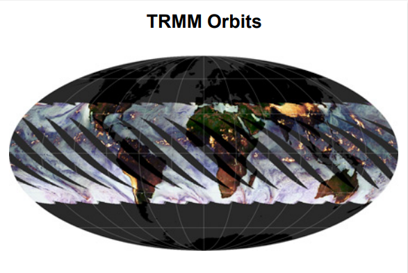

TMI全称 TRMM Microwave Imager，空间覆盖南北纬35度，swath 760km，2001年8月23日后 878km，垂直分辨率 地表-4km处0.5km，1.0km from 4-6km，2.0 km from 6-10 km, 4.0 km from 10-18 km，时间覆盖1998年11月27日至2015年4月15日，每天16轨，频道频率 10.7,19.4,21.3,37,85.5 GHz。

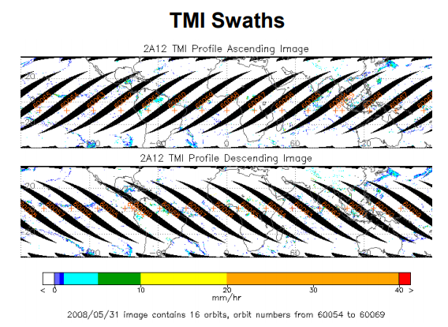

PR全称Precipitation Radar，swath 215km（变轨后247），空间分辨率4.3km（5km），垂直分辨率250m from 0-20km，时间范围是 1998年11月27日至2014年10月7日，一天16轨。

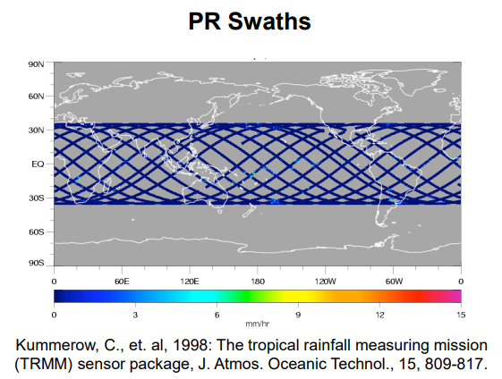

水资源中TRMM主要用于观测rain rate，使用的数据有TMI Brightness Temperatures， PR Reflectivity， VIsible and Infrared Scanner（VIRS） Brightness Temperature and Reflectance。如图2013年9月16日观测的飓风降雨：

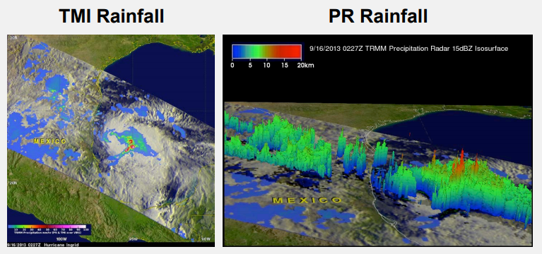

PR图展示了3D结构降雨。

另一个降雨观测任务就是GPM，也是NASA和JAXA的联合任务，GPM的核心卫星也是非极地低倾角轨道，高度407km，空间覆盖一天16轨全球热带区，南北纬65度之间，所有卫星群一起，GPM的重访期在2-4小时，传感器是GMI和DPR。下图是GPM卫星群。

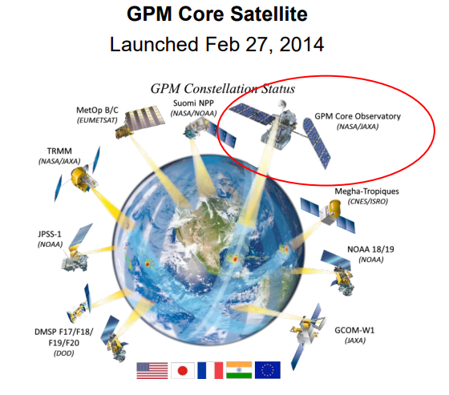

GMI 即 GPM Microwave Imager，channel频率：10.6-183GHz之间多个频道，空间覆盖南北纬65度，swath 885km，空间分辨率4.4-32km，垂直分辨率：地表-4km处0.5km，1.0km from 4-6km，2.0 km from 6-10 km, 4.0 km from 10-18 km，时间覆盖2014年2月至今，分辨率2-4小时。

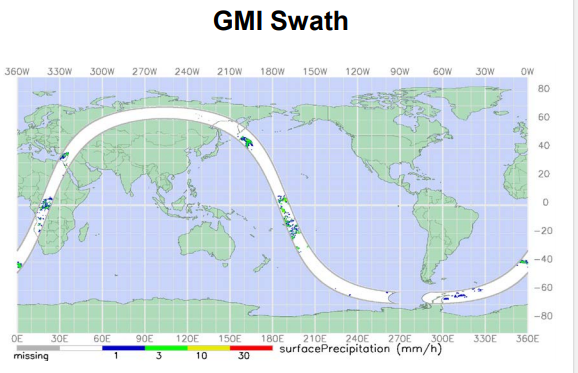

DPR即Dual Precipitation Radar，频率13.6，35.5GHz，swath 120km（Ka），245km（Ku），空间分辨率5.2km，垂直分辨率250m from 0-20km，时间覆盖2014年2月27日至今，分辨率2-4小时。

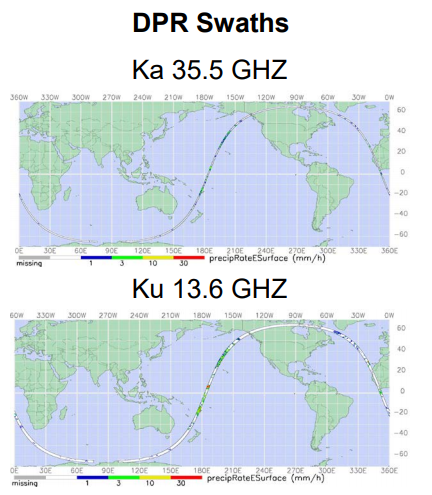

GPM是TRMM后的对rain rate观测的任务，也可以估计snow rates，主要使用的数据是GMI brightness temperatures和DPR Reflectivities。

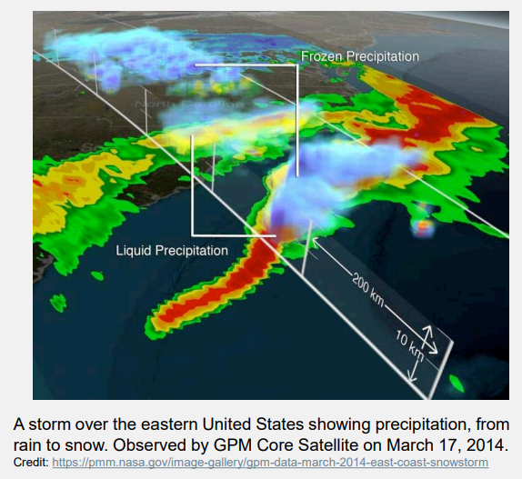

GPM和TRMM相比，观测范围更广了，因为星座群的互相率定，观测也提升了，GMI比TMI空间分辨率更高，light rain和snow detection更好了（TRMM检测不了小于0.5mm/h的降雨），DPR有更好的识别liquid，ice和固液混合态降水粒子的能力。

TRMM和GPM等卫星群的协作，多卫星算法可以获取更广覆盖，更高分辨率的数据，TRMM Multi-satellite Precipitation Analysis(TMPA)广泛应用于很多应用中，TMPA会被扩展到Integrated Multi-satellite Retrievals for GPM(IMERG)。

TMPA结合了PR和TMI rain rates，和其他传感器协作（TMI,SSM/II,AMSR,AMSU-B,MHS,IR radiometers），还用VIRS和同步轨道卫星以及NOAA低轨卫星互相率定，最后在月尺度上还用地面观测率定。其中，SSM/I and SSMIS表示 Special Sensor Microwave Imager Special Sensor Microwave Imager/Sounder – sensor on Defense Meteorology Satellite Project (DMSP) ; AMSR: Advanced Microwave Scanning Radiometer – sensor on NASA Aqua satellite; AMSU: Advanced Microwave Sounding Unit –sensor on NOAA operational satellite

IMERG 和TMPA类似，GPM星座卫星包括：GCOM-W, DMSP, Megha-Tropiques， MetOp-B， NOAA-N',NPP, NPOESS，最后月尺度降雨也通过地面观测率定。

数据可以在这里获取：https://gpm.nasa.gov/

接下来看看Terra和Aqua。

这两个卫星都是极地轨卫星，都是全球覆盖，每天1-2次观测。

Terra 上午10点半过赤道，从1999年12月18至今，传感器包括 ASTER,CERES,MISR,MODIS,MOPITT;
Aqua 下午1点半过赤道，从2002年5月4至今，传感器有 AIRS, AMSU, CERES, MODIS, AMSR-E

重点关注MODIS，MODIS全称 MODerate Resolution Imaging Spectroradiometer，在Terra和Aqua两个卫星上，设计用于land，atmosphere，ocean， 和cryosphere观测，覆盖全球，swath 2330km，空间分辨率有：250m(bands 1-2), 500m(bands 3-7), 1km(bands 8-16)，共36个波段（red, blue, IR, NIR, MIR），时间分辨率每天2次，范围从2000年至今。

MODIS数据在水资源方面主要用于观测 Snow Cover和NDVI（Normalized Difference Vegetation Index），NDVI可用于蒸散发估计。有两个snow cover产品是基于MODIS的 Spectral Reflectance的：

- 标准MODIS产品：可以在[美国国家冰雪数据中心](http://nsidc.org/data/modis/data_summaries#snow)和[NASA Reverb ECHO](http://reverb.echo.nasa.gov/)获取
    - Fractional Snow Cover
- MODIS Snow Covered Area and Grain size (MODSCAG) Product：可以在[JPL 雪数据中心](http://snow.jpl.nasa.gov/portal/)获取
    - Fractional Snow Cover
    - Grain Size
    - Snow Water Equivalence

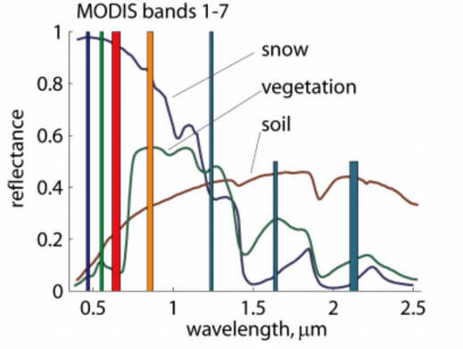

MODIS NDVI 基于红和近红外波长之间的关系计算：

- 叶绿素会大量吸收可见红光
- 植物结构会大量反射近红外
$$NDVI=\frac{NIR - Red}{NIR + Red}$$
NDVI值范围为-1.0到1.0：

- 负值到0值表示没有绿叶
- 值越接近1表明绿叶密度越高

MODIS NDVI数据可以在[LPDAAC（Land Process Distributed Archive Center）](https://lpdaac.usgs.gov/dataset_discovery/modis/modis_products_table)获取

下面看看SMAP（Soil Moisture Active Passive）。

SMAP 是极地轨卫星，高度685km，覆盖全球， 时间范围从2015年4月至今，传感器有：Microwave Radiometer 和 Microwave Radar（目前不可用了）。

Radiometer 频率1.41GHz，swath 1000km，分辨率40km，Polarization：H,V,3rd和4th Stokes。

Radar 设计作为SAR（Synthetic Aperture Radar）工作，频率1.26GHz，Polarization：VV,HH,HV，分辨率3km，2015年7月7日停止运行了。

时间分辨率3天。测量的是土壤5cm的moisture。

在水资源领域，SMAP 数据主要观测的成分是：

- Surface Soil Moisture
- Freeze/Thaw State
- Root Zone Soil Moisture

用的SMAP数据主要是Radiometer Brightness Temperatures。

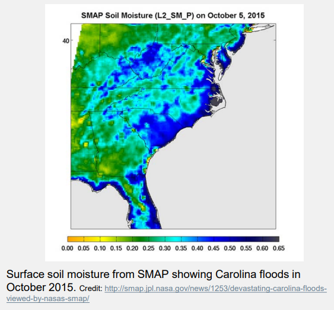

SMAP数据可以[National Snow and Ice Data Center](http://nsidc.org/data/search/#keywords=soil+moisture/)获取。

还有一个很有名的卫星GRACE，它是一个极地太阳同步轨卫星，是两个孪生卫星组成的系统，空间覆盖全球，分辨率300-400km，时间覆盖2002年5月17日至今，分辨率每天250个gravity profiles。

GRACE有多个传感器，包括MTA(Center of Mass Trim Assembly), GPS(Black-Jack GPS Receiver and Instrument Processing Unit), ACC（SuperSTAR Accelorometers）, SCA（Star Camera Assembly）, USO(Ultra Stable Oscillator), KBR(K-band Ranging System) ，主要的是KBR，通过测量两颗卫星之间的距离变化测量重力的波动。

GRACE在水资源领域主要是测量Ground Water，从GRACE Terrestrial Water Storage中获取：
$$P-ET-Q=\triangle {TWS}$$
$$\triangle {TWS} = \triangle GW + \triangle SM+ \triangle SEW + \triangle SW$$
$$\triangle {GW} = \triangle TWS - \triangle SM - \triangle SEW -\triangle SW$$
其中，P代表降水，ET是蒸散发，Q是径流，$\triangle TWS$是从GRACE获取的Terrestrial Water Storage 变化，$\triangle GW$ 是地下水storage变化（未知项），$\triangle SM$ 是soil moisture变化，$\triangle SWE$ 是 snow water equivalent 变化，$\triangle SW$是surface water storage变化，$\triangle SWE, \triangle SM, \triangle SW$ 都是从GLDAS（Global Land Data Assimilation System）模型中获取。

所以根据GRACE,GLDAS 和这些平衡公式，就可以计算出地下水storage的变化了。

获取GRACE数据可以从这里：

- Level-0 到 Level-2：
    - ftp://podaac.jpl.nasa.gov/allData/grace/
    - http://www.csr.utexas.edu/grace/
    - http://isdc.gfz-potsdam.de/
- Level 3:
    - http://grace.jpl.nasa.gov/data/
    - http://icgem.gfz-potsdam.de/ICGEM/ICGEM.html
    - http://geoid.colorado.edu/grace/
- GRACE Interactive Data Analysis and Download Portal:
    - http://geoid.colorado.edu/grace/
    
最后看看Jason 1，2，3卫星。

它们都是非极地轨，空间覆盖南北纬66度，覆盖全球95%海洋，重访期是10小时，Jason-1从2001年12月至2013年7月，Jason 2 从2008年6月至今，Jason 3从2016年1月至今，传感器包括：Poseidon Alimeter和Advanced Microwave Radiometer（AMR）and DORIS，它们是NASA, NOAA, CNES, 和 EUMETSAT 的 Joint Missions。

Poseidon Alimeter 可以估计海洋表面相对高度。

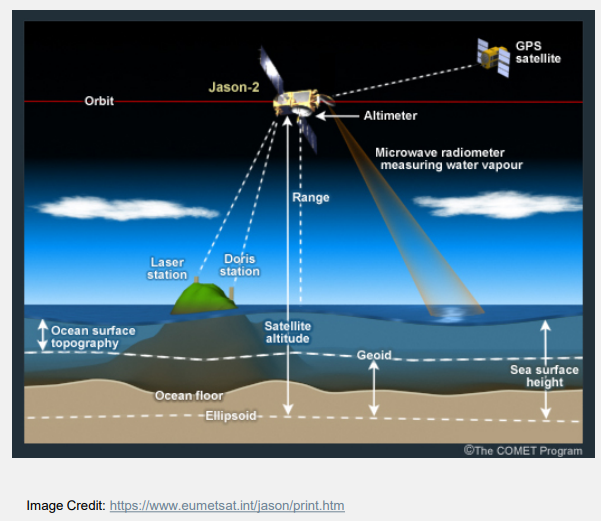

一个 传输频率是 5.3 GHz (C-band), 13.575 GHz (Ku-band) 的 Radar ，空间分辨率 11.2km * 5.1km，也可以用于确定内陆的水库的高度。

所以在水资源领域，Jason主要用于内陆lake高度。

现在还只能观测世界上最大的水体的一部分，还需要权衡时间和空间分辨率。

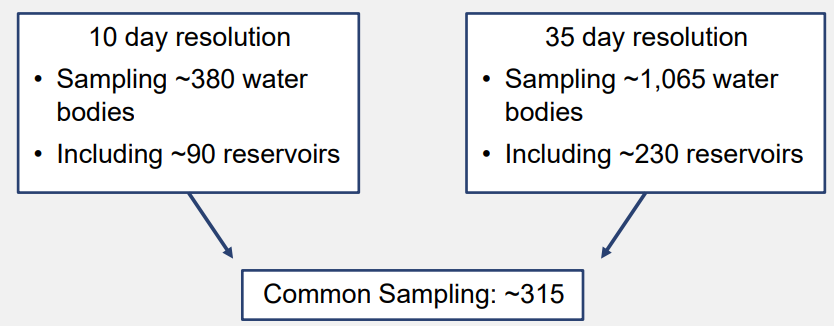

Jason 数据可以在这里获取：[USDA Crop Explorer](https://ipad.fas.usda.gov/cropexplorer/global_reservoir/)，查看了下中国的水库，在东北有丰满。

## Earth System Models for Water resource management

地球系统模型主要是一个数学物理方程，描述大气，地表和海洋的动力系统运动，这些模型同化了卫星数据和地表地面站点观测数据，因此模型内获取的各类数据尺度是一致的。

NASA可用于水资源管理的Atmosphere-Ocean-Land 模型主要有：

- GEOS-5: The Goddard Earth Observing System Version 5
- MERRA: Modern Era Retrospective-Analysis for Research and Application
- GLDAS and NLDAS:
    - Global Land Data Assimilation System
    - North American Land Data Assimilation System
    
MERRA 整合了观测数据和GEOS 模型的输出，数据从1979年至今。提供了state-of-the-art的从气象到气候时间尺度的全球分析。专注于提升水循环。MERRA-Land模型是离线的地表模型（Land surface model），由MERRA降水和NOAA气候预测中心的站点数据驱动。

用于水资源管理的MERRA数据主要是其输出中的：

- Rain
- Snow
- Weather and Climate Parameters: temperature, humidity, winds, clouds, surface radiation

MERRA线上更新是月尺度的。

GLDAS和NLDAS 整合了地面和卫星观测到数值模型中生成一致高分辨率的地表状态和通量场。它们使用了多数据源的LIS（land information system），包括Meteorological Analysis, Surface Solar Radiation, Precipitation, Soil Texture, Vegetation Classification, Leaf Area Index, Topography

GLDAS由四个版本的地表模型：Noah，CLM2， Mosaic，VIC

输入有：

- Rainfall: TRMM and multi-satellite based data
- Meteorological Data: global reanalysis and observations-based data from Princeton University
- Vegetation Mask, Land/Water Mask, Leaf Area Index: MODIS (GLDAS-2)
- Clouds and Snow (for surface radiation):NOAA and DMSP Satellites

输出包括：

- Soil Moisture
- Evapotranspiration
- Surface/Sub-Surface Runoff
- Snow Water Equivalent

NLDAS的输入源有所不同：

- Precipitation: NOAA-CPC rain gauges
- Meteorological Data, Surface Radiation Data: North American Regional Analysis

GLDAS和NLDAS用于水资源可以提供**所有成分**的数据。

MERRA还有GLDAS和NLDAS数据可以在这获取：

- [Mirador](http://mirador.gsfc.nasa.gov/)
- [Giovanni](http://giovanni.gsfc.nasa.gov/giovanni/)

可以通过设置时空范围下载。

NASA水资源的数据的优点有：

- Remote sensing-based data provide near-global - global coverage compared to surface-based, spatially nonuniform point measurements
- Provide data where surface-based measurements are unavailable
- Earth systems models integrate surface-based and remote sensing observations and provide uniformly gridded, frequent information of water resources data parameters
- Earth system models provide parameters that aren’t directly observed by satellites (e.g. runoff, ET)
- Data are free and there are web-based tools for data

限制包括：

- All freshwater components are measured by different satellites and sensors with varying spatial and temporal resolutions, coverage, and quality
- Satellite and model data files are large and in different data formats: training is required to learn how to access them
- Often additional processing may be needed for specific applications
- While the data are generally validated with selected surface measurements, regional and local assessment is recommended

最后一个总结表格：

Water Resources Data From NASA Satellites and Models

|Freshwater Component| Satellite/Sensor |Model |Data Access|
|-|-|-|-|
|Rain Amount|GPM /(GMI, DPR) & TRMM /(TMI, PR) – IMERG and TMPA Multi-satellite data|GLDAS & NLDAS forcing data from NOAA Climate Prediction Center, MERRA| https://pmm.nasa.gov/ http://mirador.gsfc.nasa.gov/ http://giovanni.gsfc.nasa.gov/giovanni/|
|Snow Cover|Terra & Aqua/MODS|-|http://nsidc.org/data/modis/data_summaries#snow http://reverb.echo.nasa.gov/reverb/ http://snow.jpl.nasa.gov/portal/|
|Soil Moisture|SMAP/(Microwave Radiometer)|GLDAS & NLDAS|http://nsidc.org/data/search/#keywords=soil+moisture/ http://mirador.gsfc.nasa.gov/ http://giovanni.gsfc.nasa.gov/giovanni/|
|Land Cover And NDVI(For ET Estimation)|Landsat/OLI Terra & Aqua/MODS|-|http://earthexplorer.usgs.gov http://glovis.usgs.gov/ http://landsatlook.usgs.gov/viewer.html https://lpdaac.usgs.gov/dataset_discovery/modis/modis_products_table|
|Runoff|-|GLDAS & NLDAS|http://mirador.gsfc.nasa.gov/ http://giovanni.gsfc.nasa.gov/giovanni/|
|Ground Water|GRACE/K-band Ranging System|GLDAS & NLDAS|http://grace.jpl.nasa.gov/data/ http://geoid.colorado.edu/grace/ http://mirador.gsfc.nasa.gov/ http://giovanni.gsfc.nasa.gov/giovanni/| 
|Reservoir Height|Jason/Altimeter|-|http://www.pecad.fas.usda.gov/cropexplorer/global_reservoir| 