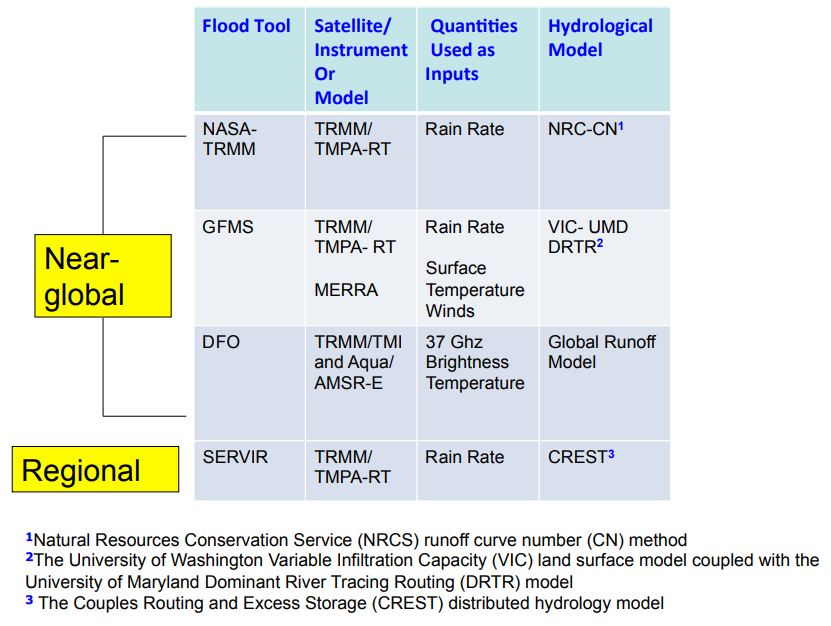
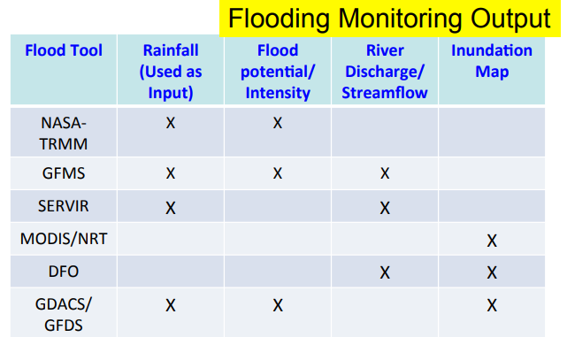
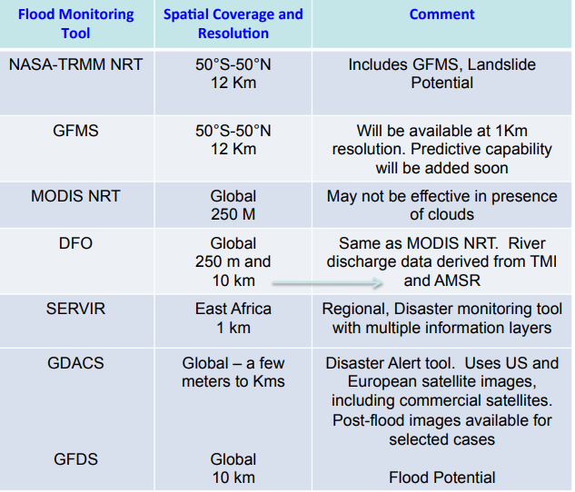

# Flood Monitoring Using NASA Remote Sensing Data

该网络研讨会着重介绍使用许多可公开获得的近乎全球的NASA遥感数据，和基于Web的洪水工具。

包括案例研究： 

- 莫桑比克林波波河洪水（2013年1月23日至30日）
- Phalin飓风在印度东北部造成的洪水泛滥（2012年10月12日至18日）
- 台风“海燕”导致菲律宾洪水泛滥（2012年11月8日至12日）

学习目标是与会者能够访问和分析基于降雨的工具中的数据，同时考虑到地形，流域，地标和社会经济数据。 

主要内容有：

1. Overview of NASA Remote Sensing and Earth Systems Modeling Data, and Flood Monitoring Tools (19 November 2013)
    1. Fundamentals of Remote Sensing and Model data for Flood monitoring
    2. Introduction to Flood Monitoring and Inundation Mapping Tools
2. Overview of Flood Monitoring Tools using Tropical Rainfall Measuring Mission (TRMM) Observations (26 November 2013)
    1. ITHACA (Information Technology for Humanitarian Assistance Cooperation and Action) and ERDS (Extreme Rainfall Detection System)
    2. Global Flood Monitoring System (GFMS)
3. Overview of Inundation Mapping using MOderate-resolution Imaging Spectroradiometer (MODIS) Observations (3 December 2013)
    1. MODIS Inundation Tool 
    2. the Flood Observatory
    3. Case Studies of Inundation Mapping and Comparison with GFMS and ITHACA-ERDS
4. Overview of Flood Tools Using Multi-Satellite Observations (10 December 2013)
    1. Global Disaster Alert and Coordination System (GDACS)/Global Flood Detection System (GFDS)
    2. Flooding Studies with Multiple Tools and GIS Applications
    
### Overview of NASA Remote Sensing and Earth Systems Modeling Data, and Flood Monitoring Tools

第一部分之前已经有记录了，合理只补充一点之前没有介绍到的。

Flood是什么？这里直接粘贴原文：

- Flood: Overflow of water from a water body on otherwise dry land. Measured in terms of stream flow or the rate at which a volume of water flows – measure of depth, width, and speed  of water flow – expressed in cubic meters per second (m3/s)
- Flash Flood: A flood caused by heavy or excessive rainfall in a short period of time, generally less than 6 hours
- Inundation: Usually dry land surface that is covered with water – due to flooding or heavy rain 

那么对于洪水检测重要的气象和水文信息有哪些？

- Rain Rate and Accumulated Rain Amount
- Snow Melt Rate
- Terrain
- Soil Condition: soil moisture, temperature, and cover
- Reservoir/River Level
- Strom Water Drainage System (urban floods)

对应的NASA有什么可以为量化洪水提供的信息？

- Several satellites in orbit with various instruments or sensors
- plans for future satellite missions
- Several earth system models which use satellite remote sensing observations

水文水资源可用的NASA卫星之前已经看了这里不再赘述。这个webinar主要关注TRMM的TMI-PR-VIRS以及多卫星融合数据（for Rain），还有Terra/Aqua的MODIS数据（for land cover）

为什么要使用遥感数据？

- Provides information where there are no ground-based measurements, including over un-gauged rivers and over oceans
- Provides global/near-global coverage with consistent observations
- Provides **large-scale views and advance warning** of impending environmental events and disasters. 

卫星是如何测量的？

- Passive satellite sensors measure **radiation reflected or emitted by the earthatmosphere system**. The intensity of reflected and emitted radiation to space  is influenced by the surface and atmospheric conditions. Thus, satellite measurements contain information about surface and atmospheric conditions
    - Radiance
- Radiance is converted to a geophysical parameter, examples:
    - Accumulated Rainfall
    - Snow Cover 
    
对洪水检测量化有帮助的NASA卫星主要有：

|Satellite|Sensors|Quantities|
|-|-|-|
|TRMM|Precipitation Radar (PR), TRMM Microwave Imager (TMI), Visible Infrared Scanner (VIRS)|Rain Rate, Vertical Rain Rate Profile, Accumulated Rain |
|Terra and Aqua|MODerate Resolution Imaging Spectroradiometer (MODIS) |Snow Cover, Vegetation Index, Leaf Area Index, Land Cover, Cloud Cover |
|Aqua|Atmospheric Infrared Sounder (AIRS), Advanced Microwave Scanning Radiometer for EOS (AMSR-E) |3-dimensional Atmospheric Temperature and
Humidity, Cloud Cover Snow Water Equivalent, Sea Ice, Soil Moisture, Rain Rate |
|Landsat|(Enhanced) Thematic Mapper (ETM) |Land Cover, Vegetation Index, Leaf Area Index|
|Grace|K-Band Ranging Assembly|Terrestrial Water|

对洪水检测量化有益的NASA模型前面已经介绍过了，这里再列个表：

|Models|Quantities|
|-|-|
|MERRA|3-dimensional Winds, Temperature, Humidity, Clouds, Rain Rate ,Snow Mass, Snow Cover, Snow Depth, Surface Snowfall Rate, Evapotranspiration |
|GLDAS/NLDAS /VIC|Evapotraspiration, Multi-layer Soil Moisture, Snowfall Rate,
Snow Melt, Snow-Water Equivalent, Surface and Sub-surface Runoff|

总之，NASA satellites and atmosphere-land models 可以提供 hourly, daily, seasonal, multiyear 等多时间尺度的 global scale geophysical parameters：

- Rain
- Temperature
- Humidity
- Winds
- Soil Moisture
- Snow/Ice
- Clouds
- Terrain
- Ground Water
- Vegetation Index
- Evapotranspiration
- Runoff 

这些参数中，Ground Water 和 Vegetation Index 要通过卫星观测获取，Evapotranspiration 和 Runoff 需要通过模型同化卫星观测来计算，其他参数既可以从观测获取，也可以从模型计算得到。

这里主要看看TRMM和Terra/Aqua

TRMM主要是用于 Extreme Rain Detection and Forcing Hydrologic Models

TRMM基本信息之前已经记录了，这里不再赘述。

TRMM 的TMPA，即多卫星降水分析可以提供近全球，多年的多时间尺度，良好分辨率的降水数据

- 可以检测近实时的降水（including flood inducing extreme rain events）
- Input/forcing to hydrological models that are used to calculate streamflow for mapping flood and landslide potential

TRMM 3B42 是TMPA一个产品，结合了PR和TMI的rain rates，和SSM/II, AMSR and AMSU-B多个卫星传感器互相率定，也通过VIRS和同步轨道卫星和NOAA的低轨卫星互相率定了。最后的降雨产品还在月尺度上和地面站点率定了。

TMPA Surface Rain Rate Data (mm/hour)产品主要是：

- TRMM 3B42RT : Near-Real Time
- TRMM 3B42 : Adjusted with surface rain gauge measurements on monthly basis

相关基本信息：

- Spatial Resolution: 0.25°x0.25° latitude-longitude
- Spatial Coverage: 50° S to 50° N, Global
- Temporal Resolution: 3-hourly,Daily
- Temporal Coverage: 1998 to present

Terra/Aqua 的 MODIS 主要用于Inundation Mapping

一些有用的相关信息：

- Reflectance in Optical Bands 1, 2, and 7
- Spatial Resolution: 250 m x250m
- Spatial Coverage: Global
- Temporal Resolution: Daily, 8-day, 16-day
- Temporal Coverage: 1998 to present
- Strength: Globally consistent
- Limitation: Data can **not** be retrieved when clouds are present 

注意 MODIS also provides observations of snow cover, vegetation indices

MERRA 可以提供

- Surface skin and Air Temperature
- Temperature Profile
- East-West and North-South wind components
- Humidity (Water Vapor) Profile

相关基本信息：

- Spatial Resolution: 2/3°x1/2° latitude-longitude and 1.25°x1.25, 42 vertical levels
- Spatial Coverage: Global
- Temporal Resolution: Hourly, Daily, Monthly
- Temporal Coverage: 1979 to present

现在看看 Flood Monitoring 的基本工具。

卫星观测方面主要是：

- Direct use	in	detecIon	of	surface	water/inundaIon	
- In	observing	flood-related	weather	quanIIes	:	Rainfall, Temperature,	Humidity,	Winds

水文模型方面：

- Forced	with	satellite-based land and atmospheric measurements [rain, air temperature and humidity, wind speed, radiation, vegetation, soil type, terrain]
- Hydrological Models route water within a channel river basin/watershed region according to the atmospheric and surface conditions, calculaIon	of	Streamflow	–	indicaIve	of	flooding	condiIons	

具体的web工具能提供以下内容的全球或区域分析：

- Near-real time flood monitoring: Flood probability/potential, extreme rain, streamflow, inundation extent)
- Flood forecasting: Flood probability/potential, extreme rain, streamflow, inundation extent)
- Information about past flooding events
- Additional information (for example about – weather, land-cover, roads, dams, population density etc.) 

哪些工具呢？

- NASA-TRMM Current Heavy Rain, Flood, and Landslide Estimates
- Global Flood Monitoring System (GFMS)
- Extreme Rainfall Detection System (ERDS)
- Global MODIS Inundation Mapping
- Dartmouth Flood Observatory (DFO)
- Global Disaster Alert and Coordination System (GDACS)/Global Flood Detection System (GFDS) 

所有这些工具都提供交互式的操作。

洪水工具的类型：

- Tools based on Remote Sensing observations and Hydrologic Models
- Inundation Mapping Tools based on MODIS
- Experimental Flood Mapping based on Passive Microwave Brightness Temperatures
- Disaster Mapping 

使用TRMM和水文模型的洪水工具：

具体使用的遥感信息：

|Flood	Tool|	 Satellite/(Instrument	|Quantity	Used	|
|-|-|-|
|MODIS NRT| Terra and Aqua/MODIS|Reflectance Bands 1, 2, 7|
|DFO, ERDS|Terra and Aqua / MODIS, TMPA-RT/NOAA-GFS| Reflectance Bands 1, 2, 7, Rain Rate|
|GFDS |TRMM/TMI and Aqua/AMSR-E TRRM/TMI|37 Ghz Brightness Temperature|

GDACS (Not a Flood Tool but a Disaster Alert System) Uses GFDS, and other remote sensing data and maps TRMM/TMPA Rain Rat  RadarSAT, erraSAR-X, Synthetic Aperture Radar Reflectivity SPOT-5 Worldview-1/2 , Visible/near-IR Images 

工具最后的输出：

注意打“x”的是表示可以输出的。

其他一些基本信息：

后面会记录一些更详细的信息。

###  TRMM-based Tools - Extreme Rainfall Detection System and Global Flood Monitoring System 

主要关注两个工具，Global Flood Monitoring System (GFMS) 和 Extreme Rainfall Detection System (ERDS) 

先看看ERDS， Extreme Rainfall Detection System：http://erds.ithacaweb.org/

主要是一个预警系统，旨在提供全球尺度的计算降雨和可能的洪水事件的及时警示。其输入的数据是：

- Tropical Rainfall Measuring Mission (TRMM) Multisatellite Precipitation Analysis (TMPA) necessary for the near-real time detection of heavy rainfall (0.25° spatial resolution) 
- NOAA-GFS (Global Forecast System) deterministic model necessary for forecasted precipitation alerts (0.5° spatial resolution) 

输出就是直接给出地图，上面显示哪些地方有较大降雨。具体可以在上面给出的网站上直接查看。

接下来看看GFMS，Global Flood Monitoring System:http://flood.umd.edu/

它提供全球南北纬50度之间地图以下变量的时间序列：

- Instantaneous Rain
- Accumulated rain over 24, 72, and 168 hours
- Stream flow rates and flood detection at 1/8th degree (~12 km)

其输入时TRMM和TMPA，还有MERRA的地表温度和winds，使用VIC model来做产流，汇流模型使用了马里兰大学的模型。

###  MODIS-based Tools – MODIS Inundation and Dartmouth Flood Observatory 

这里也主要是两个工具，Global MODIS Inundation Mapping  和 Dartmouth Flood Observatory (DFO) 

MODIS reflectance from various bands indicate **presence of water on land surface**. 主要是检测陆地上哪些地方有水。

MODIS provides surface inundation **only**, can **not** view the surface in the
presence of clouds, mountain and cloud shadows may get interpreted as
water 有云的话就看不到了。

第一个工具，网址：https://floodmap.modaps.eosdis.nasa.gov//

可以看到，有很多网格，点击一个就可以进入更详细的范围，最后可以看到一个具体的地区的洪水情况。

第二个工具，网址：http://floodobservatory.colorado.edu/

更多信息可以参考网站，这里就暂不赘述了。主要是这个工具可以通过观测，模型等手段一定程度上消除云的影响。

总之:

- MODIS 提供了无云处的高分辨率的 inundation mapping 
- MODIS Near-real time flood monitoring tool 提供了日 inundation maps，还有自2010年以来的 archived inundation maps
- The **Flood Observatory** uses the MODIS inundation tool at 14-day composite window to **remove cloud obscuration** – near-real time maps are available. Also provides additional surface water indications (drier or wetter) with respect to past observations
- The Flood Observatory provides experimental river watch (discharge  estimates) derived from combined Microwave Imager data and a run-off  model – current 7-day flooding conditions over selected river basins are available
- MODIS-based surface water data can be accessed in GIS

### Flooding case studies with GIS, Global Flood Detection System 

主要是Global Flood Detection System (GFDS) 和Global Disaster Alert and Coordination System (GDACS) 

首先是GFDS，网址：https://www.gdacs.org/flooddetection/

它是 Global Disaster Alert and Coordination System (GDACS)的一个部分，是欧盟的研究机构，它是提供基于事件的信息的，不是实时交互的形式。它也是使用TRMM和Aqua等的信息来检测洪水。

Global Disaster Alert and Coordination System (GDACS) ，网址：https://www.gdacs.org/ 

是欧盟下的研究机构开发的一个全球灾害展示平台，包括洪水，热带风暴和地震等。