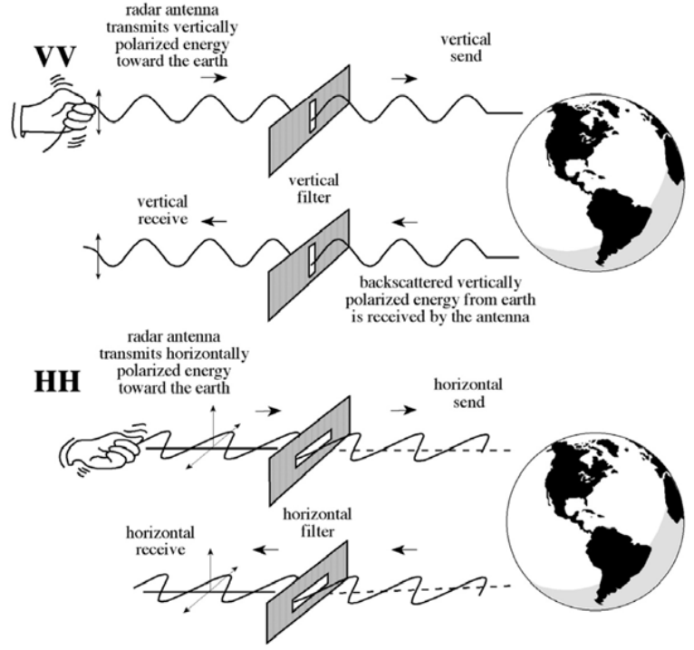

# Introduction to Synthetic Aperture Radar

光学（optical）遥感卫星需要在无云，可见度较好的地方才能产生质量较好的数据。这对于收集夜间数据、暴雨周围情况，以及森林密度大的地方情况都会有问题。Synthetic Aperture Radar（SAR）是这些问题的一个重要的解决办法。SAR日夜都能观测地球表面，能观测绝大多数气象条件下的地表，并且信号可以穿过植被覆盖。有许多现存的SAR数据集，还有一些令人兴奋的即将来的misson。这节就主要就是了解获取和使用SAR数据的情况，包括polarimetric和interferometric SAR（PolSAR和InSAR），以及一些potential 应用。

### Basics of Synthetic Aperture Radar (SAR)

- Understand the physics of SAR image formation
- Describe the interaction of SAR with the land surface
- Describe the necessary data preprocessing
- Explain what information is available from SAR

首先，了解下SAR image形成的物理基础。

光学传感器可测的是反射的太阳光并且仅仅能在白天工作。

在有云的时候，地表是不能被视觉和红外传感器成像的。

在电磁波谱里面微波是在cm级的，微波是能穿透云层和植被的，并且日夜都能运行。

所以SAR的优点是：

- Nearly all weather capability
- Day or night capability
- Penetration through the vegetation canopy
- Penetration through the soil
- Minimal atmospheric effects
- Sensitivity to dielectric properties (liquid vs. frozen water)
- Sensitivity to structure

不过SAR也有一些缺点：

- Information content is different than optical and sometimes difficult to interpret
- Speckle effects (graininess in the image)
- Effects of topography

云层覆盖的比例是很高的，所以SAR是很有用的。

被动遥感一般都是地表反射的太阳光，比如可见光，红外线；SAR显然是主动微波，包括雷达和LIDAR。

说到RADAR，还有LIDAR等主动遥感，有个基本概念需要了解：Down Looking vs. Side Looking Radar

雷达图像中的每个像素都代表了反射回卫星的能量的一个复杂量；每个像素的幅值代表了反射的回拨的强度。

雷达能够测量波的幅值（反射波的强度）和相位（波周期中时间点的位置）

雷达仅能测量反射回到天线的那部分回波，及上图接收到的那部分 backscatter。雷达波的传播速度也是光速。

雷达波中需要考虑的参数有：

- Wavelength
- Polarization
- Incidence Angle

波长和频率是关于光速的倒数，这个都知道：
$$wavelength=\frac{speed of light}{frequency}$$
SAR中常用的波段是下表中有括号的那几个：

|Band designation|wavelength($\lambda$),cm|Frequency($\nu$), GH, ($10^9$ cycles $\cdot$ $sec^{-1}$)|
|-|-|-|
|Ka (0.86 cm)|0.8 to 1.1|40.0 to 26.5|
|K|1.1 to 1.7|26.5 to 18.0|
|Ku|1.7 to 2.4|18.0 to 12.5|
|X (3.0 cm, 3.2 cm)|2.4 to 3.8|12.5 to 8.0|
|C (6.0)|3.8 to 7.5|8.0 to 4.0|
|S|7.5 to 15.0|4.0 to 2.0|
|L (23.5 cm, 25 cm)|15.0 to 30.0|2.0 to 1.0|
|P (68 cm)|30.0 to 100.0|1.0 to 0.3|

雷达波段的选择更多的是考虑 penetration，穿透森林植被和土壤的通常有更长的波长。最常用的几个波段是L,C,X，如下表所示。

|Frequency band|Frequency range|Application Example|
|-|-|-|
|VHF|300 KHz - 300 MHz|Follage/Ground penetration, biomass|
|P-Band|300 MHz - 1 GHz|biomass, soil moisture, penetration|
|**L-Band**|1 GHz - 2 GHz|agriculture, forestry, soil moisture|
|**C-Band**|4 GHz - 8 GHz|ocean, agriculture|
|**X-Band**|8 GHz - 12 GHz|agriculture, ocean, high resolution radar|
|Ku-Band|14 GHz - 18 GHz|glaciology (snow cover mapping)|
|Ka-Band|27 GHz - 47 GHz|high resolution radars|

penetration 是 wavelength 的函数，通常越长的波长，越能穿透到目标地。

Radar 成图和光学成像还是有区别的，一些例子可以参考下图：

另一个重要的雷达参数是 Polarization（偏振）。雷达信号是polarized。polarizations通常被控制在H和V之间：

- HH: Horizontal Transmit, Horizontal Receive
- HV: Horizontal Transmit, Vertical Receive
- VH: Vertical Transmit, Horizontal Receive
- VV: Vertical Transmit, Vertical Receive

当所有四种polarizations都被观测就称作Quad-Pol Mode。

不同的polarization 决定被观测目标的物理属性，所以不同偏振光的成像是不同的。

第三个重要的雷达参数：Incidence Angle。

即雷达光和地表平面的角度

传感器高度的不同回造成incidence angle的不同。

接下来，看看radar backscatter。雷达回波包含了地表信息，因为地表驱动了雷达信号的反射。反射受下面因素影响：

- The frequency or wavelength: radar parameter
- Polarization: radar parameter
- Incidence angle: radar parameter
- Dielectric constant: surface parameter
- Surface roughness relative to the wavelength: surface parameter
- Structure and orientation of objects on the surface: surface parameter

比如 dielectric constant，freeze和thaw状态下是不同的：

radar 信号对地表结构也很敏感，地表相对于波长的尺度决定了其地表表现出的粗糙或平滑以及出现在图像上是明是暗，因为地表粗糙曲折的话，散射波就多，就能有波反射回雷达，如果表面很光滑，大部分光都反射走了，回不到雷达。比如水面，在雷达照射下就显示暗色。也有double bounce，比如：

雷达波因为是side looking，不是一种直接拍照的，所以其对地面物体的观测，相比于物体原有的几何形状来说是有变形的。所以雷达图需要校正。

另外，就是有阴影，因为side looking，高低不平的地方，低处被遮挡，就会形成阴影，会影响对图像的解读，这也是需要校正的。

另外，雷达图上还存在 speckle，这会降低SAR图像的质量。减少speckle的方式之一是multi-look processing，把 radar beam 即雷达射束分成多个更细的子射束，每个sub-beam对应一个scene中的一个look，用这些looks来减少speckle。

另外，就是spatial filtering，用一个类似卷积核的操作可以帮助处理speckle。

常见的雷达数据有：

|Sensor Name|RADARSA-2|Sentinel-1A|RISAT-1|
|-|-|-|-|
|Agency|Canadian Space Program (CSP)|European Space Agency (ESA)|Indian Space Research Organization (ISRO)|
|Instrument|C-band SAR (5.4 GHz)|C-band SAR (5.4 GHz)|C-band SAR (5.35 GHz)|
|Incidence Angle|Side-looking, 15-45度 off-nadir|Side-looking, 15-45度 off-nadir|36.85度|
|Polarization|HH, HV, VV, & VH|(VV & VH) or (HH & HV)|HH & HV|
|Sensor Height at Equator|798 km|693 km|542 km|
|Orbit|Sun Synchronous (dusk/dawn)|Sun Synchronous (dusk/dawn)|Sun Synchronous (dusk/dawn)|
|Revisit Time (Orbit Repeat Cycle)|24 days|12 days|25 days|
|Resolution|100 m|5 m * 20 m|~25 m|
|Swath Width|500 km (ScanSAR mode)|250 km (IWS mode)|115 km (MRS)|
|Mean Local Time|6:00 a.m. descending|6:00 a.m. descending|6:00 a.m.|
|Launch|14 Dec 2007|3 April 2014|26 Apr 2012|
|Planned Lifetime|7 years mininum|7 years|5 years|

在[Alaska Satellite Facility网站](https://asf.alaska.edu/)上有各种SAR数据集。

还有 NASA-ISRO SAR Mission（NISAR）是美印合作的卫星，预计发射时间是2021年。双频率 L和S波段 SAR。NISAR有一些水文的应用，比如水体表面变化等。

### SAR Processing and Data Analysis

这一小节的目的是了解 Sentinel 数据，以及image processing还有饭呢西SAR 图像来分类land和水体。

关于哨兵卫星:

其目标是观测海洋和海岸。哨兵1号有不同的acquisition modes：

- Extra Wide Swath
- Strip Mode
- Wave Mode
- Interferometric Wide Swath

更多具体信息可以参考哨兵1号网站：https://sentinel.esa.int/web/sentinel/user-guides/sentinel-1-sar/acquisition-modes

如何获取哨兵1号images：

- Alaska SAR Facility：http://www.asf.alaska.edu/sentinel/
- European Space Agency Portal：https://sentinel.esa.int/web/sentinel/sentinel-data-access

有三种不同的产品类型：SLC, GND 和 OCN

- SLC: Single Look Complex
- GND: Ground Range Detected (You should select this one)
    - Full Resolution (FR), High Resolution (HR), Medium Resolution (MR)
    - Resolution is dependent on the amount of multi-looking performed
- OCN: Level-2 Ocean

哨兵1号有由ESA开发的开源的访问和处理哨兵一号和其他卫星radar图像的工具箱，可以通过网站访问：http://step.esa.int/main/toolboxes/

工具箱内容主要是：

- Calibration
- Speckle Noise
- Terrain Correction
- Mosaic Production
- Polarimetry
- Interferometry
- Classification

具体使用过程后面用到了再来看。

最后合成孔径雷达和雷达还是有些区别，ARSET这里的培训没有说清楚，所以查 ESA的资料：https://earth.esa.int/landtraining07/D1LA1-LeToan.pdf

### Introduction to Polarimetric SAR

首先，介绍下polarization。

雷达产生电磁波，电场方向和波传播方向是垂直的，它被用来定义波的偏振。

Dual-pol instruments：

- Transmit H 或者 V，同时receive H 和 V

Quad-pol instruments：

- 交替脉冲 Transmit H 和 V ，同时receive H 和V

不同polarizations返回的信号量取决于微波接触的地表物理特性。

雷达polarimetry 是研究使用多个polarimetric returns 来推求地表信息。两种互补的方法来研究polarimetry：

- 理论模型预测polarized 信号如何和不同媒介接触
- 遥感工具的观测值揭示一系列land cover types 的polarization signatures

先看看 scattering mechanisms。

量化scattering mechanisms 从 编码接收到的雷达信号到 scattering matrix开始。在quad-mode下，可以用一个3* 3的 T3 coherency matrix 

### Introduction to SAR Interferometry

SAR 干涉测量。这块在水文方面应用原资料里面没有提及，所以这里暂略。