## Water Resources Management

该网络研讨会重点介绍可从NASA遥感和地球系统建模获得的淡水量，以提供决策支持。它提供了介绍性技术信息，以进一步介绍NASA雨水产品，积雪，颗粒大小，雪水当量，径流，水流，VIC模型，土壤湿度，蒸散量估算，储层高度和地下水监测。 

- Overview of NASA Remote Sensing and Earth Systems Modeling Data for Water Resources Management
- Overview of Precipitation, Run Off
- Overview of Soil Moisture, Evapotranspiration
- Overview of Reservoir Water Height, Ground Water
- Overview of Web-tools for Data Access and Imaging (with live demos)

相关视频可以在原网站下载得到。

### Overview of Remote Sensing and Earth System Modeling

这一小节的内容前面基础部分也已经记录了，这里只做简单补充。

地球上海洋中约13亿立方公里水，河流中只有2120立方公里。

地球上只有2.5%的水是freshwater；只有1.3%是地表水。

另外，关于卫星还有一些基本概念。

极地轨轨道如下：

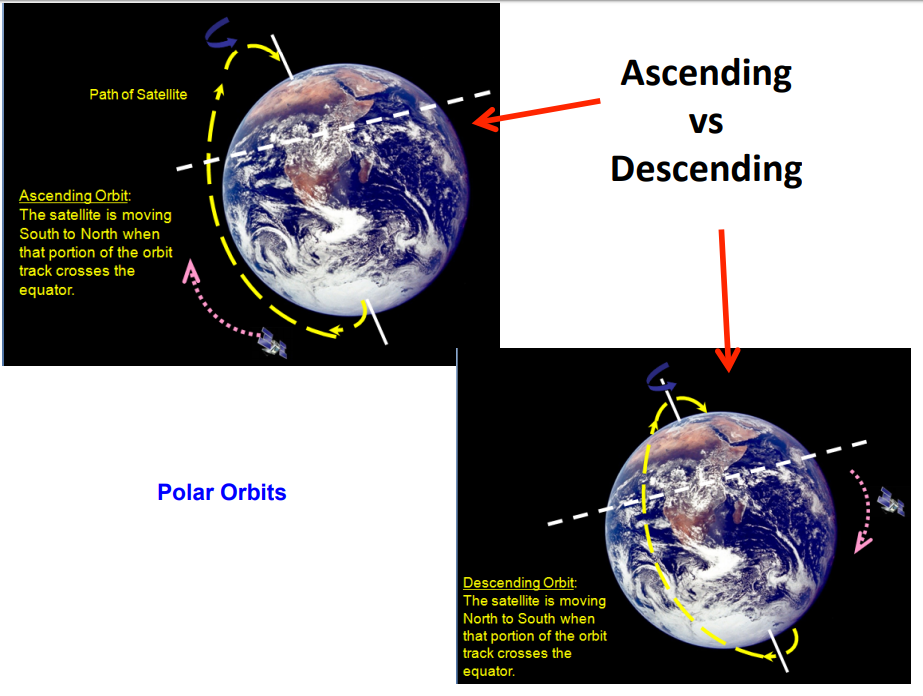

卫星的扫描如下图所示：

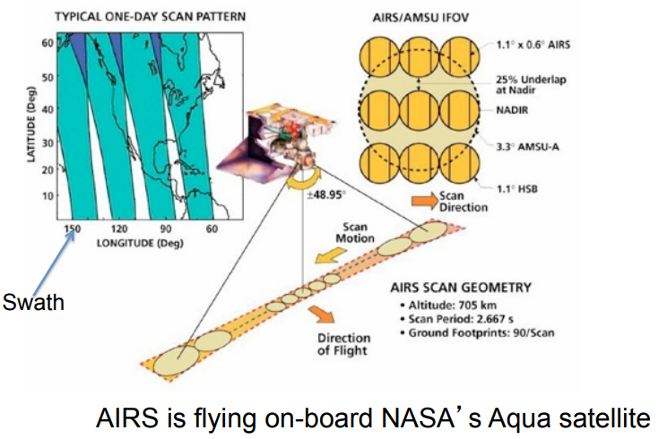

### Overview of Precipitation and Runoff 

NASA Rain Data Sources 主要有：

- Global Precipitation Climatology Project (GPCP)
- Tropical Rainfall Measuring Mission (TRMM) satellite observations (2014年后有GPM)

GPCP包括遥感和地面观测，地面观测有超过6000个雨量站点，从遥感卫星获取的数据可以获取1979年至今的日/月的全球范围2.5度分辨率数据。具体如下图所示：

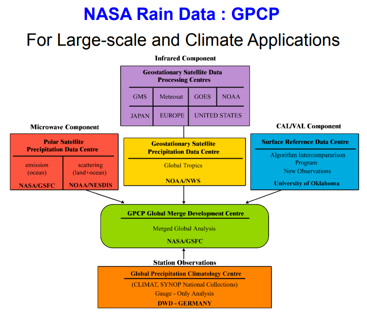

TRMM数据应用：

- Monitor near-real time rainfall – including extreme rain events
- Monitor regional wet/dry periods
- Input/forcing to hydrological models for mapping flood and landslide potential, and for water management
- Agricultural monitoring

径流方面，汉语中没太区别runoff和streamflow，注意surface runoff和channel runoff的区别

Surface Run Off:

- Excess water from rain and/or snowmelt
- Results from soil saturation, depends on soil infiltration capacity, rain/melt water rate, terrain
- A major component of water cycle – responsible for erosion, flooding, water quality (carry pollutants) 

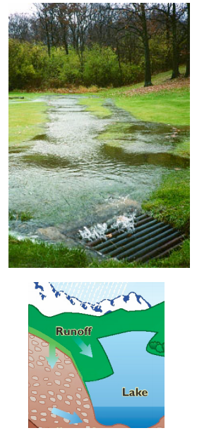

Streamflow or Channel Runoff: 

- Flow of water in rivers, streams
- Runoff that carries water from land to ocean
- In situ point measurements within stream by streamgauge
- A major component of water cycle – responsible for flooding when channel overflows

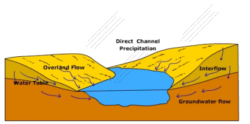

关于GLDAS和NLDAS，时间范围是1979至今，空间分辨率包括八分之一度，四分之一度，一度。

GLDAS 目的：Integrate ground and satellite observations within sophisticated numerical models to produce physically consistent, high resolution fields of land surface states (e.g., snow) and fluxes (e.g., evaporation)

输入中，包括soil texture, Land cover, Slope, 卫星的forcing数据 SW Radiation, precipitation, 以及同化的观测modis snow cover.

输出里，Noah有四分之一度和1度两个分辨率，CLM，Mosaic和VIC都是1度。整合的输出有Soil Moisture, Evapotranspiration, Runoff, Snow Water Equivalent.

NLDAS在八分之一度分辨率上运行。

NASA的径流数据主要是GFMS和SERVIR（Regional）

GFMS前面已经提到，SERVIR可以在这里查看：https://www.servirglobal.net/

SERVIR主要服务发展中国家，但不包括中国，口号：connect space to village （by helping developing countries use satellite data to address critical challenges in **food security, water resources, weather and climate, land use, and natural disasters**.）

比如东非地区的产品可以提供：

- Near Real Time Hydrologic Datasets
    – Streamflow
    – Soil moisture
    – Quantiles of Streamflow, Soil Moisture
- Short Term Forecasts using KMD QPF
    – Rainfall
    – Streamflow
    – Soil moisture
    
### Soil Moisture and Evapotranspiration 

土壤辐射率取决于观测角， The polarisation of the radiation，土壤的电导率$\epsilon _{soil}$（取决于土壤的soil moisture和texture），所以如果知道土壤电导率就能用一个关系来推求soil moisture。

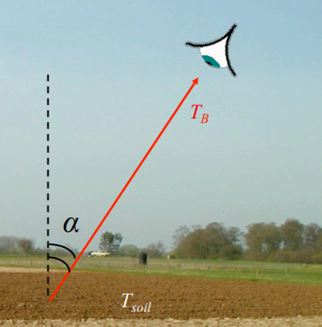

$$T_B=\epsilon _{soil} \cdot T_{soil}$$

AMSR-E(Advanced Microwave Scanning Radiometer for EOS)在Aqua卫星上，可以提供土壤含水量和SWE信息，时间范围是2000年6月到2011年9月，分辨率0.25度，日月尺度都有。

NOAA也提供soil moisture信息，从 Defense Meteorology Satellite Program (DMSP) Special Sensor Microwave Imager (SSM/I) and Special Sensor Microwave Imager Sounder (SSMIS) measurements。空间分辨率25km，日数据。

现在的是SMAP。

GLDAS和NLDAS也有soil moisture数据输出。

soil moisture可以用于：

- Weather: More accurate rainfall prediction
- Natural Disaster: Drought early warning and decision support Improved flood forecasting and mapping, soil infiltration condition
- Agriculture: Prediction of agricultural productivity, famine early warning, crop monitoring
- Water resources: Regional water balance and effective governance

关于蒸散发，如图所示：

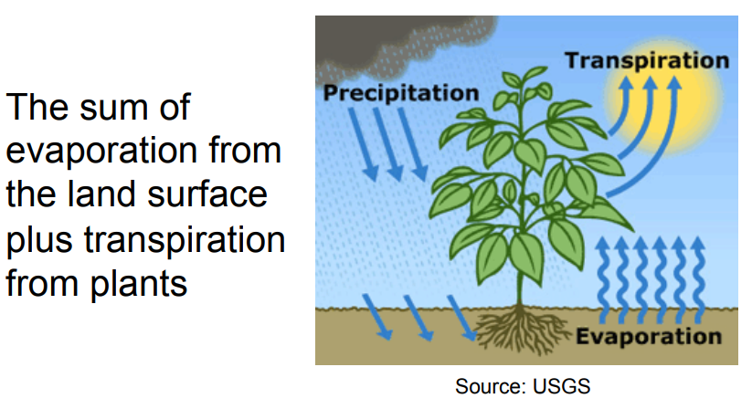

蒸散发很重要：

- Critical component of water and energy balance of climate-soil-vegetation interactions.
- Used for
    – Determining agricultural water consumption
    – Assessing drought conditions
    – Develop water budgets
    – Monitor aquifer depletion
    – Etc…. 
    
观测ET很难，因为决定ET的因素很多，且变化随时间空间很大，且地面观测的限制很多。使用遥感数据的好处是：

Provides relatively frequent and spatially continuous measurement of biophysical variables at different spatial scales:
    
    – Radiation
    – Vegetation coverage and density
    
推求ET的方法：

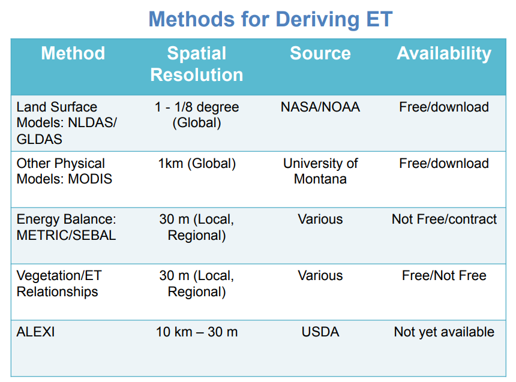

一般主要使用的就是LDAS的数据或者MODIS数据。

MODIS的计算方法如下图所示：

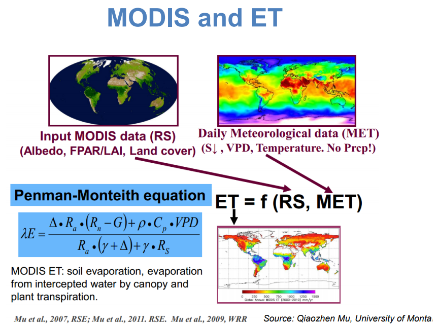

基于MODIS的ET数据产品空间分辨率1km，范围全球，时间帧 8天，月，年，时间范围2000至2011

MODIS ET的应用比如：Direct impacts on local climate of sugarcane expansion in Brazil Loarie, S. R, et al. (2011) 

获取数据的网址：https://www.ntsg.umt.edu/project/modis/mod16.php

ArcGIS中有MODIS工具箱，可以直接在ArcGIS中下载获取。

ET数据还可以从landsat中获取。有两种方法：

- Energy Balance Method
- Vegetation Indices/ET Relationship

任何人都可以在网上访问USGS的Landsat数据：

- GeoTIFF format
- Orthorectified “GIS-ready” 

Landsat中对ET重要的波段如下图所示：

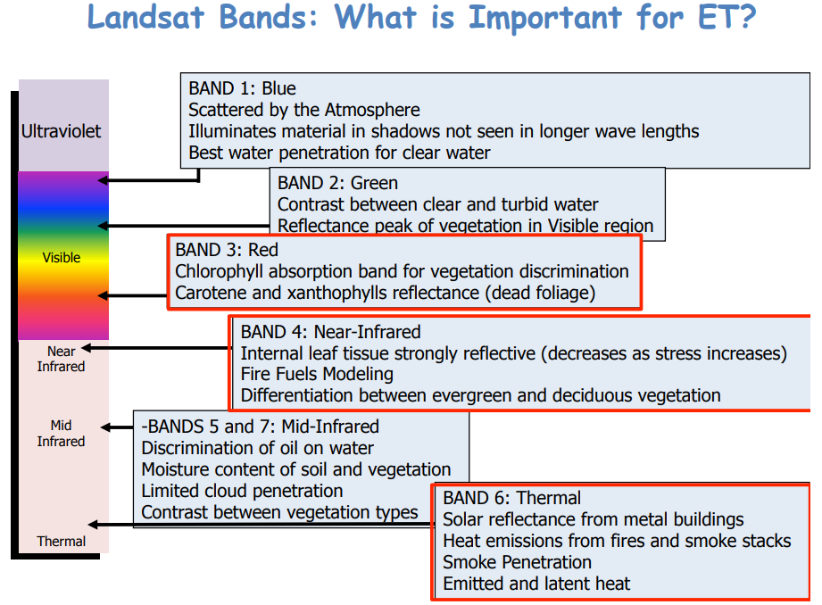

ENERGY BALANCE 方法：

- SEBAL(Surface-Energy Balance Algorithm for Land)
    – Developed by Dr. Wim Bastiaanssen (Netherlands)
    – Applications: ET and crop productivity
- METRIC(Mapping Evapotranspiration with High Resolution and Internalized Calibration)
    – Developed by Dr. Rick Allen, University of Idaho 
    
具体方式这里没有详细讲。

为什么用Landsat，因为其高分辨率。

METRIC ET Applications有如下。

1. Aquifer depletion
2. Water rights buy-back
3. Planning: ET by land use class
4. Water use by irrigated agriculture
5. Water rights compliance monitoring
6. Modeling: ET for computing water budgets
7. Analysis of water-rights curtailment alternatives. 

Although Landsat data are free, using the energy balance method to derive ET **costs time and money**! 

VEGETATION INDICES 方法：

首先，vegetation index是

- Based on the relationship between red and near-infrared wavelengths.
- Chlorophyl strongly absorbs visible (red)
- Plant structure strongly reflects nearinfrared

NDVI之前已经记录过了，从它可以推求ET。

比如TOPS-SIMS ，一个自动的实时处理NDVI,$F_c$,$K_{cb}$和$ET_{cb}$的系统。提供网络访问：https://ecocast.arc.nasa.gov/simsi/

从vegetation获取ET的优劣：

- Primarily useful for estimating ET of a well- Indices watered crop on a dry soil surface
- This method is simple and quick, and inexpensive.
- Can be used on other types of imagery – not just Landsat

### Overview of Reservoir and Lake Water Height, and Ground Water

卫星测高的基本原理不负责，首先，卫星轨道是固定的，然后根据协作卫星的GPS以及地面协作站可以知道卫星的位置/高度，然后卫星会发射微波，获取反射波，这样根据时间差就可以得到测量的表面的高度。

这样的radar记录的是回波，如图所示，可以通过这些回波来判断高度范围。

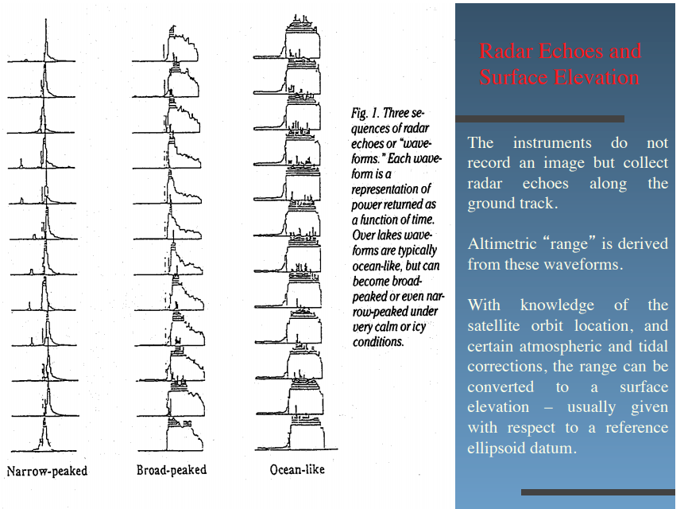

目前卫星测高雷达主要有：

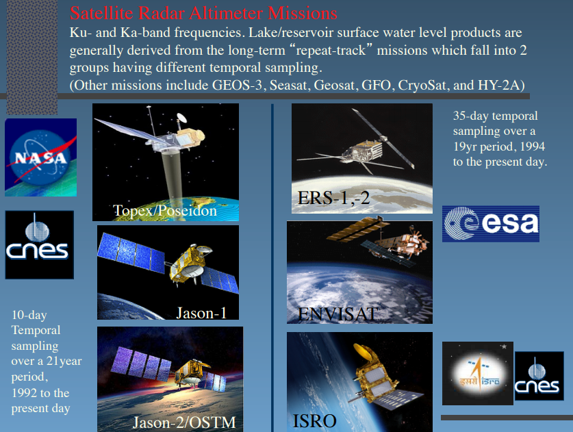

卫星观测会通过地面数据率定。其优缺点如下所示：

ADVANTAGES：

- The contribution of **new height information** where traditional gauge (stage) data is absent.
- Day/night and **all weather** operation.
- Generally **unhindered by vegetation** or canopy cover.
- Determined surface heights are with respect to **one common reference frame**.
- Repeat orbits (to ±1km) enable **systematic monitoring** of rivers, lakes, wetlands, inland seas and floodplains.
- Surface water heights are potentially obtainable for **any target** beneath the satellite overpass.
- The ability to **monitor seasonal to inter-annual variations** during the lifetime of the missions.
- Validated techniques.

LIMITATIONS:

- The satellite orbit scenario determines the spatial and temporal coverage.
- Data can only be retrieved along a narrow nadir swath.
- Highly undulating or complex topography may cause data loss.
- Height accuracy (4-20cm rms large open lakes) is dominated by the size and surface roughness of the target.
- Major wind events, heavy precipitation, tidal effects, ice formation, will effect data quality and accuracy.
- Minimum target size (50-100km2) is also dependant on many factors and the retrieved heights are
- an "average" not a "spot” height at a specific location.

可以查看水库高度的网站：

- https://ipad.fas.usda.gov/cropexplorer/global_reservoir/ ：为了观测农业（季节性）和水文干旱（长期），USDA整合了多个数据集。
- http://www.legos.obs-mip.fr/soa/hydrologie/hydroweb/
- http://www.cse.dmu.ac.uk/EAPRS/projects_riverlake_overview.html
- https://openadb.dgfi.tum.de/en/

Sentinel-3, Jason-3, Jason-CS, SWOT 都是较新的卫星任务，可用于观测水位。

接着是GRACE。

怎么用重力观测水？地球系统质量的长期平均分布决定了它的平均或静态重力场；水/空气的运动，从小时到几十年范围的时间尺度很大程度上决定了地球重力场的时间变化。

GRACE是测量总体，column-integrated Terrestrial Water Storage(TWS)的变化。观测的是两个卫星飞船之间的距离（如下图所示），能精确到百万分之一英寸，这需要非常敏感的仪器，当重力变化时，两个飞船之间的距离会有变化，所以能反映重力的anomaly。GRACE能提供月时间尺度变化的重力场的时间序列。

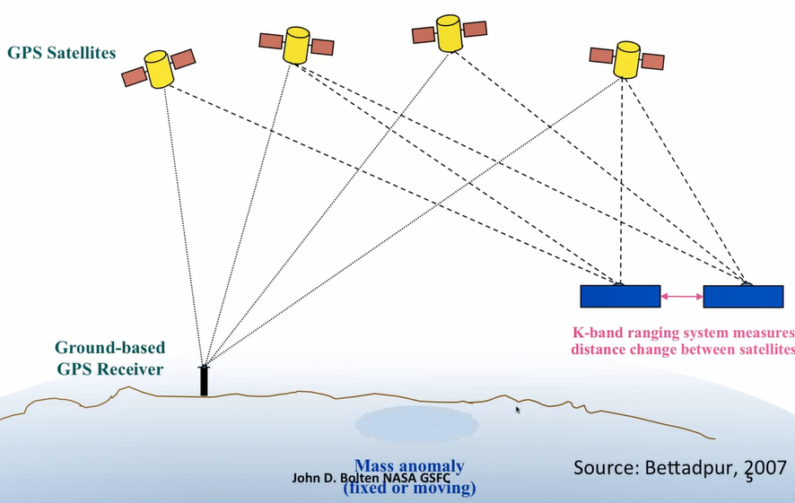
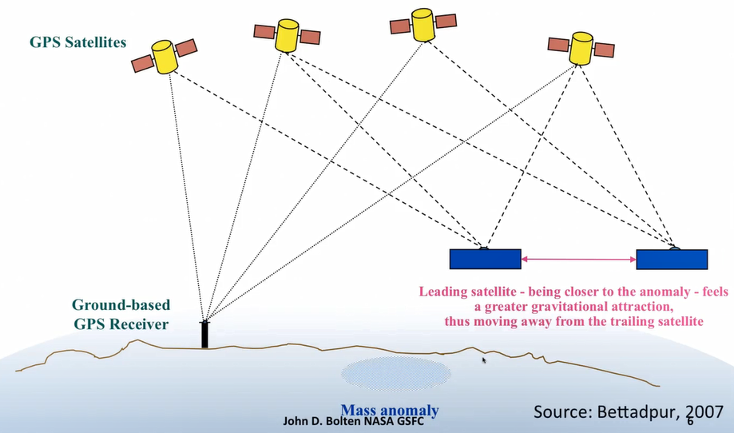

观测的重力月变化由质量的月变化引起。从质量的变化中可以推求出Terrestrial Water Storage（TWS）的变化。质量的变化可以被认为是表面水的厚度变化，单位为cm，这就是Equivalent Water Thickness。

GRACE的分辨率是15万平方公里或更低，所以是很粗糙的，检测的是月尺度变化。total column water包括：groundwater, soil moisture, snow等。因为GRACE极高的精确的，所以15万平方公里的月storage anomalies结果误差在1.5cm。

GRACE产品由三个科学整数据中心提供，包括UTCSR, JPL 和 GFZ。

所有Level-0 到 Level-2 产品在JPL的Physical Oceanography Distributed Active Data Center(PODAAC) 和 GFZ的 Integrated System and Data Center(ISDC)里都有存档。

- JPL data portal: https://podaac.jpl.nasa.gov/datasetlist?search=GRACE
- GFZ data portal: https://isdc.gfz-potsdam.de/grace-isdc/grace-gravity-data-and-documentation/
- GRACE Website at University of Texas at Austin Center for Space Research(CSR): http://www.csr.utexas.edu/grace/

更多内容可以查看：https://podaac.jpl.nasa.gov/

一些GRACE用户将多个资源整合在一起，发布了Level3的产品，该产品空间分辨率1度，时间分辨率1个月。

- GRACE Tellus: https://grace.jpl.nasa.gov/data/get-data/
- CU, Boulder: http://geoid.colorado.edu/grace/
- ICGEM: http://icgem.gfz-potsdam.de/home

GRACE 观测TWS，是没有垂直分辨率的，它不能区别存储在雪，soil moisture和ground water中的水。不过，通过比较GRACE观测到的TWS anomalies和由land surface model确定的water storage变化之间的不同，为了约束模型状态，可以将信号垂直分解。

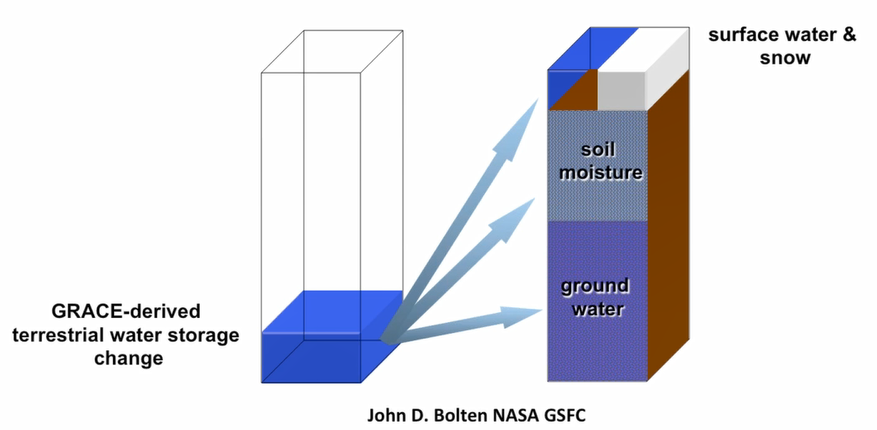

如何通过GRACE观测来检测water storage？

- 分析GRACE TWS anomalies的趋势和幅值
    - 评估variability, extremes, changing storage
    - 评估climate change, human water management
- 结合GRACE TWS anomalieshe 与地面站点观测或模型数据
    - isolate water budget components
- 数据同化
    - large-scale constrains, model-based downscaling
    
根据GRACE推求的TWS 可以分离出goundwater

前面已经记录过了，这里就不重复了，简言之如下公式所示：
$$\triangle GW =\triangle TWS-\triangle SM-\triangle SWE -\triangle SW$$

GRACE可以通过地面数据同化系统来应用，land surface model提供了物理一致的，高分辨率的输出，同化GRACE时，需要GRACE数据再水平，垂直，时间上都分解并插值到近实时，这要整合GRACE和其他数据源。

### Web-tools for Data Access/Imaging

教程是以实例为讲解内容的，这里就记录一些主要脉络信息。

比如常用GIS 图层：

|GIS Data Layers |机构|网站|
|-|-|-|
|Rivers/Basins |USGS HydroSHEDS| http://hydrosheds.cr.usgs.gov/|
|Population |NASA Socioeconomic Data and Applications Center (SEDAC) |http://sedac.ciesin.columbia.edu/|
|Elevation |Consortium for Spatial Information (CGIAR-CSI) |http://srtm.csi.cgiar.org/|
|Reservoirs| NASA Socioeconomic Data and Applications Center (SEDAC) |http://sedac.ciesin.columbia.edu/|
|Soil Type| ISRIC - World Soil Information| http://www.isric.org/|
|Dams| NASA Socioeconomic Data and Applications Center (SEDAC) |http://sedac.ciesin.columbia.edu/|
|Agricultural Lands| NASA Socioeconomic Data and Applications Center (SEDAC)| http://sedac.ciesin.columbia.edu/|
|Land Use| Waterbase| http://www.waterbase.org|
|Global, National Administrative
Areas|Global Administrative Areas| http://www.gadm.org/|
|Global Base Maps| ESRI Base maps| http://www.esri.com/data/basemaps |

一些网络工具之前也记录过了，这里就不赘述了。

最后补充下GLDAS的各变量简称备查：

- avgsurft: average surface temperature k
- canopint: total canopy water storage kg/m^2
- evap: total evapotranspiration kg/m^2/s
- lwdown: surface incident longwave radiation w/m^2
- lwnet: net longwave radiation w/m^2
- psurf: surface pressure pa
- qair: near surface specific humidity kg/kg
- qg: ground heat flux w/m^2
- qh: sensible heat flux w/m^2
- qle: latent heat flux w/m^2
- qs: surface runoff kg/m^2/s
- qsb: subsurface runoff kg/m^2/s
- qsm: snowmelt kg/m^2/s
- rainf: rainfall rate kg/m^2/s
- swe: snow water equivalent kg/m^2
- swdown: surface incident shortwave radiation w/m^2
- swnet: net shortwave radiation w/m^2
- snowf: snowfall rate kg/m^2/s
- soilm1: 0-10 cm average layer 1 soil moisture kg/m^2
- soilm2: 10-40 cm average layer 2 soil moisture kg/m^2
- soilm3: 40-100 cm average layer 3 soil moisture kg/m^2
- soilm4: 100-200 cm average layer 4 soil moisture kg/m^2
- tsoil1: 0-10 cm average layer 1 soil temperature k 