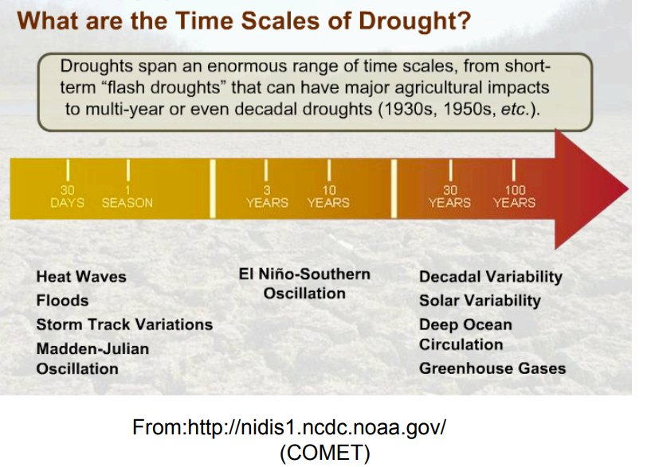
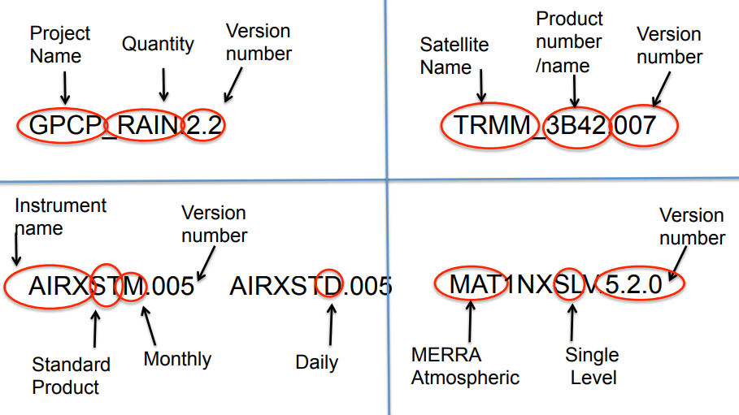
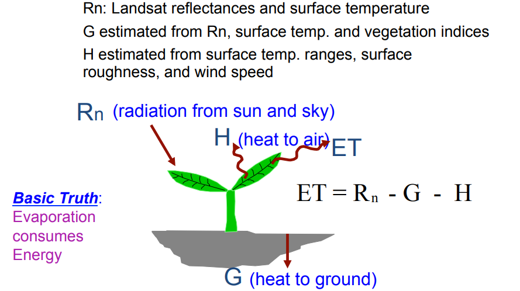

# Flood and Drought application

该网络研讨会概述了用于水资源管理应用的NASA数据；NASA卫星遥感和建模的基础知识；监测极端降水，洪水和干旱的数据；以及用于数据和图像访问的基于Web的工具。

学习目标： 
与会者将能够访问和分析用于洪水和干旱应用的NASA遥感数据。

这个webinar没有提供视频，查看ppt。

### Intro. & Background: Satellite Remote Sensing 

主要是介绍用于flood 和干旱检测的遥感数据，很多前面已经记录了，这里做补充。

Flood的基本概念前面已经记录了，这里粘贴下原文：

- Flood: An overflow of water onto normally dry land. It may last for days or weeks.
- Flash Flood: A flood caused by heavy or excessive rainfall in a short period of time, generally less than 6 hours.

Can occur within minutes or a few hours of excessive rainfall.

对flood监测关键的气象和水文信息：

- Rain Rate and Accumulated Rain Amount
- Snow Melt Rate
- Terrain
- Soil Condition: soil moisture, temperature, and cover
- Reservoir/River Level
- Strom Water Drainage System (urban floods)

干旱的基本概念：

- Meteorological Drought: Deficient rainfall over specific period
- Agricultural Drought: precipitation shortages resulting in soil moisture deficits, reduced vegetation/crop.
- Hydrological Drought: depletion of surface or subsurface water supply i.e., streamflow, reservoir and lake levels, groundwater

对区域尺度，多个时间尺度干旱检测重要的气象和水文信息：

- Precipitation, Temperature, Humidity, Wind 
- Snow cover, Snow Pack
- Streamflow, Surface and Sub-surface Water Levels
- Soil Moisture
- Vegetation, Evapotranspiration

这个webinar主要关注这些值：

- Rain
- Temperature
- Humidity
- Winds
- Evapotranspiration

### Flood and Drought [Rainfall, Weather and Climate Data] 

主要介绍 Rain, Temperature, Humidity, and Wind Data ，这对 flood and drought monitoring – 3-hourly to decade long coverage 很有用。也能作为水文模型的输入。

再重复下遥感数据产品级别的含义：

|级别|含义|
|-|-|
|Level 1 |Source Data: L1a are **raw radiance counts** and L1b are **calibrated radiances**|
|Level 2 |Derived **geophysical variables** at the same resolution and location as Level 1 source data|
|Level 2G| Level 2 binned data **mapped on a uniform spacetime grid**|
|Level 3| **Geophysical variables** mapped on a uniform space-time grid in derived spatial and/or temporal resolutions |

降水的TRMM 前面已经记录过了，这里不赘述

对于温度和湿度数据，NASA主要由Aqua/AIRS和MERRA 大气模型来获取。

Atmospheric Infrared Sounder (AIRS) 在Aqua卫星上，全球观测，一天两次，采用了先进的红外技术，2378 spectral bands in 0.5 to 15 micron wavelength。Measurement footprints vary from about 2.5 km to 40 km。 和AMSU以及HSB (Humidity Sounder Brazil) 一起配合使用。

AIRS/AMSU Standard Data products基本情况如下所示：

- Surface skin and Air Temperature
- Temperature Profile
- Humidity (Water Vapor) Profile
- Column-integrated Water Vapor ( Precipitable Water)
- Cloud Cover and Height

- Spatial Resolution: 50 kmx50 km and 1°x1° latitude-longitude
- Spatial Coverage: Global
- Temporal Resolution: Daily, 8-day mean, Monthly
- Temporal Coverage: 2002 to present 

- Strength: Globally consistent, multiple atmospheric parameters
- Limitation: Data can not be retrieved when clouds are present 

关于MERRA：

- Surface skin and Air Temperature
- Temperature Profile
- East-West and North-South wind components
- Humidity (Water Vapor) Profile
- Column-integrated Water Vapor ( Precipitable Water) 

- Spatial Resolution: 2/3°x1/2° latitude-longitude and 1.25°x1.25, 42 vertical levels
- Spatial Coverage: Global
- Temporal Resolution: Hourly, Daily, Monthly
- Temporal Coverage: 1979 to present 

- Strength – The processed data are globally continuous in space and time, and provide meteorological and climatological relevant fields
- Weakness – Earth system models represent the human knowledge of how the world works 

### Web-tools

主要是Where and how to access Rain, Temperature, Humidity, Wind data 

[Giovanni](https://giovanni.gsfc.nasa.gov/giovanni/) 和 [MIRADOR](https://disc.gsfc.nasa.gov/mirador-guide) 上可以获取。

Giobanni全称 GES-DISC (Goddard Earth Sciences Data and Information Services Center) Interactive Online Visualization ANd aNalysis Infrastructure 

是一个基于web的可视化，分析获取数据的工具，由很多portals组成，每个portal提供网格化的第3级别的不同遥感卫星传感器和模型的地球物理量。

数据产品的名称示例：

MIRADOR 是一个地球科学数据搜索工具，GES DISC开发的，有简化的接口以允许空间时间参数设置，交互方式是购物车的形式。更多使用MIRADOR的细节可以参考手册：https://arset.gsfc.nasa.gov/sites/default/files/water/Flood-Drought-Applications/Mirador.pdf

关于干旱，美国有专门的干旱portal：https://www.drought.gov/drought/

全球尺度的监测有：https://www.drought.gov/gdm/

全球农业监测有：https://ipad.fas.usda.gov/glam.htm

### Evapotranspiration

前面都已经记录了，简单补充。

推求ET的ENERGY	BALANCE	方法中的 METRIC：Mapping Evapotranspiration with High
Resolution and Internalized Calibration

METRIC方法需要satellites with Red, Near IR and Thermal IR ：

更多内容可以参考：https://www.uidaho.edu/cals/kimberly-research-and-extension-center/research/water-resources

另一种基于energy balance的方法SEBAL可以在github上查找代码：https://github.com/search?q=SEBAL

关于蒸散发还有一些terms需要了解：

Crop	EvapotranspiraBon	(ETc)	：

- ETc		=	the	combined	processes	of	crop	transpiration	(T)	and	evaporation	from	the	soil	surface	(E)	for	a	well-watered	(non-stressed)	crop	
- ETo	=	reference	ET	(measure	on	the	ground).	Typically	a	well-watered	grass	surface.

Crop	Coefficient	(Kc)：

- Vary	by	type	of	crop,	stage	of	growth	of	the	crop,	and	some	cultural	practices

计算ETc的方式：

- Apply	crop	coefficient	(Kc)	to	reference	ET	(ETo)	:	Etc	=	Eto	*	Kc

### Data Applications/ Case Studies 

案例研究主要是结合web工具，使用TRMM，MERRA,GLADAS,AIRS,MODIS的第三级产品，做一些量化分析，为进一步的复杂应用做准备。

这里只对干旱做一些记录，定义干旱是一个较主观的事情，干旱不是一种突发的事件，但是长期的干旱会影响很大。

对于农民来说，干旱是一个会影响庄稼的缺水时期，两周无雨就会影响庄稼地生产。

对气象学家来说，干旱是一段降水少于正常值的时期。

对水管理者来说，干旱就是供水缺少的情形。

对于水文学家来说，干旱又是an extended period of decreased precipitation and streamflow

干旱的一些指标如下所示：

- Precipitation：Standardized Precipitation Index (SPI)
- Surface Air Temperature
- Evapotranspiration
- Palmer Drought Index (based on supply and demand of moisture at given location over given time)
- Vegetation Index 