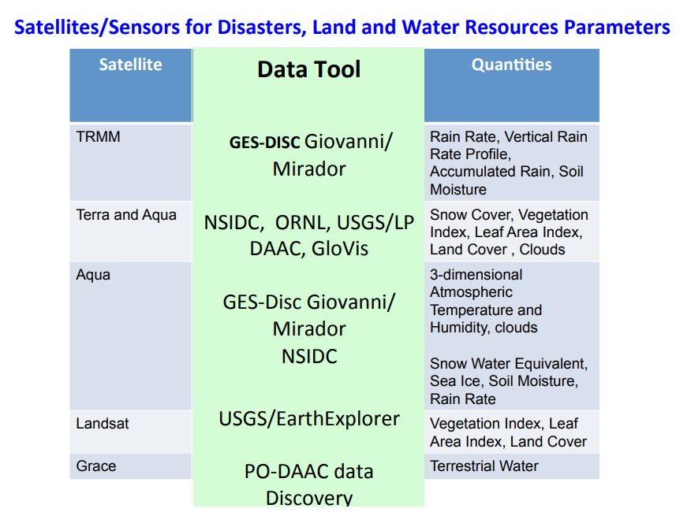
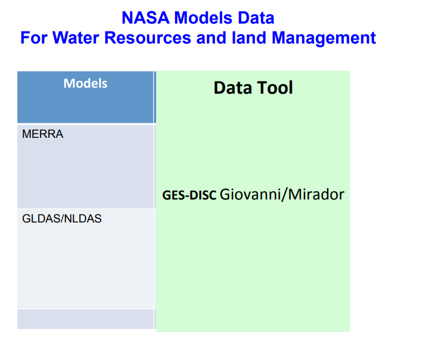

# Introduction to NASA Earth Science Data Products, Portals, and Tools

该网络研讨会广泛概述了NASA Earth Science提供的环境参数，以通过监视和绘制空气质量，水资源，灾害和生态系统来促进环境决策支持。这些数据集有多个来源和数据存档，这些数据集来自不同的卫星任务，传感器和地球系统模型-具有不同的功能，优势和局限性。许多基于Web的工具可用于轻松访问，分析和可视化NASA数据。本课程旨在提供有关NASA数据，位置，Web工具以及数据使用示例的简明信息，以方便最终用户的数据需求。

1. NASA Earth Science: Research and Applications to Decision Support
2. Overview of NASA Earth Science Data Products: Remote Sensing and Earth System Modeling Data
3. NASA Data Centers
4. NASA Data and GIS Applications: Air Quality, Water Resources
5. NASA Data and GIS Applications: Disaster, Agriculture and Ecology

### NASA Earth Science

https://science.nasa.gov/earth-science

NASA地球科学的核心问题：“How	is	the	Earth	changing	and	what	are	the	
consequences	for	life	on	Earth"?

NASA	Applied	Sciences	and	Capacity	Building 有四个计划：

- ARSET	
- DEVELOP	
- GOMI	
- SERVIR

ARSET就是本文件夹下的内容。

### NASA Data Products 

有6000+数据集。数据在这里搜索即可：https://earthdata.nasa.gov/

这是 NASA Earth Observing System Data and Information System (EOSDIS) 

数据很丰富：

- 大气数据
    - Atmospheric	temperature	
    - Atmospheric	humidity		
    - Winds	(wind	speed,	wind	direc6on,	ver6cal	air	mo6ons,	upper	air	winds)	
    - Precipita6on	
    - Lightning	(events,	area,	flash	structure)	
    - Aerosol	Proper6es	
    - Tropospheric	Chemistry(ozone,	precursor	gases,	carbon	dioxide)	- Stratospheric	chemistry	(Ozone,	CIO,	BrO)	
    - Cloud	proper6es	(amount,	op6cal	proper6es,	height	
    - Radia6ve	Energy	Fluxes(Top	of	atmosphere,	surface)
- 海洋数据
- 冰雪数据
- 陆地过程数据
    - Land	Cover	and	Land	Use	Change	
    - Vegeta6on	Dynamics	
    - Surface	Temperature	
    - Surface	Topography(Eleva6on,	slope,	DEMs)	
    - Fire	Occurrence	(Extent,	thermal	anomalies)	
    - Volcanic	Effects	(Frequency	of	occurrence,	thermal	anomalies,	impact	
    - Soil	moisture	
    - Gravity/Ground	Water	
- 人类维度数据
    - Popula6on	and	Land	Use	
    - Biodiversity	and	Ecosystems	
    - Human	and	Environmental	Health	
    - Climate	Change	
    
数据的属性：

- Spatial	Resolution	
- Spatial	Coverage	
- Temporal	Resolu6on	
- Temporal	Coverage	
- Data	Format	
- Data	Latency	
- Data	Accuracy	
- Data	Strengths/Limita6ons	
- Data	Access	
- Data	Analysis/Visualiza6on	

### NASA Data Centers 

NASA有12个数据中心，Distributed	Ac+ve	Archive	Centers	(DAACs)	，详细信息可以参考：https://earthdata.nasa.gov/eosdis/science-system-description/eosdis-components

不同数据中心主要存储的数据不同。

- Atmospheric Science Data Center (ASDC) DAAC
- Alaska Satellite Facility Synthetic Aperture Radar (ASF SAR) DAAC
- Crustal Dynamics Data Information System (CDDIS)
- Goddard Earth Sciences Data and Information Service Center (GES DISC)
- Global Hydrology Resource Center (GHRC) DAAC
- Land Processes (LP DAAC)
- MODIS Level 1 and Atmosphere Archive and Distribution System (LAADS) DAAC
- National Snow and Ice Data Center (NSIDC) DAAC
- Ocean Biology Processing Group (OBPG) DAAC
- Oak Ridge National Laboratory (ORNL) DAAC
- Physical Oceanography (PO.DAA)
- Socioeconomic Data and Applications Center (SEDAC)

数据获取的工具有多种。

- Near	real-6me	data	products	from	the	MODIS,	OMI,	AIRS,	and	 MLS	instruments	in	less	than	3	hours	from	the	 Land	Atmosphere	Near	real-6me	Capability	for	EOS	(LANCE)
- Interac6vely	browse	satellite	imagery	and	data	in	near	real6me	with	Worldview		
- Directory	level	informa6on	from	the	Global	Change	Master	Directory	(GCMD)
- Cross-DAAC	searches	through	Reverb,	"inventory	level interoperability"	–	uses	EOS	Clearing	House	(ECHO)	metadata	repository	
- Tailored	client	sobware	using	ECHO	metadata	repository	
- DAAC-specific	search	tools

跟水资源有关的如下图所示：

### NASA	Data	Applica+ons	with	GIS

这部分完全和之前的重复了，所以就不赘述了。