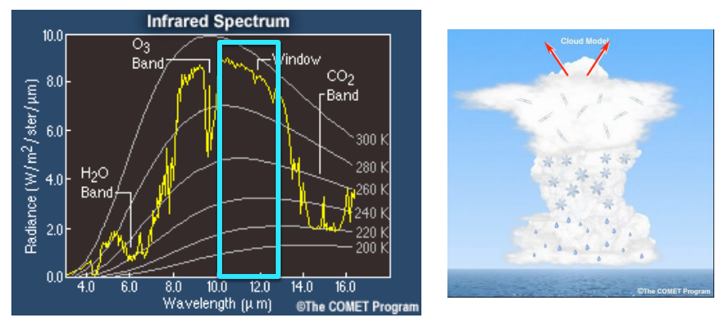
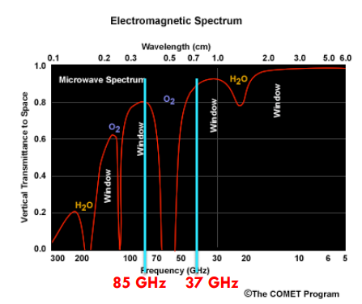
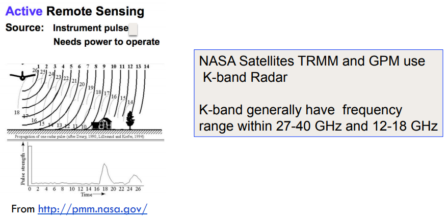
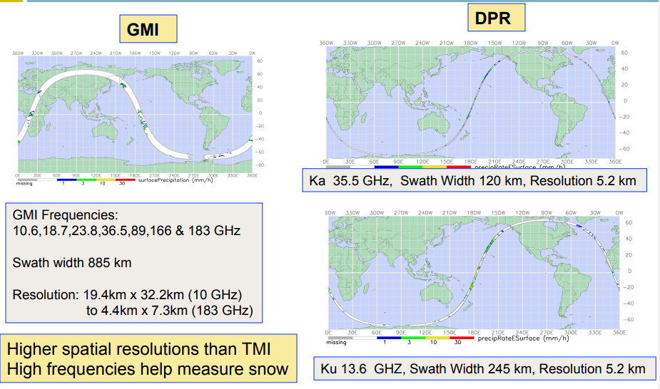
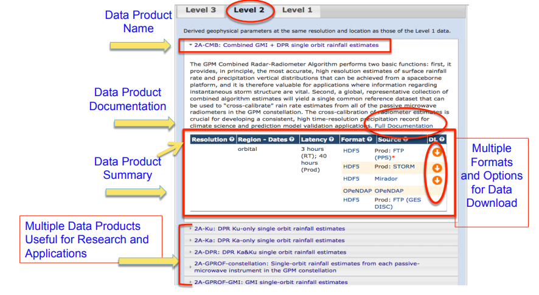
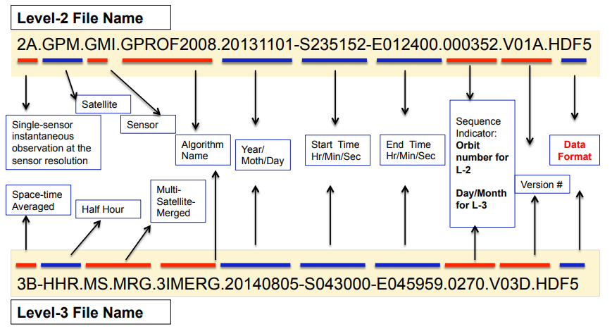
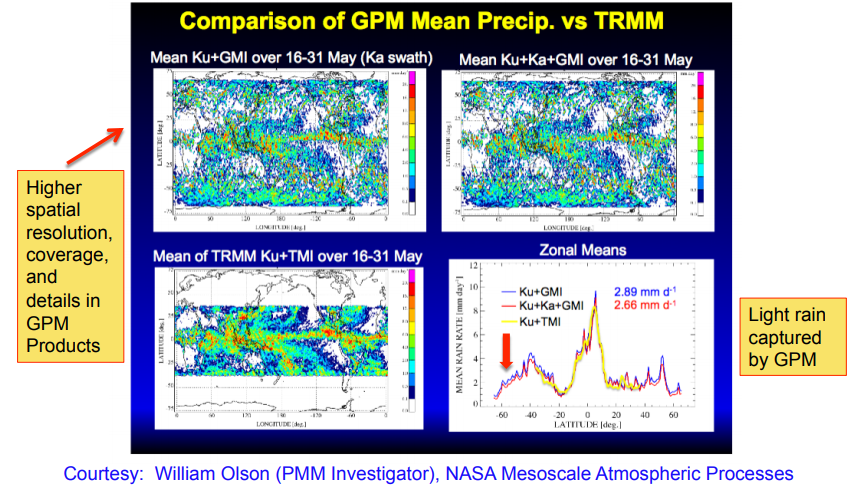
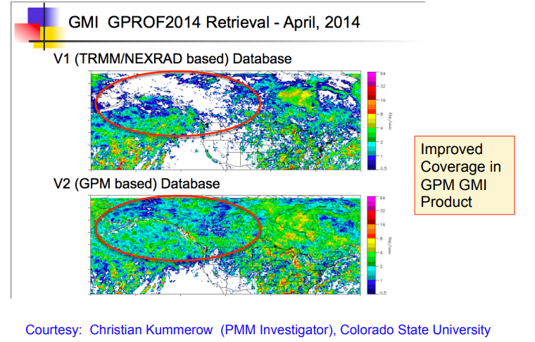

# Introduction to Global Precipitation Measurement (GPM) Data and Applications

该培训将向参与者介绍全球降水测量（GPM）任务的数据和应用。GPM是一项国际卫星任务，每三小时提供一次下一代全球雨雪观测。 

降水是淡水的最重要来源，准确的测量对于规划饮用水，农业，水力发电，卫生，生态系统和洪水管理的水资源至关重要。NASA热带雨量测量任务（TRMM）专为降水遥感而设计。结合来自其他国家和国际卫星的数据，可提供近实时测量值以及15年的历史测量值，可用于各种社会应用。TRMM卫星于2015年4月15日结束收集数据。 

NASA于2014年2月启动了GPM任务，以确保持续提供质量更高，接近全球的降水数据，以用于社会应用和环境决策支持。 

1. Introduction to Precipitation Remote Sensing and Overview of TRMM, Introduction to GPM Mission and Sensors, Examples of Precipitation Data Applications
2. Overview of GPM Data Products and Data Access
3. GPM-IMERG Product (Guest Speaker Dr. George Huffman, NASA) Live Demonstration of GPM Data Access and GIS Applications

### Precipitation Remote Sensing Overview of TRMM and GPM 

遥感基本概念不再赘述，这里直接看precipitation的遥感。

被动遥感主要是两种方式：

- 由**云层**反射的太阳辐射和发射的红外辐射（被动遥感）来间接推断的。 
- 由**降水粒子**发射或散射的微波辐射估算(被动遥感)，较低的频率被称为“发射通道”，主要用来测量雨滴(37GHz)发射的能量；更高的频率，或称为“散射通道”，收集被冰点(85千兆赫)以上的冰粒子散射的能量 

主动遥感的方式主要是雷达：由雷达发射的后向散射微波辐射估算(主动遥感)

关于TRMM，前面也已经记录了，这里不再赘述，GPM是TRMM的后续扩展任务。GPM基本信息前面也记录了，这里补充一些内容。

GPM有一个主动和一个被动rain传感器，Dual-frequency Precipitation Radar (DPR)和GPM Microwave Imager (GMI) ———— improvement over TRMM PR and TMI 

GPM联合星座的时间分辨率可达到30min，空间分辨率可以到0.1度，覆盖范围南北纬60度。

TRMM和GPM的用途：

- Extreme Events and Disasters
    - Landslides
    - Floods
    - Tropical cyclones
    - Re-insurance 
- Water Resources and Agriculture
    - Famine Early Warning System
    - Drought
    - Water Resource management
    - Agriculture
- Weather, Climate & Land Surface Modeling
    - Numerical Weather Prediction
    - Land System Modeling
    - Global ClimateModeling
等。

### TRMM/GPM Data Products and Data Access Tools 

遥感数据的处理级别：level0-level4

从原始的轨道数据到最终的网格数据产品。这里重点关注level2,3的数据，比较容易使用。

GPM和TRMM卫星图像或L1产品是brightness温度或radar反射率的形式的数据，L2和L3是从L1推求的降雨产品数据了。

遥感数据的格式有文本的-txt/ASCII（易读取，但太大），二进制的-HDF/NetCDF/OpenDAP（占空间少，信息丰富），KML或KMZ的（易于可视化），还有Shapefiles/Geotiff的（GIS应用方便）。

GPM和TRMM数据格式包括文本，二进制和Shapefiles/Geotiff三类。

官方网站：https://gpm.nasa.gov/

在 data accesss 一栏下，有介绍如何获取数据的方式。

查看GPM数据下载文档，可以看到三个级别的数据产品以及相关的数据集。每个级别数据集下又有很多不同的数据产品，形式如下所示。

上图是level2的产品，形式是**surface rainfall rate**，单位mm/hour，GPM数据是从2014年3月至今的。level2还有**vertical precipitation profiles和latent heating**的数据。具体见下表：

|Sensor/Product Name|Spatial Resolution and Coverage|Temporal Resolution|Data Format|
|-|-|-|-|
|DPR Ku-only/2A-Ku; DPR Ka-only/2A-Ka; DPR Ku&Ka/2A-FPR|5.2 km x125 m Single Orbit and 16 orbits per day (70°S-70°N) |20-120 minutes 24 hours|HDF5 and OPenDAP|
|GMI/2A-GPROF |4 km x 4 km Orbital and 16 orbits per day (70°S-70°N)  |2 – 40 hours |HDF5 and OPenDAP|
|Combined GMI and DPR/2A-CMB |Orbital (70°S-70°N) 5 km x 5 km, Coincident Ku-Ka-GMI footprints  |3 – 40 hours|HDF5 and OPenDAP|

GPM Level3 的数据中，IMERG是从多个卫星获取的，分辨率是10km-每半小时，近实时的能力。

|Sensor/Product Name|Spatial Resolution and Coverage|Temporal Resolution|Data Format|
|-|-|-|-|
|IMERG |0.1°x0.1° (90°S-90°N)  |30-minutes(Near Real Time) with 4-hour latency, 12-hour latency and 4-months latency |HDF4, NetCDF, OPenDAP, ASCII; GIF, PNG Images; KML for Google Earth |
|3-CMB Combined GMI + DPR rainfall Averages|0.1°x0.1°  (70°S-70°N) |Monthly|HDF5 and OPenDAP|
|3-DPR rainfall Averages |0.25°x0.25° 5.0°x5.0°  (67°S-67°N) for Daily (70°S-70°N) for Monthly |Daily and Monthly ; Daily and Monthly |HDF5 and OPenDAP|
|3-GPROF GMI rainfall Averages |0.25°x0.25°  (90°S-90°N) |Daily and Monthly|HDF5 and OPenDAP|

除了降水数据，level3也还有vertical precipitation profiles和latent heating的数据。

GPM数据文件命名对数据类型和时间属性的规范如下：

|Type|Description|
|-|-|
|1A|Instrument count, geolocated, at instantaneous field of view(IFOV)|
|1B|Geolocated, calibrated $T_b$ or radar power at IFOV|
|1C|Intercalibrated brightness temperature $T_c$ at IFOV|
|2A|Geolocated geophysical parameters at IFOV from a single instrument|
|2B|Geolocated geophysical parameters at IFOV from multiple instruments|
|3A|Space/time averaged geophysical parameters from a single instrument|
|3B||Space/time averaged geophysical parameters from multiple instruments|
|4|Combined satellite, ground and/or model data|

数字字母后面通过-链接的可以还有副名，内容如下：

|Type|Description|
|-|-|
|HR|The product accumulates for 1 hour|
|HHR|The product accumulates for every half hour|
|DAY|The product accumulates for a single day|
|PENT|The product accumulates for 5-day period|
|7DAY|The product accumulates for a 7-day period|
|MO|The product accumulates for a designated month|

更详细地，可以看例子：

GPM 数据目前有一些地面观测来验证。在Ground Validation一栏下可以看到具体地信息。

和TRMM相比：

数据访问工具有多个，如下表所示：

|Tools|Data Products and Formats |Analysis and/or Visualization |Data Download|
|-|-|-|-|
|[Mirador](https://disc.gsfc.nasa.gov/mirador-guide)|L1B, L2, and L3 GMI-GPROF; IMERG Half-hourly, Monthly; Orbital and Gridded Daily, Monthly; HDF5, OPenDAP (can be converted to ASCII, Binary, NetCDF) |N/A |Batch download|
|[Giovanni](https://giovanni.gsfc.nasa.gov/giovanni/)|IMERG Half-hourly, Monthly NetCDF, GeoTIFF, PNG|Visualization: Map, Time Series, Scatter Plot Histogram Analysis: Time-averaged Maps, Time Series, Scatter Plot, Map Correlations, Vertical Profiles, Timeaveraged Differences|Download by Select and Click on Data Files|
|[PPS/STORM](https://storm.pps.eosdis.nasa.gov/storm/) |L1B and 1C, L2, L3 GMI, DPR, GMI-DPR Combined Data, Orbital and Gridded Daily, Monthly IMERG Half-hourly, Monthly HDF5, PNG |Map Visualization, Interactive Latitude/Longitude Point Data Value Display|FTP|

### GPM-IMERG Data Demonstration of Data Access and GIS Applications

本节是具体实践展示，这里暂略，后面一起用代码来获取数据地时候再进行分析处理。