# Water Resource Management Using NASA Earth Science Data

这一节与前面的有很多事重复的，所以只记录一些新增的内容。

### NASA Remote Sensing Data and Applications for  Water Resources Management

介绍模型时，提到了land information system(LIS)，就是NLDAS和GLDAS这些使用的计算模型，如下图所示。

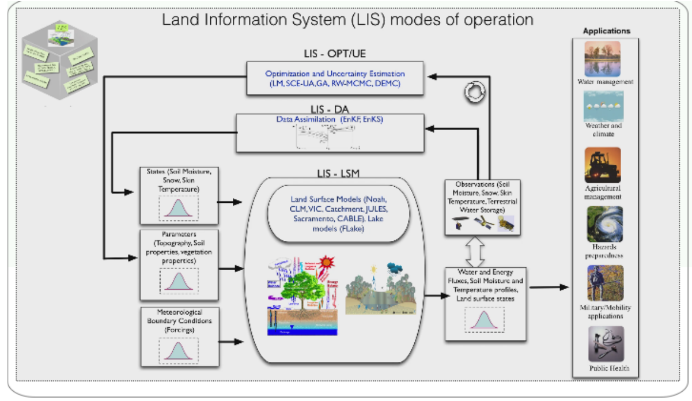

主要关注的物理量和之前的基本一样：

- Rain Amount           (TRMM, GPM)
- Snow Cover            (Terra and Aqua MODIS)
- Soil Moisture         (SMAP, NLDAS/GLDAS)
- Runoff/Streamflow     (TRMM, GPM, NLDAS/GLDAS)
- Lake Level Height     (Jason-2)
- Evapotranspiration    (Terra and Aqua MODIS, Landsat, NLDAS/GLDAS)
- Terrestrial Water     (GRACE)
- Regional Water Budget (NLDAS/GLDAS)

用到的数据获取分析可视化的工具依旧是这些：

- [Mirador](https://disc.gsfc.nasa.gov/mirador-guide): Precipitation, LDAS -Run Off, Soil Moisture, ET
- Reverb-ECHO: 现在已经搜不到，如果这个是用来搜索数据的，那么可以查看：https://data.nasa.gov/browse 或 https://search.earthdata.nasa.gov/search
- [Giovanni](http://giovanni.gsfc.nasa.gov/giovanni): Geospatial Interactive Online Visualization And aNalysis Infrastructure -- Selected Data Access [Precipitation, LDAS – Run Off, Soil Moisture, ET]
- [PPS-STORM](https://storm.pps.eosdis.nasa.gov/storm): Precipitation Processing Systems - Science Team On-Line Request Module [Precipitation] 
- [NSIDC](https://nsidc.org/), JPL Snow Server: Snow Cover. JPL Snow Server 现在网站应该已变，在NSIDC查看相关数据足够，earthdata上可以访问-- https://earthdata.nasa.gov/eosdis/daacs/nsidc 
- [GFMS](http://flood.umd.edu/): Global Flood Monitoring System [Run Off/Streamflow]
- [USDA Crop Explorer](https://ipad.fas.usda.gov/cropexplorer/global_reservoir/): Reservoir Height

水资源数据可以应用的方面：

- Water Allocation: Water Budget including all the freshwater components 
- Agricultural and Irrigation Management: Precipitation, Soil Moisture, Evapotranspiration
- Flood/Drought Management: Precipitation, Runoff/Streamflow, Soil Moisture, Evapotranspiration, Ground Water
- Reservoir/Dam Management: Reservoir Height, Precipitation, Runoff/Streamflow 

几个典型的例子可以参考：

- [The Distributed Water Balance of the Nile Basin](https://svs.gsfc.nasa.gov/cgi-bin/details.cgi?aid=4044)：可以看到尼罗河流域的水分布情况宏观尺度上可以很好地获取基本信息
- [Irrigation Management Using Satellite-based ET](https://ecocast.arc.nasa.gov/simsi/about/)：用卫星产品获取的蒸散发数据来为灌溉服务
- [A Drought Monitoring Decision Support Tool for the Navajo Nation](https://develop.larc.nasa.gov/2015/summer_term/NavajoNationClimateII.html)：基于TRMM和GPM获取降水数据监测干旱
- [ National Drought Monitoring with GRACE Terrestrial Water Data](https://drought.unl.edu/Home.aspx)：利用GRACE数据观测国家尺度干旱
- [NASA Satellites Allow USDA to See World’s Lakes Rise and Fall](https://ipad.fas.usda.gov/cropexplorer/global_reservoir/)：监测全球湖和水库的水位变化
- [Streamflow Estimates, Flood Detection, Landslide Estimation](http://flood.umd.edu/)：GFMS全球洪水监测系统

更多内容可以参见：[ENHANCING WATER MANAGEMENT](https://appliedsciences.nasa.gov/what-we-do/water-resources)

### Precipitation and Soil Moisture Data Access and Applications 

TRMM 和 GPM 观测一览：

- TRMM Microwave Imager (TMI) (Passive Sensor)
    - Frequencies: 10.7, 19.4, 21.3, 37, 85.5 GH
    - Swath: 760 km (870* km)
    - Resolution: 5 to 45 km (channel-dependent)
- Precipitation Radar (PR) (Active Sensor)
    - Frequencies: 13.6 GHz (Ku band)
    - Swath: 220 km (247* km)
    - Resolution: 5 km
- GPM Microwave Imager (GMI) (Passive Sensor)
    - Frequencies: 10.6,18.7,23.8,36.5,89,166 & 183 GHz
    - Swath width: 885 km
    - Resolution: ~4 to 32 km ((channel-dependent)
- Dual-frequency Precipitation Radar (DPR) (Active Sensor)
    - Frequencies: 13.6 GHz (Ku), 35.5 Gz (Ka)
    - Swath: 245 km, 120 km
    - Resolution: 5.2 km 
    
实际最常用的数据：

- TMPA: TRMM Multi-satellite Precipitation Analysis
- IMERG: Integrated Multi-satellitE Retrievals for GPM

都是多卫星星座一起获取的降水估计数据，情况一览：

|| IMERG| TMPA|
|-|-|-|
|Temporal Resolution | 30-minutes| 3 hours|
|Spatial Resolution| 0.1°x0.1° |0.25°x0.25°|
|Spatial Coverage| Global 60°S to 60°N| Global  50°S to 50°N | 

关于GPM IMERG 数据集，有不同的数据

Multiple runs accommodate different user requirements for latency and accuracy

- “Early” – 4 hours (flash flooding)
- “Late” – 12 hours (crop forecasting)
- “Final” – 3 months (research data)

Time intervals are half-hourly and monthly (Final only)

0.1° global CED grid

- PPS will provide subsetting by parameter and location
- initial release covers 60°N-S

User-oriented services

- interactive analysis (GIOVANNNI)
- alternate formats (KMZ, KML, TIFF WRF files, …)
- area averages

Half-hourly data file (Early, Late, Final)

1. [multi-sat.] precipitationCal
2. [multi-sat.] precipitationUncal
3. [multi-sat. precip] randomError
4. [PMW] HQprecipitation
5. [PMW] HQprecipSource [identifier]
6. [PMW] HQobservationTime
7. IRprecipitation
8. IRkalmanFilterWeight
9. probabilityLiquidPrecipitation [phase]

Monthly data file (Final)

1. [sat.-gauge] precipitation
2. [sat.-gauge precip] randomError
3. GaugeRelativeWeighting
4. probabilityLiquidPrecipitation [phase]

其中，PPS: Precipitation Processing System  CED: Cylindrical Equidistant 

关于Snow data，主要是MODIS Standard Products: Daily, 8-Day, Monthly Snow Cover available from Terra and Aqua (Data Start Date: 2000-02-24; Daily, 8-Day, Monthly; Coverage: Global Multiple Spatial Resolutions)

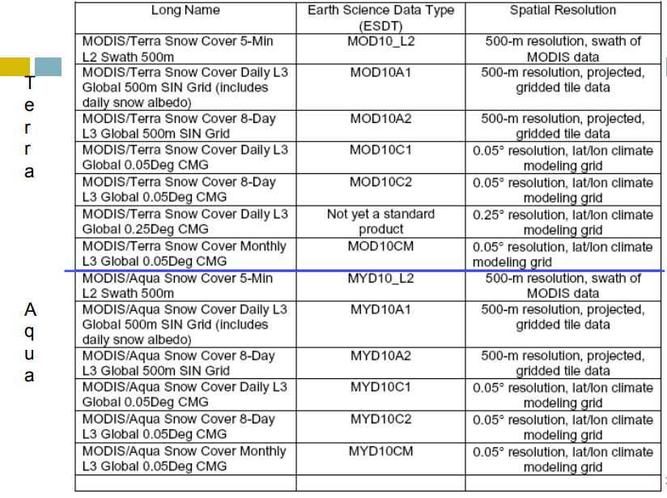

MODIS 还有近实时的snow数据：https://lance-modis.eosdis.nasa.gov/

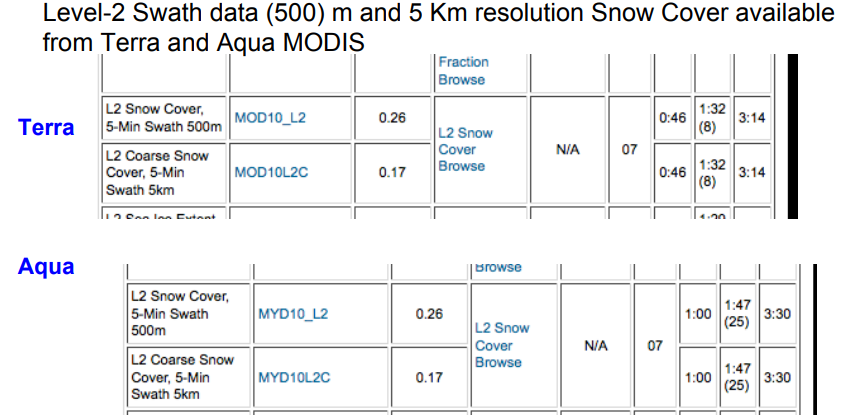

限制主要是（Limitation of MODIS Data）：No Snow Mapping Under Clouds

一个应用于水资源的例子：MODSCAG, Snow and Dust Radiative Forcing Information, along with CBRFC Modeling Analysis is used in Decision Making for River Basin management  -- [USE OF SNOW DATA FROM REMOTE SENSING IN OPERATIONAL STREAMFLOW PREDICTION](https://www.cbrfc.noaa.gov/papers/snow_rs_op_streamflow_prediction_2014WSC.8.pdf)

关于soil moisture，主要来自SMAP。详细的资料可见：[SMAP Mission Description](https://smap.jpl.nasa.gov/mission/description/)

soil moisture 用途十分广泛：

- Enhanced weather & climate forecasting
- Improved agricultural productivity and crop yield predictions
- Drought monitoring and early warning
- Flood monitoring and prediction
- Human health and vector borne diseases 

SMAP provides a capability for global observations of soil moisture and its frozen or thawed state at high spatial resolution and frequent temporal revisit： SMAP provides 10-40 km spatial resolution, 3-day global revisit, accuracy of 0.04 $m^3/m^3$

SMAP同时又主动遥感和被动遥感双监测，SMAP的波段范围：

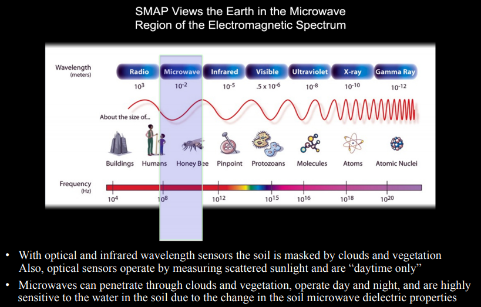

关于测量的方法，如下图所示：

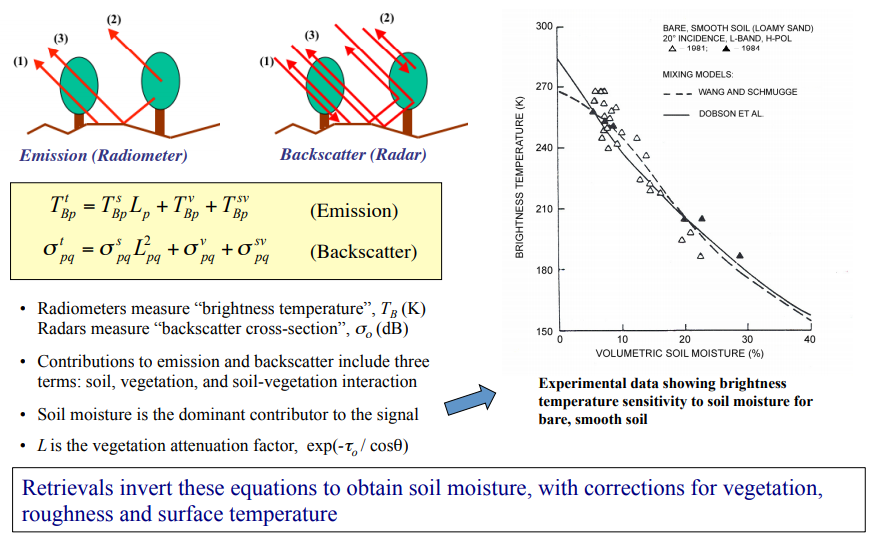

SMAP各级数据产品一览：

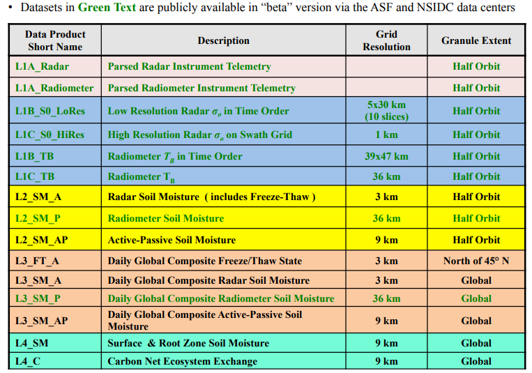

SMAP的雷达15年7月的时候坏了，不过总体上SMAP现在还能持续生成数据。原PPT介绍了以下产品，详情可参考SMAP Handbook。

- Radar Level 1C Product：只有 April 13-July 7, 2015 是有数据的。
- Radiometer Level 1B Product
- L2 Radiometer 36 km Soil Moisture Product 
- L2 Active/Passive 9 km Soil Moisture Product 
- L4 Surface and Root-Zone Soil Moisture Product：Based on assimilation of SMAP brightness temperatures from the L1C_TB and L2_SM_AP products into a state-of-the-art land surface model 
- L4 Carbon Product

SMAP Radar Level 1 Products 可以在 ASF DAAC 获取: [ASF SMAP 网站](https://asf.alaska.edu/data-sets/sar-data-sets/soil-moisture-active-passive-smap-mission/)；数据接口-- [ASF Data Access and Distribution](https://asf.alaska.edu/api/) 以及 [Vertex](https://vertex.daac.asf.alaska.edu/)

Level 1 Radiometer Products 以及所有的 SMAP Level 2, Level 3 和 Level 4 Products 可以在 NSIDC DAAC 获取: [NSIDC SMAP 网站](https://nsidc.org/data/smap/); [NSIDC 数据搜索](http://nsidc.org/data/search/)

NASA的一个可视化网页：[Worldview](https://worldview.earthdata.nasa.gov/), [Worldview github网址](https://github.com/nasa-gibs/worldview)

SMAP数据的应用，比如将其同化到天气系统中。

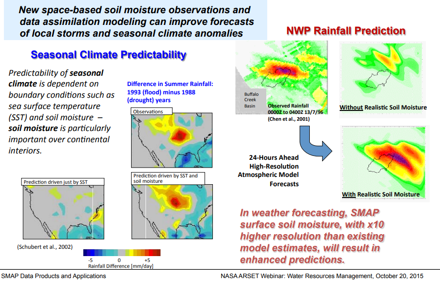

还有比如Flood的例子：

Application of a SMAP-Based Index for Flood Forecasting in Data-Poor Regions，暂时没找到论文，有个网站可以关注：http://www.eohandbook.com/eohb2015/case_study_2.html

这是[SATELLITE EARTH OBSERVATIONS IN SUPPORT OF DISASTER RISK REDUCTION](http://www.eohandbook.com/eohb2015/index.html)下的内容。

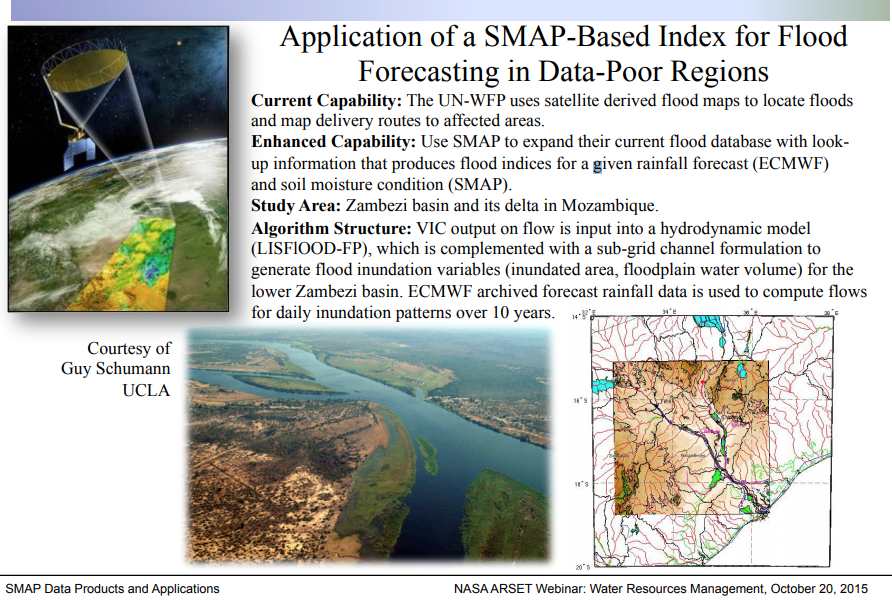

还有应用于 Crop Yield 的。

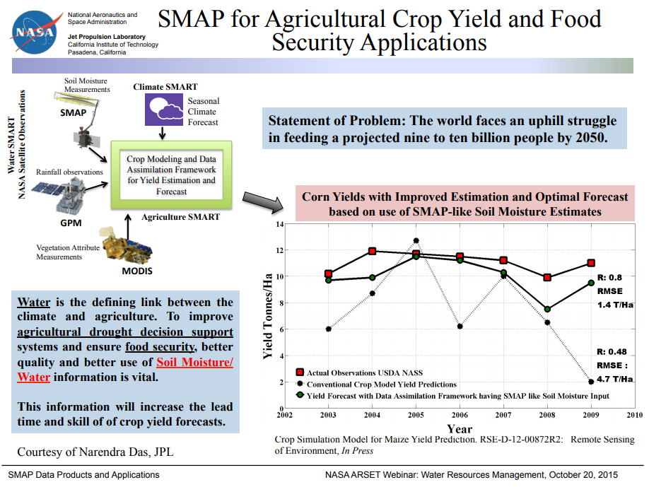

更多内容可以参考：[SMAP Applications](https://smap.jpl.nasa.gov/science/applications/)

### Run off, Streamfow and Reservoir Level Data

径流数据暂时没有遥感直接观测数据，不过可以由卫星观测和地面观测结合物理模型模拟得到。

再复习下runoff和streamflow的区别：

- Run Off
    - Excess water from rain and/or snowmelt
    - Depends on soil saturation and infiltration capacity, rain/snow melt intensity, terrain
- Streamflow
    - Flow of water in rivers, streams
    - Runoff that carries water from land to ocean 

run off更像是产流值，streamflow是河道中径流，更多指汇流结果。

NLDAS 结合高质量地表驱动数据集和地表模型来生成一致性的产品数据。

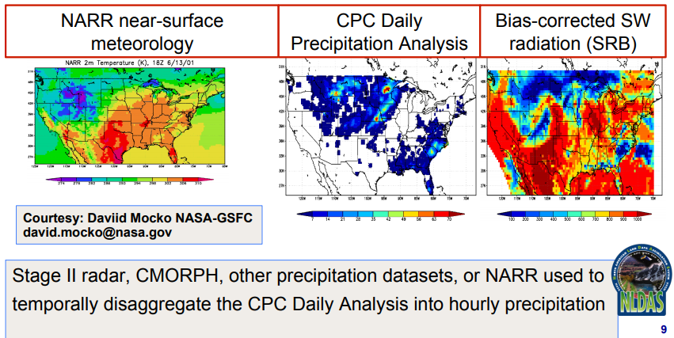

NLDAS使用了多个地表模型，包括VIC/Noah/SAC/Mosaic等。

GLDAS使用了多种数据输入，有多个输出值：

- [GLDAS uses Different Sources of Inputs](http://ldas.gsfc.nasa.gov/gldas/GLDASforcing.php) 
    - Meteorological Analysis
    - Surface Solar Radiation
    - Precipitation
    - Soil Texture
    - Vegetation Classification and Leaf Area Index
    - Topography
- Integrate Output for Water Resources
    - Soil Moisture
    - Evapotranspiration
    - Surface/Sub-surface Runoff
    - Snow Water Equivalent 
    
在[NASA网站](http://disc.gsfc.nasa.gov/hydrology)上可以较容易获取到NLDAS和GLDAS相关数据:

- Access via GDS, FTP, or quick-look visualization in Giovanni (below right)
- GRIB and NetCDF formats
- 3-hourly and monthly; 1.0° and 0.25° global grids
- On-the-fly subsetting (below left)
- Full documentation
- NLDAS & GLDAS support a growing number of national and international hydrometeorological investigations and water resources applications

- NLDAS: 0.125°, 1979-present (operational at NOAA/NCEP, 3.5 day latency), 25 to 53N, -125 to -67W, hourly/monthly: Noah, Mosaic, VIC 
- GLDAS v1: 1.0°, 1979-present (1-2 month latency), Noah, Mosaic, VIC, CLM2 0.25°, 2000-present: Noah w/ MODIS snow cover assimilation
- GLDAS v2: 1.0° & 0.25°, 1948-2012, Noah
- GLDAS v2.1 & v2.2 (coming soon): 1.0° & 0.25°, 1948-present, with multivariate data assimilation, Noah, Catchment, VIC, CLM4.5 

GLDAS/NLDAS Run Off 数据可以从[Mirador](http://mirador.gsfc.nasa.gov/)或[Giovanni](http://giovanni.gsfc.nasa.gov/giovanni/)获取

|Model|Spatial Resolution|Temporal Resolution|Temporal Coverage|
|-|-|-|-|
|GLDAS (NOAH V 1) |0.25°x0.25° 1°x1°|3-hourly Monthly|2000-Present|
|NLDAS VIC |0.125°x0.125° |Hourly Monthly Climatology|1979-Present |

GLDAS-VIC (Variable Infiltration Capacity) 1948-2000 Run Off Data 月平均数据可以在这里获取：[International Research Institute/Princeton University (1°x1° Monthly Run Off, Climatology)](http://iridl.ldeo.columbia.edu/SOURCES/.Princeton/.VIC/.runoff/) 

Run off 数据很难验证，不过使用流域观测的streamflow数据可以间接地来验证，一些有用地文献可以参考：

- Zaitchik, B.F., M. Rodell, and F. Olivera, Evaluation of the Global Land Data Assimilation System using global river discharge data and a source to sink routing scheme, Water Resour. Res., 46, W06507, doi:10.1029/2009WR007811, 2010.
- Lorenz, C., H. Kunstmann, B. Devaraju, M. J. Tourian, N. Sneeuw, J. Riegger, Large-scale Runoff from Lanmasses: A global Assessment of the closure of the hydrology and atmospheric water balances, J. Hydrometeorology, 15, 2111-2139, DOI: 10.1175/JHM-D-13-0157.1, 2014.
- Xia, Y. L., K. Mitchell, M. Ek, B. Cosgrove, J. Sheffield, L. F. Luo, C. Alonge,H. L. Wei, J. Meng, B. Livneh, et al., Continental-scale water and energy flux analysis and validation for North American Land Data Assimilation System project phase 2 (NLDAS-2): 2. Validation of model-simulated streamflow, J Geophys Res, 17, D03110, DOI: 10.1029/2011JD016051, 2012.

从[GFMS](http://flood.umd.edu/)可以获取streamflow数据。GFMS提供global maps, time series, and animations (50°S-50°N) of：

- Instantaneous Rain
- Accumulated rain over 24, 72, and 168 hours
- Streamflow rates at 1/8th degree (~12 km) and also at 1 km 

GFMS通过利用水文模型和遥感数据来进行洪水监测：

- Inputs: TRMM and Multi-satellite Precipitation (TMPA) Surface temperature and winds from MERRA*
- Runoff generation from U. Washington Land Surface Model (Variable Infiltration Capacity - VIC)
- Runoff routing model from the U. Maryland 

For details see:

- Wu, H., R. F. Adler, Y. Tian, G. J. Huffman, H. Li, and J. Wang (2014), Real-time global flood estimation using satellite-based precipitation and a coupled land surface and routing model, Water Resour. Res., 50, 2693.2717, doi:10.1002/2013WR014710.
- Wu H., R. F. Adler, Y. Hong, Y. Tian, and F. Policelli (2012), Evaluation of Global Flood Detection Using Satellite-Based Rainfall and a Hydrologic Model. J. Hydrometeor, 13, 1268.1284

在网站上：http://flood.umd.edu/ ，可以通过操作地图来查看streamflow数据。美国的数据是比较好的，中国的相对还是较少。

在网站上这行字里：DATA AVAILABILITY: Flood Detection/Intensity at 1/8th degree resolution are available from [here](http://eagle2.umd.edu/flood/download/)，可以查看二进制数据文件。通过代码可以读取相关数据。

接下来是卫星测高，可以用来测量湖泊水库高程的卫星有：

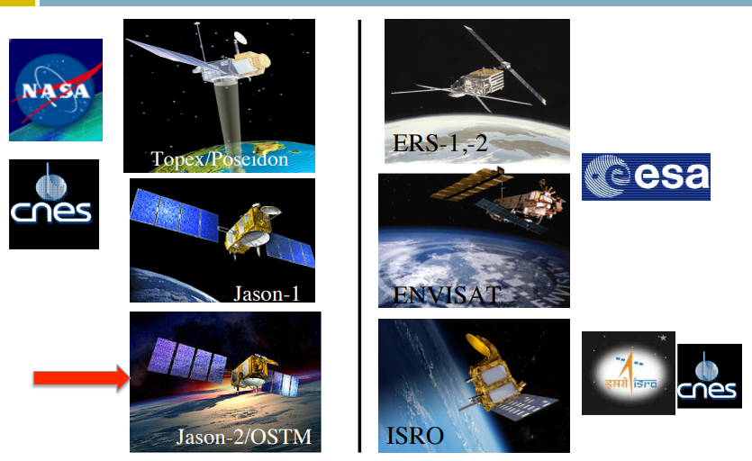

现在可以提供的是最大水体的高程，精确度也还有待提升，前面已有记录，这里不再赘述。

### Evapotranspiration and Ground Water Data 

推求ET的方法：

|Method |Spatial Resolution|Source|Availability|
|-|-|-|-|
|Land Surface Models: NLDAS/GLDAS|1 - 1/8 degree (Global)|NASA/NOAA|Free/download|
|Other Physical Models: MODIS|1km (Global) |University of Montana |Free/download|
|Energy Balance: METRIC/SEBAL|30 m (Local, Regional)|Various|Not Free/contract |
|Vegetation/ET Relationships |30 m (Local, Regional)|Various|Free/Not Free|
|ALEXI|10 km – 30 m |USDA|Free/download |

首先，看看MODIS ET产品。

MODIS (Moderate Resolution Imaging Spectroradiometer) 的一些参数这里再放一次：

- Spatial Resolution
    - 250m, 500m, 1km
- Temporal Resolution
    - Daily, 8-day, 16-day, monthly, quarterly, yearly
    - 2000-present
- Data Format
    - Hierarchal data format – Earth Observing System Format (HDF-EOS)
- Spectral Coverage
    - 36 bands (major bands include Red, Blue, IR, NIR, MIR)
        - Bands 1-2: 250m
        - Bands 3-7: 500m
        - Bands 8-36: 1000m 
        
MODIS 的 全球 ET产品获取的基本方法前面已经记录过，产品基本参数如下：

- Spatial Resolution 0.5 km
- Spatial Coverage: Global
- Time frame: multi-day, annual
- Time period: 2001-01-01 - present
- Data download: 原文档给的网站 http://www.ntsg.umt.edu/project/mod16 找不到该数据，google搜索可以在这里看到数据：[MODIS Evapotranspiration](https://modis.gsfc.nasa.gov/data/dataprod/mod16.php)，可以在NASA的数据搜索种寻找相关数据：https://lpdaac.usgs.gov/product_search/

下面，看看Landsat。

使用 Landsat 的原因有：

- Landsat allows field-level ET
- Landsat has a thermal band which is important for some ET approaches 

简而言之，分辨率高，波段重要。它的光谱特点：

- Landsat instruments measure primarily light that is reflected from Earth’s surface (with one exception)
- Landsat instruments are designed to detect visible and infrared (near and mid) wavelengths. 

Energy balance 和 Vegetation Indices 前面都已经记录了，这里就不赘述了。

关于groundwater，主要是GRACE观测其变化，补充一点前面没提到的概念。

Global Groundwater Stress： RGS = use / availability，其中

- use: withdrawal statistics or GRACE
- availability: simulated aquifer recharge

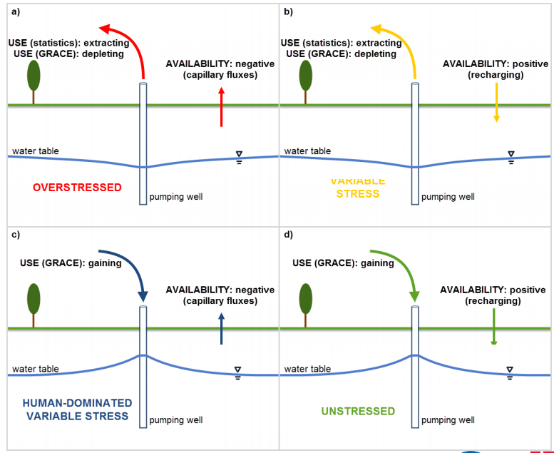

### Introduction to Land Data Assimilation Systems (LDASs) 

网站：https://lis.gsfc.nasa.gov/ 。这一小节重点介绍了陆地数据同化系统的一些基本概念。

首先水循环基本概念，水在水循环中有多种阶段，以多种相态存在变化，相态的变化伴随着能量的变化。关键过程一个图：

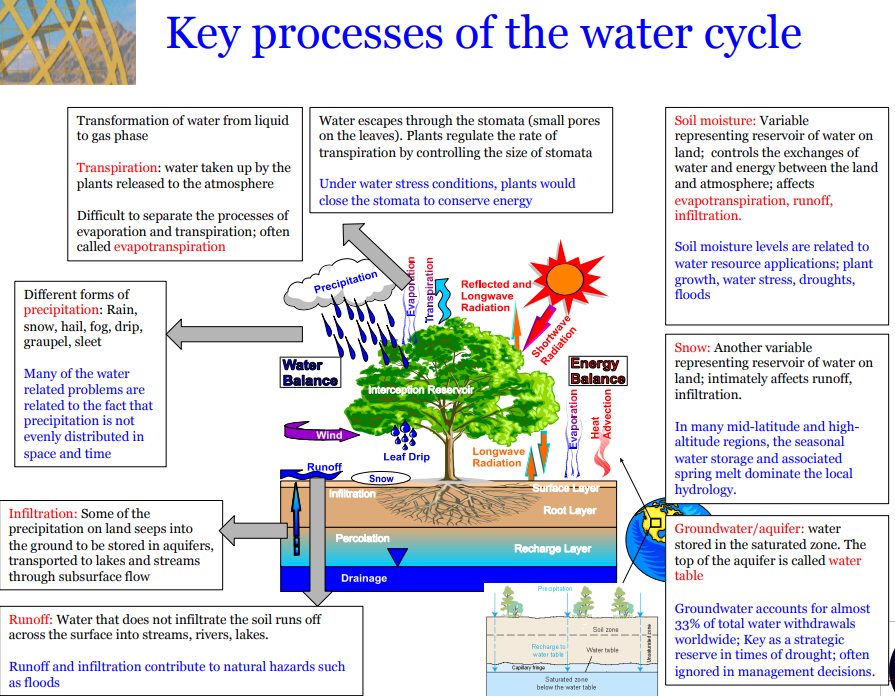

主要有：蒸散发、降水、渗透、径流、土壤含水、地下水、积雪等。

水循环观测方式主要有in-situ, remote sensing, 和 numerical model这三类。

in-situ观测不同water component的一些方式：

- Precipitation: Surface Gages and Doppler Radar
- Radiation: DOE-ARM, Mesonets, USDA-ARS
- Surface Temperature: DOE-ARM, Mesonets, NWS-ASOS, USDA-ARS
- Soil Moisture: DOE-ARM, Mesonets, Global Soil Moisture Data Bank, USDA-ARS
- Groundwater: Well Observations
- Snow Cover, Depth & Water: Field Experiments, SNOTEL
- Streamflow: Real-Time Stream Gauge
- Vegetation: Field Experiments
- Soils: Field Experiments

卫星观测（NASA）：

- Precipitation：(TRMM, GPM) 
- Radiation：(CERES, CLARREO )
- Land surface temperature：(MODIS, AVHRR,GOES,… ) 
- Surface soil moisture：(SMMR, TRMM, AMSR-E, SMOS, Aquarius, SMAP) 
- Terrestrial water storage：(GRACE) 
- Snow water equivalent：(AMSR-E, SSM/I, SCLP)
- Snow cover fraction：(MODIS, VIIRS, MIS)
- Water surface elevation：(SWOT)
- Vegetation/Carbon：(AVHRR, MODIS, DESDynI, ICESat-II, HyspIRI, LIST, ASCENDS)

Land surface models：

Land surface models solve for **the interaction of energy, momentum and mass between the surface and the atmosphere**
$$R_n=\lambda E+SH+G$$
$$\frac{dS}{dt}=P-E-R$$
Estimates fluxes, land conditions (soil moisture, snow, runoff, …) 常见的模型有: Noah, CLM, VIC, Catchment, JULES … 

通常实际中会结合卫星观测和models，数据同化是常用的方法，将观测数据吸收入模型预报。这就是 Land Data Assimilation Systems(LDASs) 

其基本思想就是用最好的观测来inform model。[NASA Land Information System(LIS)](http://lis.gsfc.nasa.gov)就是NASA的LDASs 具体实现。

LDAS结合利用观测，建模和数据同化，以给实际应用提供信息。

- North American LDAS
    - NOAA, NASA, (and 6 other US institutions) 1998-present
    - 1/8 degree resolution, central North America
- Global LDAS
    - NASA (and NOAA) 2000-present
    - 1/4 and 1.0 degree resolutions, all land 60S-90N
- Land Information System (LIS)
    - NASA 2002-present
    - Software configurable for any domain and resolution
    - Multiple data assimilation options
    - Can be run uncoupled or coupled to an atmospheric model 
    
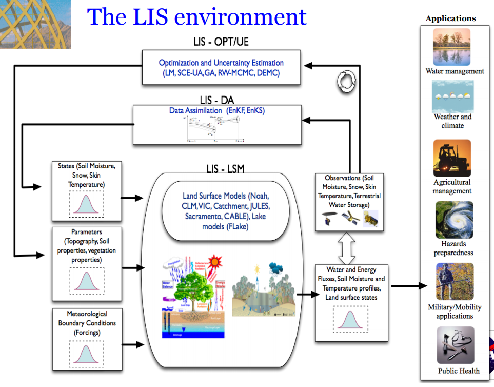

LDAS应用如图所示，有很多方面。比如：

- drought monitoring：可以利用 soil moisture, evapotranspiration, streamflow, groundwater estimates 
- flood monitoring：可用Runoff, streamflow fields 
- estimating crop water requirements：利用The simulated soil moisture fields 来计算 water requirement satisfaction index (WRSI)
- global crop product decision support system：也是利用soil moisture 输出。
- improving weather forecasts：Realistic simulation of land conditions from a LDAS can be used to initial weather and climate models, leading to improved weather forecasts

现在LDAS已经有很多版本：central North America (NLDAS), Europe (ELDAS), South America (SALDAS), Middle East North Africa (MENA-LDAS) and the globe (GLDAS) 

The common goal of these projects is to **integrate all relevant data in a physically consistent manner within sophisticated land surface models to produce optimal estimates of hydrological states (e.g. soil moisture, surface temperature) and fluxes (e.g. runoff, evapotranspiration) **