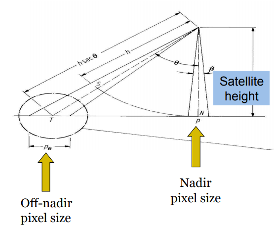
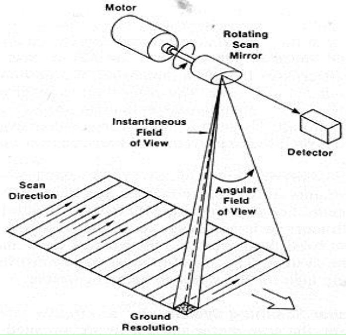

# NASA Remote Sensing Observations for Flood Management

该培训介绍了可用于**监测极端降水和洪水的遥感资源**，以及用于洪水管理和规划的洪水制图工具。 

### NASA Remote Sensing Data for Flood Management, Introduction to Flood Monitoring Tools

大部分前面都介绍了，这里简单补充一下更多关于分辨率的概念。

首先，关于卫星轨道运行的一些基本情况，可以参考landsat的视频，这里放一个b站的链接：[Landsat8官方介绍(5集全)](https://www.bilibili.com/video/BV1cJ411a78q?from=search&seid=17875756029381894380)。

几个关键概念，首先太阳同步轨道，Landsat每次下降沿的时候都在有阳光一面，所以是太阳同步轨，这样好处是受光照的情况是一致的，即使这个物体无论在升交点、降交点或轨道上任何的一点，在地球表面同一个点的上方时都在相同的平太阳时，即表面每次都接近相同的照明角度。这也对卫星观测分析是有利的。卫星一次扫描是一个seath，这个带宽对landsat是185km，可以估算下多少天能覆盖全球，landsat绕一圈是99min，一天大约10次，地球周长按40000公里，swath按200km，一天就是2000，那么需要20天，实际上landsat要覆盖全球就需要16天。这也就是对应了时间分辨率的概念。

遥感传感器有声学类的：

- Imagers: Create Images. Examples: MODIS, TMI
- Sounders: Provide vertical profiles. Examples: AIRS 

空间分辨率详解：

简单说就是一个像素的大小，卫星图像是以栅格形式存在的，所以每个像素都有一定对应的空间的大小。想象卫星传感器的观测角度，如果是垂直向下，那么能观测到的面积相对倾斜的一定是小的。

卫星观测的一瞬就是所谓IFOV(Instantaneous Field of View )。传感器是会扫动的，以获取更大的景，这就是Angular Field of View(AFOV)，另外，卫星也会动，这样就会形成swath。图示参考：[（被动）遥感概述](https://zhuanlan.zhihu.com/p/32699929).

而卫星传感器的空间分辨率，其实就是对应IFOV的。

然后是Spectral 和 Radiometric 分辨率。

前者是光谱分辨率，就是光谱通道的数目和宽度。更多和更细的光谱通道意味着遥感能观测更多不同部分的大气。这个理解就和之前提到过的物质的频谱特性有关了，不同物体对不同波段的光的反射特性是不同的，这里不赘述了。

后者是辐射分辨率。因为测量结果是一系列数字来表示的，二进制位数越高，说明能表示的数字也越多，也就是说在一定范围内能表达的辐射离散值是更多的，这就意味着传感器对地物反射或发射辐射能量的微小变化的探测能力越强，这就是更高的辐射分辨率。

以上就是一些简单的回顾。

接下来回归本节主题，遥感观测用于洪水观测主要用途在：

- To **infer flooding conditions** by using satellite-derived precipitation
- To **derive streamflow and runoff to monitor flooding conditions** by using rainfall and surface weather data in a **hydrology model**
- To **detect flood water on previously dry land surface** by using satellite-derived land-cover observations 

具体相关的信息有：

- Rain Rate and Accumulated Rain Amount
- Snow Melt Rate
- Soil Condition: soil moisture, temperature, land cover
- Reservoir/River Level
- Storm Water Drainage System (urban floods)
- Terrain

常遇到的卫星有：

- Landsat (07/1972-present)
- TRMM (11/1997-04/2015)
- GPM (2/27/2014-present)
- Terra (12/1999-present)
- Aqua (5/2002-present)
- SMAP (1/31/2015-present)
- GRACE (3/2002-present) 

前面都已经记录过了，这里就不赘述了。

### TRMM-based Flood Monitoring Web-tools 

大部分内容前面已经有了，这里补充一些。

一些应用，比如

- flood potential 估计：https://trmm.gsfc.nasa.gov/publications_dir/potential_flood_hydro.html
- [ERDS – Extreme Rainfall Detection System](http://www.ithacaweb.org/projects/erds/)
- TRMM/GPM-based Experimental River Discharge: [Dartmouth Flood Observatory (DFO)](http://floodobservatory.colorado.edu/); [Global Disaster Alert and Coordination System/Global Flood Detection System (GDACS/GFDS)](http://www.gdacs.org/flooddetection/) 
- [Global Flood Monitoring System (GFMS)]http://flood.umd.edu

### Regional Flood Management over Africa, Demonstration of the MODIS-based Inundation Mapping

主要是基于MODIS的洪水淹没图。前面有记录了，这里不赘述。

### Floodplain Management of the Mekong River, Demonstration of Selected Flooding Cases using Multiple Web-Tools and GIS

这里内容还是比较丰富的，本节主要记录这一小节。

首先，What	are	the	impacts	of	floods?

会造成生命财产损失，当然也能肥沃土壤，不过更多还是洪灾。由于人口经济增长，损失也会变大。随着全球气候变化，全球洪灾风险也增加。

- Benifis：
    - Replenish	soils	for	agriculture	
    - Support	fishing	industry	
    - Restore	groundwater	and	reservoirs
- Costs：
    - Loss	of	life	
    - Damage	to	infrastructure	
    - Damage	and	loss	of	crops	
    - Disruption	of	transportaJon	
    
洪水观测的方法：

- Vis/	NIR	-	MODIS,	Landsat,	or	higher	resoluMon	multi-spectral
    - Many	water	and	flood	indices,	classifications,	decision	trees	
    - Medium	to	high	resolution,	accuracy,	and	acquisiJon	frequency	
    - Limited	by	cloud	and	atmospheric	condiJons	
- Microwave	Radar	
    - High	resoluJon	and	accuracy	
    - Not	affected	by	clouds	
    - Limited	data	availability
- Microwave	Radiometer（radiometer通常是被动微波的，radar是主动的，比如SMAP mission上两者的配合）
    - Low	resoluJon	and	accuracy	
    - Not	affected	by	clouds	
    - Limited	data	availability
- Hydrological	Models	
    - Use	precipitation	and	land	surface	models	to	estimate	water	accumulation	
    - Resolution	dependent	on	data	
    - Accuracy	depends	on	models	and	data	used	
    
对于分类， Classification	of	Multi-spectral	Data，会使用一些机器学习算法来帮助。比如决策树。

另外，许多特定的指数可以用来观测vegetation和water，比如NDVI，NDWI等
$$NDVI=\frac{NIR-RED}{NIR+RED}$$
$$NDWI=\frac{GREEN-SWIR}{GREEN+SWIR}$$
雷达的应用比如：TerraSAR-X,	RADARSAT,	ENVISAT,	etc.

水文模型方面，计算runoff并利用routing model结合DEM可以估计 inundation的extent和depth。

常用的DEM数据，比如SRTM产品，其获取全球北纬60度到南纬56度之间的DEM。空间分辨率90m，2014年后可到30m。文件格式.HGT