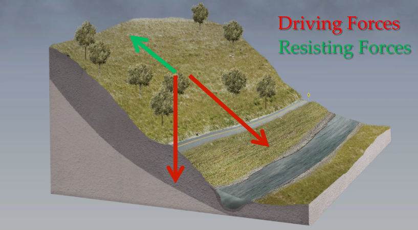

# Using NASA Remote Sensing for Disaster Management

这部分稍微了解下 Landslide即可。主要是session4.

Finding the Slippery Slope: Detecting Landslides from Space 

首先，为什么关注 landslides：

1. They are important geomorphologically
    - Movement of a mass of rock, debris, earth, or soil down a hill
2. They are pervasive 
    - Triggered in nearly every country in the world
3. They impact people 
    - Landslides have killed over 26,000 people worldwide since 2007 (~3,700/year) and impacted millions
    
Landslides：

Landslides全球都有，主要发生在下雨的时候，主要在北半球夏季。

遥感观测通常能发现其发生的地点，但是对于发生的时间，由于clouds及revisit times等的原因，通常较难获取。

landslide有时还会形成堰塞湖，影响下游安全。

那么如何对landslide activity进行建模？NASA卫星还是可以参与进来的。

相关的数据集：

|Data	type|Data	Set |Resolution/Map	Scale |Source	and	website|
|-|-|-|-|
|Elevation |Digital	Elevation	Models |ASTER,	near	global,	30m |https://asterweb.jpl.nasa.gov/gdem.asp|
||SRTM	30m |30m,	near	global |https://lta.cr.usgs.gov/SRTM1Arc|
|Forest	Loss |Global	Forest	Change	and	Land	Analysis	|30	m|http://glad.umd.edu/dataset|
|Road	Networks|Global	Roads:	gROADS|Variable|http://sedac.ciesin.columbia.edu/data/set/groads-global-roads-open-access-v1|
|Population |CIESIN	Gridded	Population	of	the	World	(V3)|30	arc-seconds,	~1	km|http://sedac.ciesin.columbia.edu/data/collection/gpw-v3|
|Precipitation	 |TRMM	Multi-satellite	Precipitation	Analysis	(TMPA)|0.25⁰	x	0.25⁰	3-hourly	resolution,	12	hr	latency|www.pmm.nasa.gov/data-access|
||Integrated	Multi-satellite	Retrievals	for	GPM	(IMERG)|0.1⁰,	30-minute,	5	hour	latency|www.pmm.nasa.gov/data-access|
|Modeled	Precipitation	|GEOS-5	model	(NASA),	24,	48,	73	hour	precip	forecast	(updated	every	6	hours)|0.3125˚	longitude	x	0.25-	degree˚	latitude|ftp://ftp.nccs.nasa.gov/fp/forecast/; http://gmao.gsfc.nasa.gov|
|Soil	Moisture|Soil	Moisture	Active/Passive	(SMAP)|~36	km,	1-3	day	latency	Higher	resolution	products	planned|https://nsidc.org/data/smap|

具体方法可以参考相关论文：

- Kirschbaum, D. B., Stanley, T. and Yatheendradas, S.: Modeling Landslide Susceptibility over Large Regions with Fuzzy Overlay, Landslides, doi:10.1007/s10346-015-0577-2, 2015.
- Kirschbaum, D. B., Stanley, T. and Zhou, Y.: Spatial and Temporal Analysis of a Global Landslide Catalog, Geomorphology, doi:10.1016/j.geomorph.2015.03.016, 2015.
- Kirschbaum, D. B., Adler, R., Hong, Y., Hill, S., & Lerner-Lam, A. (2010). A global landslide catalog for hazard applications: method, results, and limitations. Natural Hazards, 52(3), 561–575. doi:10.1007/s11069-009-9401-4