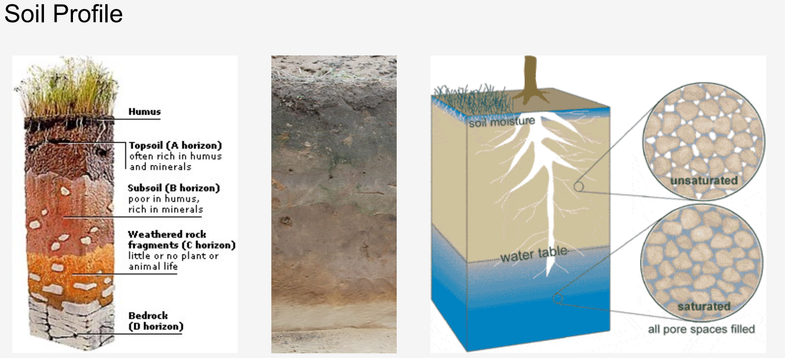
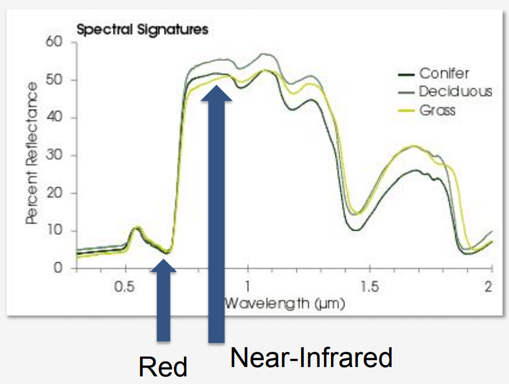
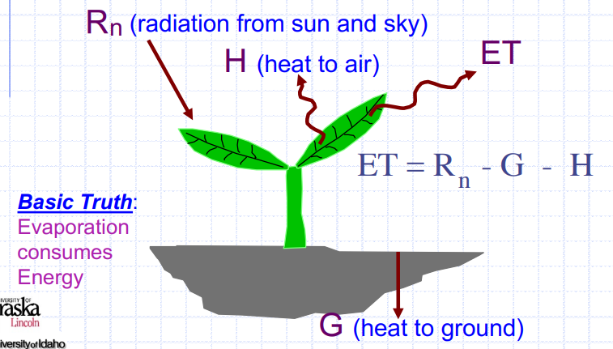
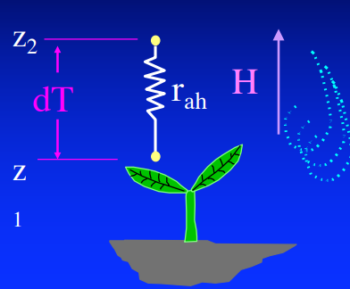

# Applications of Remote Sensing to Soil Moisture and Evapotranspiration

本节主要介绍了 土壤含水量 和 蒸散发数据的情况。

目标是了解 NASA Earth observation 资源里对以下内容有帮助的部分：

- how evapotranspiration(ET) and soil moisture（SM） are included in the water cycle
- how to access and visualize these data products 

###  Intro to Soil Moisture, Evapotranspiration (ET), and an Overview of the Soil Moisture Active Passive (SMAP) Mission

SM和ET是global和reginal fresh water budgets 的主要部分。在以下方面等有应用：

- Water resources management
- Flood and drought monitoring and management
- Agriculture 

soil moisture的观测主要就是利用SMAP数据。所以先看看overview of SMAP

地球上每一千克水中只有1毫克在储存为soil moisture。soil moisture 对水文过程，生态过程，气象过程有着显著的影响。

影响soil moisture的因素有：

- Soil moisture varies with space and time
- Primary factors that influence distribution of soil moisture: 
    - Rainfall
    - Soil Texture 
    - Vegetation
    - Topography

目前对soil moisture的地面观测还是很稀疏的，SMAP提供了一种针对全球尺度高时空分辨率观测soil moisture以及其frozen或thawed state的能力。其空间分辨率为10-40km，还有不少降尺度后的可达1km分辨率的产品。时间分辨率为3days的global revisit。准确度可以达到 0.04$m^3/m^3$

soil moisture 在如下多个方面都有应用：

- Enhanced weather & climate forecasting
- Improved agricultural productivity and crop yield predictions 
- Drought monitoring and early warning
- Flood monitoring and prediction
- Human health and vector borne diseases

SMAP的主要目标是每3天观测一次的soil top 5cm 的moisture，来帮助 理解terrestrial energy, water, and carbon cycles相关过程。估计全球water and energy terrestrial fluxes 以及量化 net carbon fluxes in the northern high latitudes 

SMAP uses active and passive sensors to measure soil moisture。即SMAP 有两个观测仪器，一个radar，但是已经坏了，还有一个radiometer。光的波段是microwave。

更多内容前面已经记录了，这里就不赘述了。

然后是overview of evapotranspiration。

前面也有介绍，因为记这个笔记的时候，我正好有计算ET的需求，所以这里再回顾下。

首先，ET对以下内容都有用：

- determining agricultural water consumption
- assessing drought conditions
- developing water budgets
- monitoring aquifer depletion
- monitoring crops and carbon budgets

然而由于ET受许多因素影响，比如：

- solar radiation at the surface
- land and air temperatures
- humidity
- surface winds
- soil conditions
- vegetation cover and types

所以在时空上有很高的变化性，而地面的lysimeter等观测有限，同时，遥感能提供时间分辨率尚可，空间上连续的全球的ET观测，所以是个不错的选择。

主要是两个卫星及其传感器：Terra and Aqua的 MODIS 以及 LandSat的OLI, ETM+,
TIRS。

|Satellite |Sensor|Parameter|
|-|-|-|
|Terra and Aqua |MODIS|Normalized Difference Vegetation Index (NDVI)；Leaf Area Index (LAI)；Albedo (fraction of surface solar radiation reflected back)|
|Landsat|OLI, ETM+, TIRS|Spectral Reflectance, Thermal Emission |

基于 red 和 near-infrared wavelengths：chlorophyll 对红光有很强的吸收作用，植被结构能很强反射near-infrared。

因此，NDVI是一个很好的判断植被的指标。
$$NDVI=\frac{Near-Infrared - Red}{Near-Infrared + Red}$$
其值范围为-1到1。加减的数是反射率，详情见：https://earthobservatory.nasa.gov/features/MeasuringVegetation/measuring_vegetation_2.php
越接近1，表示越可能是green leaves。负值到0表示没有green leaves

其他MODIS相关产品：

- Leaf Area Index
- Land Cover
- Albedo 

更多信息可以搜索：https://lpdaac.usgs.gov/product_search/

Enhanced Thematic Mapper (ETM+) 在Landsat7上，更多详细信息之前有，就不重复了。

Operational Landsat Imager (OLI) 和 Thermal Infrared Sensor (TIRS) 在Landsat8上。OLI的波段是前几个，TIRS是波长更长的红外的波段。

Landsat相比MODIS（1km）能提供更高分辨率的field-level（30m）的ET数据。

推求ET的方法主要是以下几种：

- Surface water balance: ET = Precipitation + Irrigation – Runoff – Ground Water + Vertical Water Transport ± Subsurface Flow ± Soil Water Content
- Surface engergy balance:ET (Latent Heat Flux) = Net Surface Radiation – Ground Heat Flux – Sensible Heating Flux
- meteorological and vegetation/crop data (Penman-Monteith )

GLDAS的land surface models有整合卫星和地面观测数据到基于水热平衡的数值模型中来计算ET。输入包括 surface solar radiation，precipitation，vegetation classification和LAI以及Topography。输出有soil moisture和evapotranspiration

surface energy balance 也是常用的估算ET的方法，使用MODIS或Lnadsat来获取地表温度和land cover。

也可以根据彭曼公式以及Vegetation和Crop的信息利用Kc系数来计算。

还有建立Kc系数和NDVI之间关系的，可以从MODIS获取。

那么基于遥感的ET数据产品有哪些呢？如下所示：

- Global产品：
    - MOD16: MODIS Global Evapotranspiration Project
        - http://ntsg.umt.edu/project/mod16
    - METRIC: Mapping EvapoTranspiration with high-Resolution with Internalized Calibration：没有找到相关数据，稍后会有更多补充
        - http://eeflux-level1.appspot.com/
    - ALEXI: Atmosphere-Land Exchange Inverse Model（后者找到了NOAA的链接，但是没有ET数据，前者数据是需要申请的，稍后会有更多补充）
        - https://data.eol.ucar.edu/dataset/77.103
        - https://www.ospo.noaa.gov/Products/land/index.html
    - GLDAS: Global Land Data Assimilation System（模型输出结果中有ET）
         - http://ldas.gsfc.nasa.gov/gldas/
- Regional Products: can be adapted for other regions
    - SIMS: Satellite Irrigation Management Support (California)
        - https://cimis.water.ca.gov/Default.aspx
    - NLDAS: North American Land Data Assimilation System (North America)（和GLDAS类似，也是输出中的一项）
        - http://ldas.gsfc.nasa.gov/nldas
    - SSEBop: Operational Simplified Surface Energy Balance (US & Africa)
        - https://earlywarning.usgs.gov/ssebop/modis/daily
    - ETWatch: Multi-Satellite Based Energy Balance Model (China)（可以搜到论文，暂时没有找到数据）
    
综上，直接能方便免费下载并使用的数据有：MOD16，GLDAS，NLDAS，SSEBop。

关于METRIC和ALEXI的更多内容，稍后补充。

下面先继续看看SMAP数据的应用。

### Applications	of	SMAP	Data

每次谈到soil moisture都会谈到：Why	measure	soil	moisture?主要有以下一些点：

- It	is	the	major	limi4ng	factor	on	agricultural	productivity	in	large	parts	of	the	world.
- Soil	moisture	has	an	impact	on	evaporation,	and	the	partition	of	heat	between	sensible	and	latent	heat,	and	impacts	weather	prediction
- Dynamic	global	vegetation	models,	which	feed	the	CO2	budget,	depend	on	soil	moisture	in	the	root	zone

soil moisture和land water，energy，carbon cycles都有联系，因此应用广泛。

SMAP Misson产品（radar坏了，所以都是radiometer产品）：

|产品|描述|网格分辨率|延迟时长||
|-|-|-|-|-|
|L1A_Radiometer|Radiometer Data in Time-Order|-|12 hrs|Instrument Data|
|L1B_TB|Radiometer $T_B$ in Time-Order|36* 47 km|12 hrs|Instrument Data|
|L1C_TB|Radiometer $T_B$ in Half-Orbits|36km|12 hrs|Instrument Data|
|L2_SM_P|Soil Moisture (Radiometer)|36km|24 hrs|Science Data (Half-Orbit)|
|L3_SM_P|Soil Moisture (Radiometer)|36km|50 hrs|Science Data (Daily Composite)|
|L4_SM|Soil Moisture (Surface and Root Zone)|9km|7 days|Science Value-Added|
|L4_C|Carbon Net Ecosystem Exchange (NEE)|9km|14 days|Science Value-Added|

SMAP还有一些enhanced product，这里暂不列了。

应用方面，有用于flooding的：

- Evaluate	global	scale	run	off	models	with	climate	models.	
- Evaluate	scenarios	at	the	global	scale	using	soil	moisture	data.
- Evaluate	the	scale	of	data	needed	for	decision	making.	

SMAP+precipitation 可以生成flood alert map。

还有用于Drought Monitoring， USDA Crop Condition Report等等。

### Accessing Soil Moisture Active Passive (SMAP) Data

EARTHDATA里能下载，有很多细节，这里暂不多说。

代码可以关注：https://github.com/nsidc/smap_python_notebooks

### Landsat-based (Field-Scale) Evapotranspiration Estimates - METRIC Overview and Applications

能量平衡的方法来计算是因为ET是从液态变为气态的水，蒸发需要吸热，而能量平衡的成分可以从地表温度来推求。

ET is calculated as a **“residual”** of the energy balance

能量平衡计算可以给我们 “actual” ET。因为它能照顾到影响ET的water shortage，disease，crop variety，planting density，cropping dates，salinity，management等多种因素。

那么显然，计算的关键就是如何去求$R_n$，H和G了。比如对H，在METRIC model中，Sensible Heat Flux (H) 计算如下：
$$H=(\rho * c_p * dT)/r_{ah}$$
各变量如下图所示：

整体计算过程是比较复杂的，更多细节还需要补充资料，这里暂略。

### Mapping Water Use and Drought with Satellite Remote Sensing

ALEXI也是能量平衡模型，原文有和NLDAS水量平衡计算比较的内容。