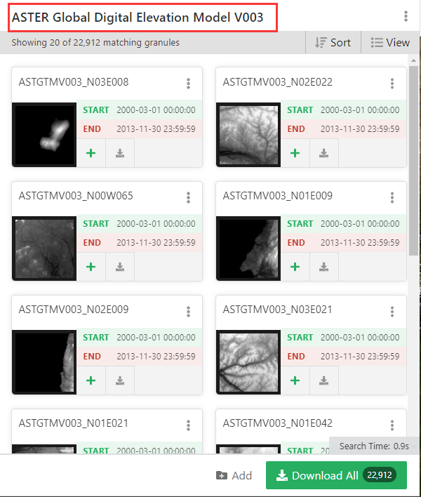
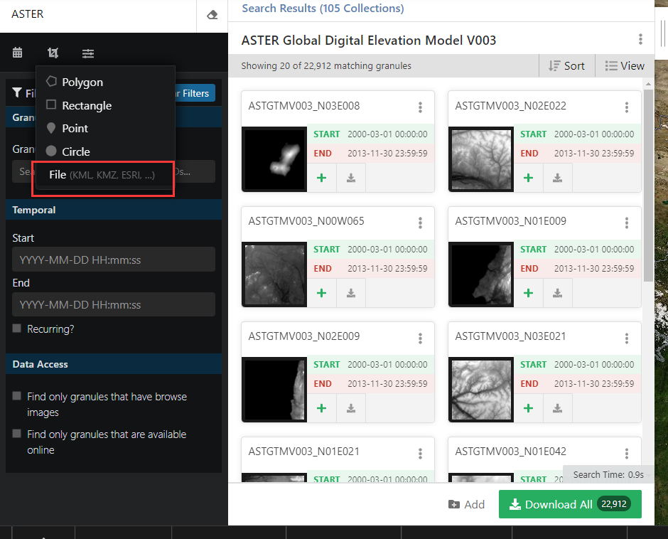
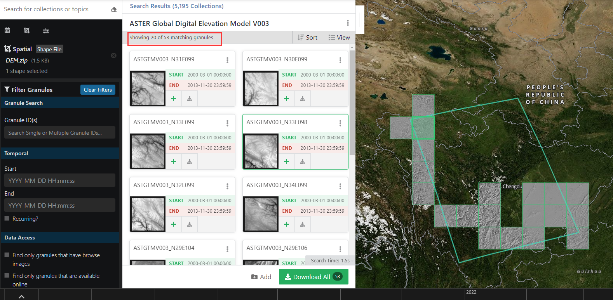
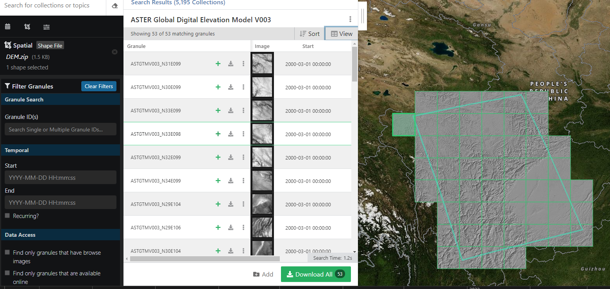
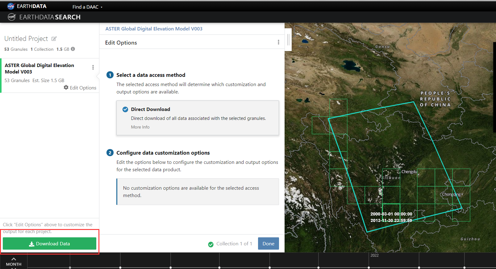
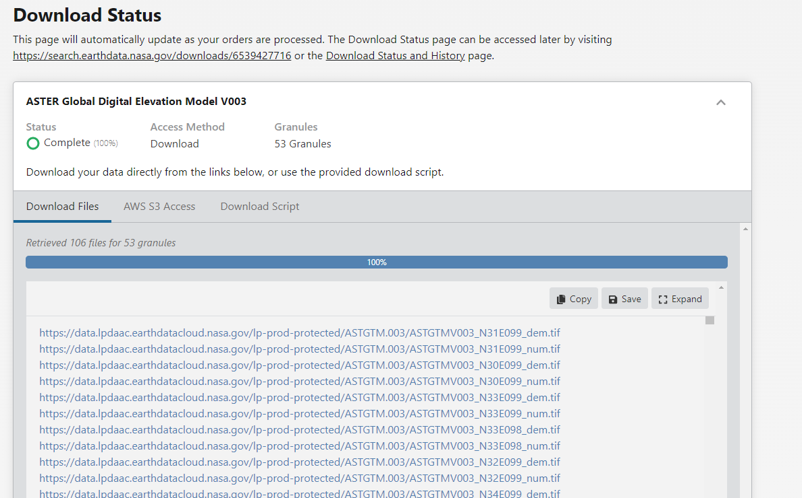
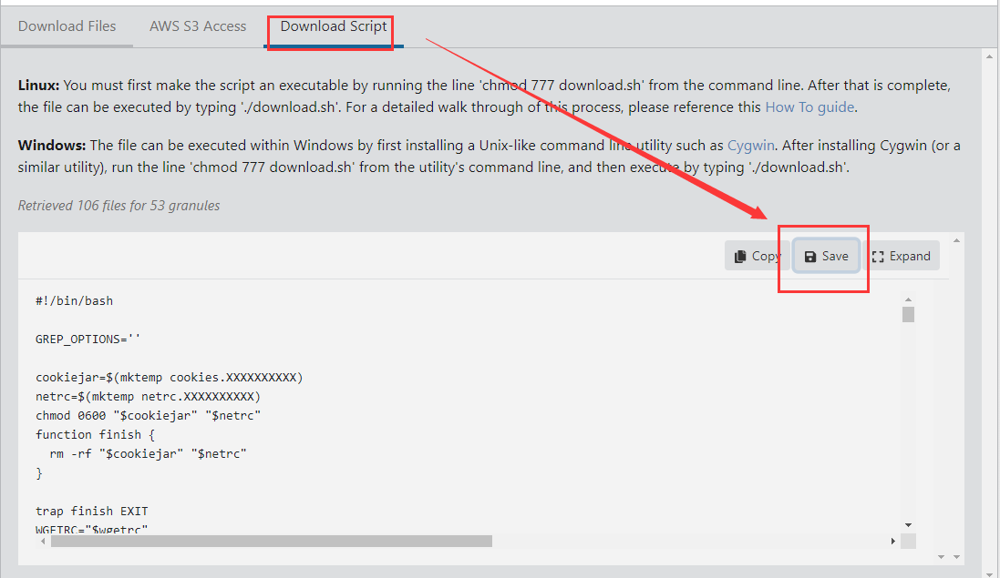
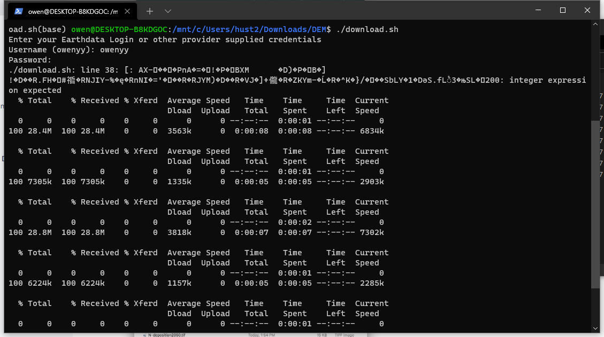

# DEM

DEM数据类型比较多，这里结合自己日常使用情况，简单记录下部分DEM数据下载使用的方法。

可参考的资料：

- [ajnisbet/opentopodata](https://github.com/ajnisbet/opentopodata)
- [SRTM Downloader Plugins in QGIS](https://sryhandiniputeri.medium.com/srtm-downloader-plugins-in-qgis-1809cfe8a9e8)

## 从 Earthdata 下载

首先你要有Earthdata的账号。要创建一个NASA Earthdata登录账户，请到[Earthdata登录网站](https://urs.earthdata.nasa.gov/)，点击 "注册 "按钮，该按钮在密码输入框下的绿色 "登录 "按钮旁边。填写必要的方框（用红色星号表示），然后点击页面底部的 "注册Earthdata登录 "绿色按钮。一封带有激活注册说明的电子邮件就完成了这一过程。注意可能需要科学上网。

然后进入这个网站：https://search.earthdata.nasa.gov/search/ ，搜索自己想要的DEM数据，比如我想要ASTER DEM，那么直接搜索 ASTER即可，一般使用的数据就是如下图所示的数据：



如果你有要DEM的区域shapefile，那么如下图所示导入：



但是注意不要是个边界太复杂的shapefile，否则容易导不进去。

本文件夹下给了一个示例shapefile -- DEM.zip，导入后会看到如下图所示的界面：



有53个匹配的，界面上显示了20个tiles。完全显示的话，会如下图所示：



点击上图中的绿色“+”号即可选中要下载的数据，全部选中，然后点击右下角绿色的下载键即可进入下载页面（如果你还没登录Earthdata，则会登录后跳转）



点击下载键就会进入到一个下载链接页面：



然后可以点击链接一个个下载，也可以使用给的脚本下载，这里直接使用脚本下载了，如下所示操作下载脚本，并重新命名 download.sh，一会儿数据会下载到同一个文件夹下，所以可以在download.sh所在处新建一个DEM文件夹，并把download.sh放进去：



因为是linux脚本文件，windows下还需要根据提示处理，如果你在linux下安装了ubuntu（方法请参考[这里](https://github.com/OuyangWenyu/elks)），那么可以直接在ubuntu下执行脚本，这里就采用这种方式了。

首先在刚下载的脚本下打开windows终端（在[这里](https://www.microsoft.com/en-us/p/windows-terminal/9n0dx20hk701)可以下载安装），然后执行下面语句（详情请参考[这里](https://wiki.earthdata.nasa.gov/display/EDSC/How+To%3A+Use+the+Download+Access+Script)）：

```Shell
bash
cd DEM
chmod 777 download.sh
./download.sh
```

然后输入用户名密码（输密码的时候是不显示的，所以慢点输，确保正确）即可下载：


