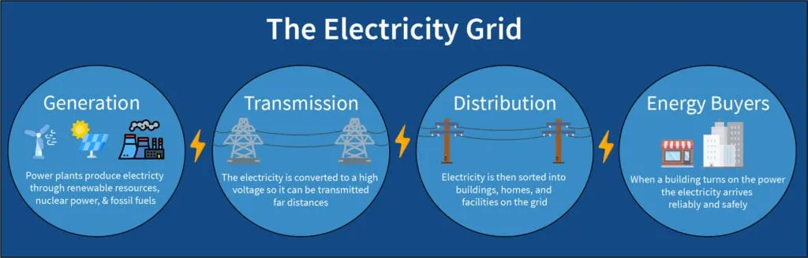

# 美国电力系统中的基本概念

参考资料包括：

- [为什么电力系统频率由负荷决定？](https://www.zhihu.com/question/35918477)
- [U.S. electric system is made up of interconnections and balancing authorities](https://www.eia.gov/todayinenergy/detail.php?id=27152)
- [About 60% of the U.S. electric power supply is managed by RTOs](https://www.eia.gov/todayinenergy/detail.php?id=790)
- [A matter of balance](https://www.tanc.us/understanding-transmission/a-matter-of-balance/)
- [Energy 101: Electricity – The Wizard Behind the Curtain](https://bestpracticeenergy.com/2020/05/21/energy101-electricity-iso/)
- [Regional transmission organization (North America)](https://en.wikipedia.org/wiki/Regional_transmission_organization_(North_America))

本文主要帮助了解 Balancing authorities， ISO/RTO, Interconnection等 概念。

## 平衡机构

在一个较高层面上简述，电力的使用是这样的：各种发电机（核电、风力涡轮机、煤炭、石油、天然气等）创造电力商品，根据需求，由电网设备分配和传输，并进入建筑物、家庭。

发电厂产生的电力在到达客户之前会通过一个由变电站、电力线和配电变压器组成的复杂网络。在美国，电力系统由 7,300 多个发电厂、近 160,000 英里的高压电力线以及数百万条低压电力线和配电变压器组成，连接着 1.45 亿客户。

从原理上说，电能的生产和消耗是需要平衡的，且电能是难以直接大量存储的，而如果电力供需不平衡，则会导致停电、供电频率异常等故障，破坏用电设备的正常运行。

为了确保发电、输电和配电系统都能可靠地工作，以满足区域能源需求，美国对电力区域进行了划分，各区域有平衡机构，它们通过控制整个地区以及相邻平衡机构之间的电力生产和传输负责维护区域内的电力平衡。每天每个小时，平衡当局都在进行一场精致的舞蹈。平衡机构有多种方法来维持供需平衡，比如打开或关闭发电机，或者向/从邻近区域输入或输出多余的电力。平衡机构是美国电力系统实际运行的管理实体。大多数（但不是全部）平衡机构是承担电力系统特定部分平衡责任的电力公司。

## 区域性输电组织

美国还有区域性输电组织，也起到平衡的作用，更重要的是它们负责整个电力市场的运营。电力市场交易过程是复杂的，比如电力供应商购买批发电力市场期货，然后以零售合同的形式将其卖回给能源买家。能源顾问通过利用市场洞察力和情报来推动供应商之间的市场竞争，为企业量身定制采购策略，并形成保护性合同，从而促进这一交易并为该过程增加价值，所有这些都为能源购买者降低了总体成本。如此复杂的过程，谁来促进市场并负责确保整个过程顺利进行呢？

这就是 ISO/RTO。RTO即区域传输组织，和ISO（独立系统运营商）在语义上没有明确区别。它是根据美国联邦能源监管委员会 (FERC)的建议成立的组织，负责协调、控制和监控特定地理区域的电网。它们是负责整个电网以及指定区域市场过程的首要电力机构。

在 ISO 出现之前，单一实体拥有电网上的发电、输电和配电权力。能源买家几乎无法选择从谁那里购买能源，这导致了恶意的商业行为、垄断和用户的整体价格上涨。这还使出现想要进入该领域来为买家发电、传输或提供电力的新供应商变得非常困难。所以美国就设立了一系列法律推出了了独立系统运营商和区域传输组织。

简而言之，ISO/RTO 的成立是为了减少政府监管，增加市场竞争，倡导经济效率、电网可靠性，并监管所有市场参与者，以确保他们的行为是公正和中立的。它们负责以下方面：

- 调度发电厂并规划其区域内的扩张和新资源
- 拥堵的管理和缓解
- 控制用于电压、监控和切换服务的传输设施
- 在发电和负载之间保持电网平衡
- 预测和调度发电，以确保有足够的发电和备用电源满足需求
- 为电力市场交易提供平台并管理流程

如果把整个电网看作一个身体，电力就是流经它的血液，而 ISO 是掌管一切的大脑。没有大脑，整个系统就无法工作。

不过并不是所有地方都有ISO，总共十个区域输电组织 (RTO) 在北美大部分地区运营大容量电力系统。2009 年，美国 RTO 管理了提供给负载服务实体的60% 的电力。在该国其他地区，电力系统由个别公用事业公司或公用事业控股公司运营。

RTO 有许多不同类型的成员：

- 独立的发电机、输电公司和负载服务实体，
- 结合发电、输电和配电功能的综合公用事业，以及
- 其他实体，例如电力营销商和能源交易商。

RTO 通过将来自发电机和负载服务实体的日前和实时报价以及机组特性等其他信息提供给复杂的优化软件来调度电力。他们以短至五分钟的时间间隔在系统上发布数千个地点的大量价格数据。

对 RTO 的更多信息感兴趣的人可以点击下面的链接到 RTO 的网站，并查看 FERC 的 RTO 日前和实时价格的每日摘要。

- [California ISO](http://www.caiso.com/)	[FERC CAISO Daily Report](http://www.ferc.gov/market-oversight/mkt-electric/california/CAISO-rto-dly-rpt.pdf)
- [ERCOT RTO](http://www.ercot.com/)	(Not regulated by FERC)
- [SPP RTO](http://www.spp.org/)	(SPP does not produce day-ahead prices.)
- [MISO RTO](http://www.midwestmarket.org/home)	[FERC MISO Daily Report](http://www.ferc.gov/market-oversight/mkt-electric/midwest/miso-rto-dly-rpt.pdf)
- [PJM Interconnection](http://www.pjm.com/)	[FERC PJM Daily Report](http://www.ferc.gov/market-oversight/mkt-electric/pjm/pjm-rto-dly-rpt.pdf)
- [NYISO](http://www.nyiso.com/public/index.jsp)	[FERC NYISO Daily Report](http://www.ferc.gov/market-oversight/mkt-electric/new-york/nyiso-rto-dly-rpt.pdf)
- [New England ISO](http://www.iso-ne.com/)	[FERC ISO-NE Daily Report](http://www.ferc.gov/market-oversight/mkt-electric/new-england/isone-rto-dly-rpt.pdf)

## 互联

为了可靠性和商业目的，地方电网相互连接以形成更大的网络。在最高层，美国本土 48 个州的电力系统由三个主要互连 interconnection 组成，它们在很大程度上彼此独立运行，它们之间的电力转移是有限的。

- 东部互联包括落基山脉以东的地区和德克萨斯州北部的一部分。东部互联由 36 个平衡机构组成：31 个在美国，5 个在加拿大。
- 西部互联包括落基山脉以西的地区，由 37 个平衡当局组成：34 个在美国，2 个在加拿大，1 个在墨西哥。
- 德克萨斯电力可靠性委员会 (ERCOT) 覆盖了德克萨斯的大部分地区，但不是全部，并且由一个平衡机构组成。

互连的网络结构通过提供多条电力流动路径和允许发电机向许多负载中心供电，有助于维持电力系统的可靠性。这种冗余有助于防止输电线路或发电厂故障导致服务中断。这些互连描述了电网的物理系统。

总之，按个人理解，电网的物理运行还是主要由平衡机构来负责，而市场运行则是由区域性输电组织等处理。ERCOT 比较特别，其独特之处在于平衡权限、互连和区域传输组织都是同一个实体和物理系统。
