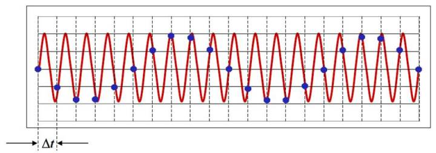

# GRACE数据简介

GRACE数据是水文领域经常会用到的数据之一，因此有必要认识GRACE，GRACE数据还有其在水文领域的应用情况。本文的内容基本来自[GRACE官网](https://grace.jpl.nasa.gov/)。

## Mission

首先，简单认识GRACE任务。GRACE是一对卫星，2002年3月17日发射，目的是观测地球重力场变化，革新关于地表水库，冰，海洋以及地震和地壳变形的调查。美欧两方支持了GRACE的全部运作。

GRACE TELLUS提供方便使用的Level－3的数据给了很多地理相关，分析地球水文，冰冻圈和海洋质量变化的应用。

关于重力场的观测这里就不表了，非常复杂，我搞不懂的。

## Data

这部分重点关注。卫星观测的重力的月变化是由质量的月变化引起的。质量的变化可以当作近地表的一个薄水层的厚度的变化－－equivalent water thickness（比如几千米的厚度）。实际上，月尺度重力变化大部分就是由水文水库的水量变化；移动的海洋，大气和陆地的冰；和这些地球系统组成之间的质量交换导致的。其深度由equivalent water thickness厘米来度量，远远小于地球半径或变化的水平尺度（km来度量）。重力有些变化是有soild earth的质量再分布引起的，比如一次大地震，或由此导致的冰川均衡调整，这些变化解释为equivalent water thickness是不正确的，因此是需要修正的。

大气质量通过使用ECMWF的大气压场处理来去除，因此GRACE Tellus的地表质量网格是不包含陆地和大陆冰（比如格陵兰岛和南极洲）的大气质量变化的；
使用了一个海洋模型来去除高频风和压力驱动的海洋移动，否则可能会混叠成月重力（这需要先补充些基本知识，见文末，这里的意思个人理解就是用了一个低通滤波器来避免混叠），如果该模型很好，那么重力场是不反映海洋的变化的。不过为了在海洋上使用这些结果，GRACE Tellus海底压力场将每月平均的海洋模型网格加了回去。这也是为什么分开提供OCEAN和LAND grids的原因之一。

最后可用的数据就是changes in equivalent water thickness relative to a time-mean baseline。海洋和陆地的网格是不同的filter处理的，以在过滤噪声的同时保存真实的地理信号。这是level－3的数据。

GRACE是同类任务的第一个，因此对数据处理的修正是频繁的。三个地面中心CSR (U. Texas / Center for Space Research); GFZ (GeoForschungsZentrum Potsdam); and JPL (Jet Propulsion Laboratory)生产Level－2的数据（spherical harmonic fields）。其输出包括重力场和dealiasing fields 的spherical harmonic coefficients（球谐函数相关内容见文末）。

以上三个机构发布的数据是官方版本的，不过也还有其他的数据中心提供基于GRACE的mass grids。目前GRACE-Tellus 数据来自最近的GRACE重力场：Release 05 from CSR, JPL and GFZ。OCEAN version from RL05 是 'RL05.DSTvDPC1401' ， LAND version from RL05 是 RL05.DSTvSCS1401'。

另一种方法解决重力变化的方法是使用质量瘤(或mascons)作为基函数。质量瘤是指一颗行星或卫星的地壳上一处具有比周边地方有更强引力的地域。使用mascons作为基函数的优势是每个mascon都有已知的特定地理位置，不像spherical harmonic coefficients没有特定局域信息。可以利用这个方便的属性在数据反演过程中指定先验信息(约束)，从而在内部消除重力解中的相关误差。因此，与RL05无约束球面调和解不同，约束mascon解通常不需要去条纹或平滑。mascon方法还可以更好地分离陆地和海洋信号。

## Applications

使用GRACE数据的应用研究很广泛，这里关注几个和水相关的应用领域。这也是本文的核心部分。

### 干旱监测

干旱特征元素典型地包括干旱类型，频率，持续时间，强度，严重程度，和影响范围。干旱的定义是复杂的，仍需要更准确的能描述干旱条件时空演变的识别方法的发展。

对水文干旱，在合适的时空尺度上观测所有有必要描述的相关水文变量，比如snow, surface water, soil moisture, and groundwater，依然存在挑战。而GRACE可以提供月尺度的关于water storage variations throughout all components of the surface and subsurface water balance that was previously unobtainable的完整信息。

因为GRACE观测total water storage variability，区域的GRACE时间序列能用来描述典型的variablity，以及与典型行为的偏差。这些偏差能提供：a quantitative estimate of essentially how much water would be needed to be added to storage in order to return to “normal” conditions and recover from a drought event。

GRACE数据同化到 land-surface model 能生成water storage and flux estimates的改进模拟。GRACE数据同化也证明了能 increase correlation between TWS estimates and gauged river flow, 这说明 data assimilation has considerable potential to downscale GRACE data for hydrological applications。

基于GRACE的干旱指标作为北美干旱调查的一部分。以前干旱指标都缺乏对 deep soil moisture and groundwater conditions的客观信息。现在USGS观测井的groundwater storage和Soil Climate Analysis Network的soil moisture用来评估GRACE TWS data同化的效果。研究结果显示，美国大部分地区的水文模型技术得到了适度，在统计上具有重要意义的改进，这凸显了一个被GRACE同化的water storage field 在改善干旱探测方面的潜在价值。

美国国家航空航天局戈达德太空飞行中心的科学家**目前每周**为国家干旱监测系统生成地下水和土壤湿度干旱指标。它们是根据GRACE卫星数据得出的 terrestrial water storage观测数据，并利用复杂的陆地地表水和能源过程的数值模型与其他观测数据相结合推出的。

### Flood Potential

**Longer lead-time flood prediction** could greatly minimize flood-related losses, but requires **accurate information on the hydrologic state of an entire river basin**, that is, **its total water storage**.

这些信息传统的观测是很难获取的。而The GRACE satellite mission provides a means to observe **monthly variations** in **total water storage** **within large (>200,000 km2) river basins** based on measurements of changes in Earth’s gravity field: when **the amount of water stored in a region increases**, the **gravity signal in that region increases proportionately**, and is detected by the GRACE mission with tremendous accuracy. The **terrestrial water storage signal** defines the **time-variable ability of the land to absorb and process water**, and accounts for the **water beneath the surface**.

土壤含水量在预测洪水和径流方面很关键，GRACE data can show us **when river basins have been filling with water over several months**. When it finally rains and the basin is full, there is nowhere else for the water to go

利用GRACE的遥感观测数据和storage-based ‘flood potential’ method已被证明在确定全球主要洪水发生方面是有用的。在GRACE记录的时间长度范围内，每个区域都倾向于表现出effective storage capacity，超过这个容量，额外的降水必须通过显著增加径流或蒸发来满足。这些saturation periods 表明这些地区可能向洪水易发性地区转变。

将基于grace的洪水潜力的预测能力与使用传统输入数据源(如河流高度、雪量和表层土壤湿度)的洪水预测模型进行了比较。2011年密苏里河特大洪水的一个案例研究表明，包含total water storage信息有可能将区域洪水预警的准备时间延长至5个月。

GRACE storage deficit estimates可以与传统的降水预报方法结合使用，以帮助评估洪水的可能性。周期性GRACE信号对于global modeling也有一定的价值，其中基于网格的模型需要一些effective storage capacity的度量。与目前基于 storage anomaly的方法相比，同化基于grace的storage deficit可以提供额外的好处。

### 地下水

Tracking groundwater changes around the world

世界上大部分的地下水储备来自化石含水层。这意味着水最后一次补充到地下蓄水层是在很久以前:大约在1万到2万年之间，那时我们的星球正处于最后一次冰河时期。因此，这些水在我们生活的时间范围内是不可再生的。过度使用是不可持续的。

但是全球地下水观测时很难的，即使在美国也很难。NASA’s GRACE mission provides the first opportunity to **directly measure groundwater changes** from space。By observing changes in the Earth’s gravity field, scientists can **estimate changes in the amount of water stored in a region**, which cause changes in gravity. GRACE已经有超过10年的数据来，这使得我们能有机会在长期范围内了解我们的水资源被使用的趋势。GRACE has returned data on **some of the world’s biggest aquifers** and how their water storage is changing。 Using **estimates of changes in snow and surface soil moisture**, scientists can **calculate an exact change in groundwater in volume over a given time period**.

在印度西北部有研究利用来terrestrial water storage-change observations from GRACE 和一个data-integrating水文建模系统得到的模拟soil-water variations。其结果显示在印度拉贾斯坦邦、旁遮普和哈里亚纳邦(包括印度),地下水正以平均速度4.0 + / - 1.0厘米的等效水位(17.7 + / - 4.5立方千米一年)耗尽。在2002年8月至2008年10月的研究期间，地下水枯竭相当于净损失109 km3的水，是印度最大的地表水水库的两倍。

在像加州Central Valley这样的高产农业地区，地下水通常是灌溉用水的主要来源，但由于缺乏监测基础设施和缺乏用水报告要求，地下水耗竭率的量化仍然是一个挑战。Famiglietti等人2011年的一篇论文使用了GRACE的78个月(2003年10月至2010年3月)的数据来估计加州萨克拉门托和圣华金河流域的蓄水变化。他们发现，这些流域正以31.0±2.7 mm 每年的当量水高度失水，相当于研究期间有30.9 km3的体积，这接近美国最大的水库——Lake Mead的容量。他们利用额外的观测和水文模型资料，确定这些损失的大部分是由于Central Valley的地下水枯竭造成的。

这些数字很有趣，因为它们描述了**人类对水资源的影响**。当天气干燥，河水减少时，我们倾向于用更多的地下水来满足农业、家庭和工业的需要。因此，**人类活动可以直接导致由气候引起的局部干旱的增加**。澳大利亚的大含水层(坎宁盆地)、中东、华北平原、印度北部、美国南部高平原含水层，当然还有加州的中央山谷，在GRACE记录期间，都被表明受到了严重影响。GRACE是第一个能够从太空中估算这些含水层“缺失”水量的工具。在政府间气候变化专门委员会(IPCC)最新的报告(AR5)中，地下水抽取估计占目前全球海平面上升速度的15-25%。

### GRACE Applications Focus Areas

最后根据[Applications Plan for the Gravity Recovery And Climate Experiment (GRACE) Missions: GRACE, GRACE-FO, and Future Missions](https://grace.jpl.nasa.gov/internal_resources/114/)再稍作补充：

The most obvious opportunities are currently in the areas of **water resources** including **surface and groundwater, climate, natural disasters and surveying and navigation**

关于水资源方面：

**Seasonal and interannual changes in water availability** including water stored in surface waters, groundwater, and snow and ice can be quantified using GRACE.

可以使用GRACE数据关注的是季节性和年际变化。比如地下水是气候变化和人类活动影响的一个重要指标。结合GRACE数据和水温模型能量化大区域的地下水变化。 Observations will provide
information on **seasonal and large-scale (>100,000 km2) river basin water storage changes**, human influences on regional water storage changes and, evapotranspiration, which may affect water management and policy decisions. 

Assimilation of GRACE data into land data assimilation models enables **the generation of higher resolution data products**. GRACE data assimilation is currently being used to generate **weekly drought indicator maps** . 

另一个 GRACE applications research 的重要例子是**the incorporation of GRACE－based groundwater observations within water supply decision support tools**, including **GRACE data assimilation within terrestrial hydrology models**. These tools would be useful for **responding to the combined effects of climate change and anthropogenic water consumption**. Numerous end users utilize output information of these data assimilation tools in their respective decision making. 

## 基础补充

GRACE数据了解过程中有一些基本概念需要简单了解才能把逻辑捋顺。

### Spherical harmonics

补充说明下 The spherical harmonics，这一小段主要参考了维基百科[Spherical harmonics](https://en.wikipedia.org/wiki/Spherical_harmonics)。spherical harmonics是数学物理科学中定义在球体表面的一类特殊函数，通常被用来求解偏微分方程。 The spherical harmonics是球面上正交函数集，因此可以用来表示球面上定义的任意函数，就像通过cos，sin和傅立叶级数能表示任何周期函数一样。就像傅立叶级数中的cos和sin， the spherical harmonics可以通过空间角频率来构建。在笛卡尔坐标系中， the spherical harmonics形式最简单，可以被定义为 homogeneous polynomials of degree l in (x,y,z)，遵从Laplace方程，因此被称为 harmonic。 spherical harmonics在很多应用中都十分重要，比如3D计算机图形学，多极静电场和电磁场的表示，计算原子轨道电子构型,**引力场的代表**,**大地水准面**,以及行星和恒星的磁场,以及宇宙微波背景辐射的表征等。

关于傅立叶变换和球谐函数之间的类比的更详细解释可参考一个回答[傅里叶变换与球谐函数展开有何相似之处？](https://www.zhihu.com/question/52859906/answer/700007373)。

关于傅里叶变换，可以参考这篇比较经典的[博客](https://zhuanlan.zhihu.com/p/19763358?columnSlug=wille)。简单总结下，周期信号三个关键：振幅，频率和相位，一个信号，从这三方面对应的时间，频率和相位看，有三个图，如作者的图所示：

傅立叶级数就很好理解了，就是cos sin作正交基可以构建任意周期信号，傅立叶级数也可以利用欧拉公式写成指数形式。这实际上是把定义在实数直线R上的周期函数看作了一个等价的定义在复平面上的单位圆周T上的函数F，T上的点可以写成$e^{i \theta}$(设为z)，又因为单位圆上相位2pi的周期性，所以傅立叶分析就是把R上的函数分解为$z^n$的线性组合（插播FT，对于非周期信号，或者说周期无限大的信号，如何分析频域特性？这时候就要上傅立叶变换了。根据这个[视频](https://www.bilibili.com/video/av20317906)，可以这么理解，一个非周期的时域上很短的信号可以看作是我们并不确定其到底包含了多少频率，那么转换到频域上较好的处理就是所有频率上都有分量，所以离散非周期信号转换到频域上成了连续的，而傅里叶变换就是可以识别出哪些频率的概率更大，对应该频率的数也更大，也就是说傅立叶变换还是识頻器的作用，在数学表达上，利用欧拉公式在复数域上进行表达，傅立叶变换的$z^{-n}$就能把如前所述的频率抵消，所以能识别出来频率）。

插播完毕，回到球谐函数，函数$z^n$就是T的特征标，即基。现在设想F不是定义在T上，而是定义在单位球面$S^2$上，那么函数F是怎么样的？这里的推广就没有那么直接了，因为定义T的是一些复数的集合，推广到高维时难找类似一维的基，因此通过另外的方式，回到实数域上，$sin(n\theta)$,$cos(n\theta)$都可以表示为$sin(\theta)$，$cos(\theta)$的多项式。所以**基本的函数可以看作是某些多项式在单位圆周上的限制**。而这些多项式是调和齐次的。一个调和的多项式p(x,y)是满足Laplace方程$\triangle p=0$的多项式（三角符号是Laplace算子）。Laplace算子是线性算子，所以调和多项式可以构成一个向量空间，因此可以作基。这个概念就可以推广到高维了。一个n阶d维的球面调和，就是一个d个变量的n次齐次调和多项式在d－1維球面上。这些多项式就是球谐函数，球谐函数就是laplace方程的解。

这些作基的多项式是正交多项式最好了，在球谐函数中，关心的是勒让德多项式，勒让德函数。勒让德函数是勒让德微分方程(Legendre Differential Equation)的解，而勒让德方程是物理和工程领域里面常常遇到的一类常微分方程，也是拉普拉斯微分方程的一种变形，当**试图在球坐标中求解三维拉普拉斯方程（或者其他偏微分方程的时），问题经常会归结为勒让德方程的求解**。所以其实球谐函数是laplace方程在球坐标系下的解，这个解称作伴随勒让德多项式。

得到伴随勒让德多项式就可以得到对应每个band(球谐基)的函数。所以定义在球面上的函数可以用球谐函数展开成二重广义傅立叶级数（参考[球谐光照与PRT学习笔记](https://zhuanlan.zhihu.com/p/50208005)）。形如：
$$f(\theta ,\phi)=\sum _{l=0}^{\infty} \sum _{m=-l}^{l}C_l^m Y_l^m (\theta ,\phi)$$

其中，$C_l^m$就是频域上的系数了。其求解和傅立叶级数系数的求解类似，用积分变换，
$$C_l^m=\int _S f(s)Y_l^m (s)ds$$
也就是频域上的系数等于原函数与球谐函数的乘积在球面上的积分。这个过程称为投影projection。
在实际中是不可能对无穷级数储存和卷积操作的，展开项是有限的：
$$\widehat{f}(s)=\sum _{l=0}^{n-1}\sum_{m=-l}^{l}C_l^m Y_l^m (s)=\sum_{i=0}^{n^2}c_i y_i (s)$$
其中n是球谐基band的数量，显然n个band的球谐基数量是$\frac{(1+2n-1)n}{2}=n^2$个。这个过程是一个带限的近似(band limited approximation)。在这个语境下，因为频域信号带宽的限制，大于一定阈值的高频信号就被去掉了。所以我们只能用$n^2$个预计算的球谐系数(SH Coefficient)和球谐函数本身**近似地重建出原函数**：

从图中可以看出，球谐展开阶数越高，能重构出来的信号就越精确。

## Aliasing

参考[百度词条](https://baike.baidu.com/item/%E6%B7%B7%E5%8F%A0/6996184?fr=aladdin)和一篇[博文](https://zhuanlan.zhihu.com/p/23923059)，混叠（英语：Aliasing），在信号频谱上可称作叠频；在影像上可称作叠影，主要来自于对连续时间信号作取样以数字化时，取样频率低于两倍奈奎斯特频率。在统计、信号处理和相关领域中，混叠是指取样信号被还原成连续信号时产生彼此交叠而失真的现象。当混叠发生时，原始信号无法从取样信号还原。一个例子直观理解：

当采样频率设置不合理时，即采样频率低于2倍的信号频率时，会导致原本的高频信号被采样成低频信号。如图所示，红色信号是原始的高频信号，但是由于采样频率不满足采样定理的要求，导致实际采样点如图中蓝色实心点所示，将这些蓝色实际采样点连成曲线，可以明显地看出这是一个低频信号。在图示的时间长度内，原始红色信号有18个周期，但采样后的蓝色信号只有2个周期。也就是采样后的信号频率成分为原始信号频率成分的1/9，这就是所谓的混叠：高频混叠成低频了。

一个生活例子：小时候都见过家中的吊扇，当转速越来越快时，出现的现象是先顺时针旋转，然后静止，然后逆时针旋转。这是因为人眼在看物体时，人眼也有一定的采样速率。当人眼的采样速率跟不上越来越快的转速时，就会出现混叠现象。静止不动时的转速对应的频率就是人眼的采样速率。对于倒转现象是因为高速旋转的叶片转速非常快，在短时间内从0度顺时针旋转到330度时（假设的情况），人眼观察到的似乎是从360度逆时针旋转到330度，因此，看起来像是在倒转。

为了避免此情形发生，要怎样做呢？怎样才能最小化混叠或者消除混叠呢？可以想象如果信号中没有高于奈奎斯特频率的频率成分，那么则不存在混叠，即要求采样频率极高，使得实际信号都位于奈奎斯特频率以下。但是这在实际不总是实用和可能的，因为很多信号谁也不知道其真实的频率成分。另一个方面，虽然采样频率极高可以一定程度上避免混叠，但这样会导致出现大的数据文件，同时，最高采样频率受数据采集设备的限制。

另外，采样定理只保证了信号不被歪曲为低频信号，即使高的采样频率也不能保证不受高频信号的干扰，如果传感器输出的信号中含有比奈奎斯特频率还高的频率成分存在，ADC同样会以所选采样频率加以采样，使高于奈奎斯特频率的频率成分混入分析带宽之内。

故在采样前，应把高于奈奎斯特频率成分以上的频率滤掉，这就需要抗混叠滤波器，它是一个低通滤波器：低于奈奎斯特频率的频率通过，移除高于奈奎斯特频率的频率成分，这是理想的滤波器。