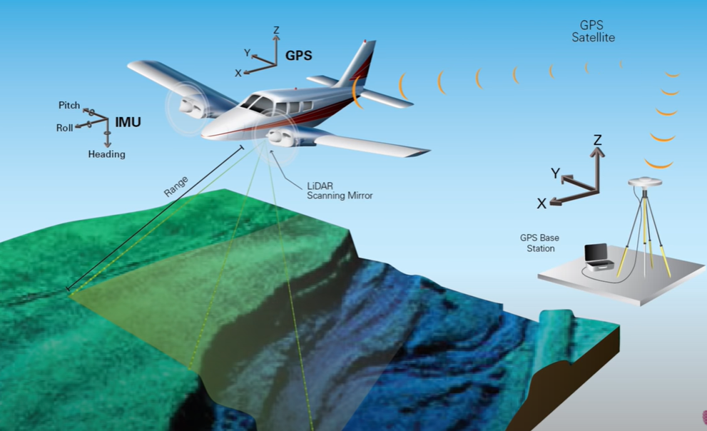

# 卫星测高

ICESat-2 有被应用到内陆水体高程监测，所以有必要补充一些卫星测高的基本信息。首先补充一些基础知识，比如激光测距（以LiDAR为代表）等，然后再来了解相关文献资料。

## LIDAR 简介

LIDAR（Light Detection And Ranging 激光雷达） 在地球科学方面已经被广泛应用，有必要了解一些基本概念以便于自己理解相关文献。

参考资料有：

- [What is LiDAR?](https://www.youtube.com/watch?v=eBUCGxZq_xg)
- [惯性测量单元](https://zh.wikipedia.org/wiki/%E6%83%AF%E6%80%A7%E6%B5%8B%E9%87%8F%E5%8D%95%E5%85%83)
- [How Does LiDAR Remote Sensing Work? Light Detection and Ranging](https://www.youtube.com/watch?v=EYbhNSUnIdU&vl=en)
- [What are the Top 5 uses of Lidar? Why is Lidar so important?](https://www.youtube.com/watch?v=zREAEdXzOcw)
- [无人驾驶技术入门（六）| 工程师又爱又恨的激光雷达](https://zhuanlan.zhihu.com/p/33792450)

LIDAR 基本原理是用激光测距，不过更多时候说到LIDAR是代指一系列相关测量的结合，如下图所示，有三个主要部分：LiDAR Scanning Mirror + GPS + IMU

LiDAR扫描仪用来测距，GPS用来定位LiDAR仪器，IMU(Inertial measurement unit)即惯性测量单元 用来测量物体三轴姿态角（或角速率）以及加速度的装置。如下图所示

LiDAR 数据收集的方式有多种，比如上图所示的航空器（Airborne LiDAR），还有航天观测，当然还有地面装置。

Airborne LiDAR 是比较常见的，比如美国的国家生态观测网络就有[LiDAR数据](https://www.neonscience.org/lidar-basics)监测的树木。

用观测手段收集到上面的数据之后，利用计算机算法就能生成需要的数据。

LiDAR测量的时候，会发送一个pulse，然后会接到一个return，根据光速和来回的时间就能计算距离。

LiDAR的应用有很多，几个比较典型的应用如下：

- 无人驾驶：用来识别汽车周围的环境
- 农业：监测农田，判断哪些需要灌溉等
- 河流监测：对河流三维建模，监测河流的长宽高等，监测洪水等
- 污染监测：监测二氧化碳，二氧化硫，甲烷等，帮助城市管理
- 建筑：三维建模

根据无人驾驶LiDAR相关的介绍，LiDAR线束越多，观测能力越强，越能构建复杂的周边环境。

## ICESat-2 简介

ICESat-2 全称 The Ice, Cloud, and Land Elevation Satellite - 2 mission. 这里主要参考：[The Ice, Cloud, and Land Elevation Satellite – 2 mission: A global geolocated photon product derived from the Advanced Topographic Laser Altimeter System](https://www.sciencedirect.com/science/article/pii/S003442571930344X) 了解一些基本信息。

该卫星任务主要目标是观测 ice和vegetation canopy来了解当前气候条件下的海平面、冰川、biomass变化等。不过个人关心的内陆水体高程也是可以监测的。其主要要解决的科学问题是 海平面变化，它要能区分高程变化和由于冰川快速变化导致的高程不稳定，所以需要multiple beams来支持足够精度的观测，所以其观测能力很强。

ICESat-2 上的装置是 Advanced Topographic Laser Altimeter System (ATLAS)，其在第一代ICESat基础上改进，其lidar很强大。

ATLAS 将一个单个输出的激光pulse 分成 6个low-pulse 能力的绿激光 beams（组成3对beams），脉冲频率是10kHZ。成对的安排能使观测在一次pass内观测along-和acroos-track两个方向，这样能保证任意两次pass之间的高程变化都能得到。其单光子敏感检测技术能够使光子飞行时间（[times of flight-- TOF](https://en.wikipedia.org/wiki/Time_of_flight#:~:text=Time%20of%20flight%20(ToF)%20is,a%20distance%20through%20a%20medium.)）的精度到800ps。关于单光子激光遥感的基本信息可以参考这个论文：[1.5μm单光子探测器在激光遥感中的应用](http://gb.oversea.cnki.net/KCMS/detail/detail.aspx?filename=1017296335.nh&dbcode=CDFD&dbname=CDFDREF)

结合GPS和IMU，ATLAS TOF 数据的结果数据产品中能定位到每个光子。

ICESat-2 Science Unit Converted Telemetry Level 1B 数据产品（即ATL02）提供 ATLAS TOF, ATLAS housekeeping data 以及 其他科学数据比如GPS和 attitude 数据。ICESat-2 Global Photon Level 2A 数据产品（ATL03）提供 latitude，longitude，和ellipsoidal height of photons。ATL03 产品被用作是 其他地表特定的地理物理数据产品的基础，比如 sea ice（ATL07），land ice（ATL06）以及 vegetation canopy height（ATL08）。所有数据产品都以 HDF5数据格式提供，可以在 the National Snow and Ice Data Center（[NSIDC](https://nsidc.org/data/icesat-2)）网站上获取。

更多内容以后需要再阅读，暂略。

## ICESat-2 用于水库观测

这部分是个人了解ICESat-2的主要目的，主要参考了文献：[(Global Characterization of Inland Water Reservoirs Using ICESat‐2 Altimetry and Climate Reanalysis](https://doi.org/10.1029/2020GL088543)。

从前面的介绍可以了解到，ATLAS 可以通过任两次对同一地点的观测判断高程变化，其有很广泛的观测能力；而且其单光子监测的能力使得其精度很高，超过其他一些卫星测高计；还有空间分辨率高，对小水库也能观测。

这篇文章使用的数据来自ATL08 Land and Vegetation Data Products 产品，ATL08产品是基于ATL03制作的（如前所述，ATL03产品是其他产品的基础）。ICESat-2 有Inland Surface Water Height 数据产品（ATL13），不过目前的ATL13产品还不包括小于10平方公里的湖面和水库。而很多水库是小于10平方公里的，所以就使用ATL08产品了。ATL08和ATL13的比较结果显示，两者非常接近。

将ATL08数据和GranD数据库求空间求交集可以得到想要的水库的水位。每个水库的表面高程由along-track 的ICESat-2 高程数据的中位值表示，另外还做了一些细节处理，可见原文。总之最后获得了水面高程数据，然后水位变化就由连续的观测之间的差值来确定。

接下来开始分析这个数据的可用性，这里我按照结果展示的内容简单记录下。

首先，关于ICESat-2数据的验证，精度方面使用的是USGS地面观测站的水位数据，有195个lakes或reservoirs的数据被选择来验证。

比较的是water level change的结果，比较结果显示RMSE是14.1cm，季节性变化下，这个RMSE是很不错的了，并且可以从原文图中可以看到两种观测之间拟合度非常高。

从观测范围上看，在GRanD数据库的7000多水库中，有一半水库一年至少有两次观测，并且有很多水库都小于100平方公里。有一个水库甚至只有0.38平方公里。基本数大于10平方公里的水库一年能获得至少4次观测，越大的水库观测越多。

第二部分，reservoir levels 随 climate conditions 变化的情况。主要和水量平衡计算（P-ET）的结果比较，依据的数据是 ERA5 大气再分析数据。分析的是水库整个上游流域的平均变化。上游流域的数据从 HydroBASINS 数据集获取。

水库水位展现出明显的季节性波动。原文图2（更多图在附件图3-6.），地图上的颜色是P-E的季节性变化（图上是19年秋天到动听的变化），点颜色是ICESat-2观测的水库水位变化，从图上可以看出还是有区域模式的。更明确的分析可以看图3，大部分地区水库水位变化趋势和P-E变化趋势是一致的，有一些关系不大，还有极个别是相反趋势。这可以反映一定的问题，比如在南亚，ICESat-2观测到水库水位的减少，这和干旱是有直接联系的；水库水位和P-E变化趋势相反的地方，水库水位变化趋势和能源使用趋势一致，这说明水库水用来发电了，另外就是可能有春季泄洪；在趋势关系不大的区域里，同一个流域不同水库的变化趋势都不同，说明人类调节是很明显的。

继续分析水库水位变化和水量平衡的季节性变化之间的关系时，发现可以通过它们之间的直接比较就能分析水库的主要用途。主要用于灌溉的水库，其水位变化就和季节性水量平衡的表现比较相关（有正有负）。因为灌溉是随着缺水与否的情况变化的，所以和水量平衡更密切，其也表现出更大的波动性；而发电的秋天到冬天的时候通常都表现出和water balance相反的趋势，在较冷的北欧和俄罗斯这时候为了取暖会发电；防洪的水库在夏到秋的时候都有明显的预泄，而在冬春季节会有明显上升。供水，航运，娱乐的水库变化则小得多。它们需要更平稳的水位。这些特点

第三部分，训练一个分类器来识别水库，这样就能得到一个从space判断水库功能的方法。

根据上面的分析，作者就训练了一个分类器来从太空数据识别水库用途，对404个有季节性水位观测的水库，随机森林的分类准确率在 0.64（F1 score）.在识别发电水库方面更准。

观测到的水库管理对季节性水量平衡的响应有注意察觉到潜在的水资源 vulnerabilites 和 resilience。比如有上下游这种梯级水库的地方，就有更heterogeneous的地区水位响应模式，如北美，中国，巴西，水库更多，变化更多样，更能应对气候，也就有着更小的用水压力；而对于缺水的地区，就有着更homogeneous的水位变化模式，比如西亚、南亚，说明区域对气候更依赖，应对气候的能力更弱，就更脆弱。

最后结论：

ICESat-2提供了对更多水库的观测，相比于现在的水平的测高卫星是一个量级的提升。随着其数据的不断累积，ICESat-2 会成为一个关键的水库数据库的组成部分，未来和SWOT等的联合使用会为水库监测提供更多的手段。

此外，也展示了从太空了解水库功能的新方式。仅用一年的数据就能看出来水库用途的模式了，发现了发电水库和灌溉水库的模式是比较特别的，比其他用途的水库变化更复杂。ICESat-2 重返期在91天，所以不能观测到短时间的变化。在从太空了解全球水资源脆弱性和恢复力方面，研究开了个头，起了基础性作用。通过比较 水位变化和水量平衡变化之间的关系，已经能看出来哪些区域water stress更大。在理解气候变化和人类需求的全球水资源响应方面提供了潜能。
