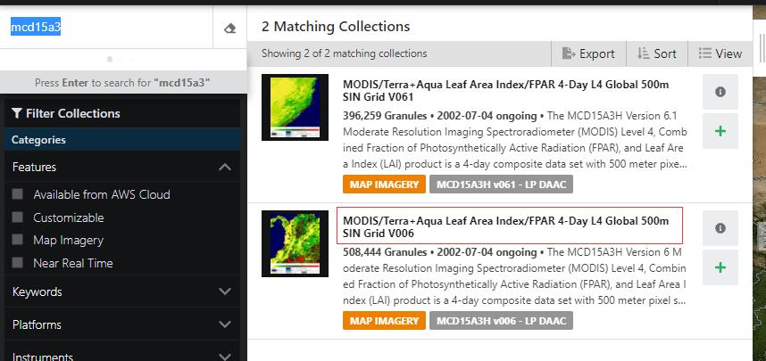

# MODIS 产品下载

本文主要参考了：

- [MODIS NASA 官网](https://modis.gsfc.nasa.gov/about/)
- [Find and Download MODIS Data From the USGS Earth Explorer Website](https://www.earthdatascience.org/courses/use-data-open-source-python/multispectral-remote-sensing/modis-data-in-python/download-modis-hdf4-data/)

## MODIS 简介

MODIS 全称 Moderate Resolution Imaging Spectroradiometer，根据维基百科介绍，Spectroradiometer是一种测光工具，能测从一个光源发出的光的波长和幅值。所以从名称上看，MODIS就是一种分辨率适中的光成像仪。

MODIS，与Landsat卫星不同，不仅仅是一颗卫星。MODIS由两颗独立的卫星组成，是 Terra (最开始称作 EOS AM-1) 和 Aqua (开始叫做 EOS PM-1) 两个卫星搭载的关键仪器。它们有不同的任务。从名字上能看出，Aqua和Terra卫星将其数据收集的重点放在其专业领域，即水和陆地。对于基于陆地的地球分析项目，如计算NDVI或NBR，你通常应该从Terra卫星上获取数据，因为它是专注于陆地数据收集的卫星。Terra 的绕地轨道定时的，它在早上从北到南穿过赤道（**10:30 a.m. descending node (Terra)**），而Aqua在下午从南到北越过赤道（**1:30 p.m. ascending node (Aqua)**）。Terra MODIS 和 Aqua MODIS **每一到两天能观测到整个地球表面**，获取的数据有 **36 spectral bands**, 或者说 groups of wavelengths. 这些数据能提升我们对发生在land， oceans， 和大气层低处的全球动力过程的理解。MODIS 在 Earth system models 的发展方面起到了关键作用，使ESM能准确预测全球变化以帮助决策者指定良好的政策来保护环境。

MODIS仪器提供的是**12 bit** 高radiometric sensitivity的，从**0.4微米到14.4微米**范围的36个spectral bands的response，这些responds会根据用户社区的需要被定制提供。两个波段在名义分辨率为250米成像，5个波段500米，其余29个波段1公里成像。在705公里的EOS（NASA的地球观测系统）轨道上的±55-degree 扫描模式可获取2330公里带状区域（**2330 km (cross track) by 10 km (along track at nadir)**），每一至两天能提供全球覆盖。

扫描镜组件使用连续旋转的双面扫描镜扫描±55度，在6年的仪器设计寿命中以100%的占空比（在一个周期内，工作时间与总时间的比值）运行。该光学系统包括一个双镜离轴天文望远镜，它将能量导向四个折射物镜组件，分别负责**VIS, NIR, SWIR/NWIR 和 LWIR** 的频谱区间，覆盖总光谱范围0.4 - 14.4µm。

第一架MODIS Flight仪器，即ProtoFlight Model (PFM)，集成在Terra (EOS AM-1)航天器上。Terra 于**1999年12月18日**成功发射。第二个MODISFlight仪器，Flight Model 1（FM1），集成在Aqua (EOS PM-1)航天器上;它于**2002年5月4日**成功发射。这些MODIS仪器为世界各地广泛而多样的用户群体提供了对陆地、大气和海洋现象学的前所未有的观察。

下面粘贴下各个波段的主要用途：

以下，

1. Bands 1 to 19 are in nm; Bands 20 to 36 are in µm
2. Spectral Radiance values are ($W/m^2$ -µm-sr)
3. SNR = Signal-to-noise ratio 信噪比
4. NE(Δ)T = Noise-equivalent temperature difference

|Primary Use	|Band	|Bandwidth	|Spectral Radiance	|Required SNR|
|-|-|-|-|-|
|Land/Cloud/Aerosols Boundaries	|1	|620 - 670	|21.8	|128|
||2	|841 - 876	|24.7	|201|
|Land/Cloud/Aerosols Properties	|3	|459 - 479	|35.3	|243|
||4	|545 - 565	|29.0	|228|
||5	|1230 - 1250	|5.4	|74|
||6	|1628 - 1652	|7.3	|275|
||7	|2105 - 2155	|1.0	|110|
|Ocean Color/Phytoplankton/Biogeochemistry	|8	|405 - 420	|44.9	|880|
||9	|438 - 448	|41.9	|838|
||10	|483 - 493	|32.1	|802|
||11	|526 - 536	|27.9	|754|
||12	|546 - 556	|21.0	|750|
||13	|662 - 672	|9.5	|910|
||14	|673 - 683	|8.7	|1087|
||15	|743 - 753	|10.2	|586|
||16	|862 - 877	|6.2	|516|
|Atmospheric Water Vapor	|17	|890 - 920	|10.0	|167|
||18	|931 - 941	|3.6	|57|
||19	|915 - 965	|15.0	|250|

|Primary Use	|Band	|Bandwidth	|Spectral Radiance	|Required NE[Δ]T(K)|
|-|-|-|-|-|
|Surface/Cloud Temperature	|20	|3.660 - 3.840	|0.45(300K)	|0.05|
||2|1	|3.929 - 3.989	|2.38(335K)	|2.00|
||2|2	|3.929 - 3.989	|0.67(300K)	|0.07|
|| 3	|4.020 - 4.080	|0.79(300K)	|0.07|
|Atmospheric Temperature	|24	|4.433 - 4.498	|0.17(250K)	|0.25|
||25	|4.482 - 4.549	|0.59(275K)	|0.2 |
|Cirrus Clouds Water Vapor	|26	|1.360 - 1.390	|6.00	|150(SNR)|
||27	|6.535 -6.895	|1.16(240K)	|0.25|
||28	|7.175 -7.475	|2.18(250K)	|0.25|
|Cloud Properties	|29	|8.400 - 8.700	|9.58(300K)	|0.05|
|Ozone	|30	|9.580 - 9.880	|3.69(250K)	|0.25|
|Surface/Cloud Temperature	|31	|10.780 - 11.280	|9.55(300K)	|0.05|
||32	|11.770 - 12.270	|8.94(300K)	|0.05|
|Cloud Top Altitude	|33	|13.185 - 13.485	|4.52(260K)	|0.25|
||34	|13.485 - 13.785	|3.76(250K)	|0.25|
||35	|13.785 - 14.085	|3.11(240K)	|0.25|
||36	|14.085 - 14.385	|2.08(220K)	|0.35|

## MODIS 数据产品

Landsat 8收集了11个波段的数据，而MODIS卫星收集了36个波段。由于波段数量众多，许多可供下载的MODIS数据都经过了大量的预处理，以使其更容易获得。这些数据产品描述了陆地、海洋和大气的特征，可用于研究局部到全球范围的过程和趋势。

MODIS数据从卫星仪器上通过Tracking and Data Relay Satellite System (TDRSS)传输到地面接收站，然后被送到EOS Data and Operations System (EDOS) ， **Level 1A, Level 1B, geolocation 和 cloud mask products 还有  Higher-level MODIS land and atmosphere products** 由MODIS Adaptive Processing System (MODAPS) 生成，然后被分配给三个DAACs（数据中心）进行发布。Ocean color products  由 the Ocean Color Data Processing System (OCDPS) 生成，并放送给科学和应用社区。

- MODIS Level 1和atmosphere产品可通过[LAADS网站](http://ladsweb.nascom.nasa.gov/)获得
- land产品可通过[美国地质调查局EROS数据中心(EDC)的Land Processes DAAC](https://lpdaac.usgs.gov/)获得。
- 冰冻圈数据产品(雪和海冰覆盖)可以从位于科罗拉多州博尔德的[国家冰雪数据中心(NSIDC)](http://nsidc.org/daac/modis/index.html)获得
- 海洋颜色产品和海洋表面温度产品以及有关这些产品的信息可在[GSFC的OCDPS处](http://oceancolor.gsfc.nasa.gov/)获得。
- 使用适当的x波段接收系统的用户可以使用MODIS直接广播信号直接从航天器捕获区域数据。这方面可以参考：https://modis.gsfc.nasa.gov/data/directbrod/

对于一般的地球分析产品，如计算NDVI或NBR，表面反射率产品是相当标准的产品，可以使用。可以在[这里](https://modis.gsfc.nasa.gov/data/dataprod/)看到一个使用MODIS数据的可用产品的完整列表。注意，使用表面反射率这样的预处理数据要容易得多，而不是像原始辐射度产品这样的更原始的数据。表面反射率和其他类似的产品，已经被地理定位，并有一些大气校正的应用。原始反射率和其他1级产品，还没有进行任何处理。

每个产品的名称包含一些关于产品组成的信息。对于表面反射率，名称的第二个字母是O或Y。O意味着数据来自Terra卫星，Y意味着数据来自Aqua卫星。因此，如果你想获得基于陆地的数据，你就应该选择以MO开头的产品。

在USGS EarthExploer网站上找到modis产品，将鼠标悬停在每个产品的名称上，你可以找到更多关于该产品的信息。也可以在MODIS网站上找到关于每个产品的更多数据。MODIS产品可以有很大的不同。MODIS每天都会对地球进行一次完整的扫描。有些产品是根据当天的个别读数每天创建的，而其他产品则是一个地区的每周平均数，以帮助说明云层或其他每天都可能发生的干扰。有些产品甚至是一年一次的，如MODIS土地覆盖产品，它是一整年的数据的综合。

在表面反射率类别中，可以看到这些空间和时间分辨率的差异。

像MOD09GA这样的产品是最高分辨率的日常产品，其中有所有七个波长的数据。它是许多由MODIS数据创建的其他产品的基础，并经常用于地球分析项目。

你会注意到，还有一个分辨率更高的日表面反射率产品，叫做MOD09GQ。然而，这个产品只有1号和2号波段，因为其余的MODIS波段的分辨率不够高，无法在这个产品中发布。

对于地表反射，也有收集8天的平均数，如MOD09A1。与每日数据相比，这种数据的一个优点是，由于它是一个星期的平均数，它允许数据的一些层，如表面反射率500米状态旗的QC层，比每日产品的分辨率更高。

接下来看看一些数据工具，NASA MODIS 官网给出了一些工具，github上也有一些开源代码，接下来了解并记录相关内容。

## 获取/分析数据

首先，看看官网上的tools。

- [AppEEARS](https://lpdaacsvc.cr.usgs.gov/appeears/)：AppEEARS接口建立在中间件服务的基础上，使用户能够输入精确的样本位置——例如现场研究站点或通量塔——并访问由NASA LP DAAC持有的陆地MODIS产品的analysis-ready 数据。AppEEARS提供交互式时间序列和散点图，允许用户在下载查询结果之前预览和交互。除了交互式绘图，用户还可以查看表格格式的质量信息和像素值。
- [Earth Data](http://earthdata.nasa.gov/)：地球数据(Earth Data)是一个包含大量关于使用和访问所有NASA地球观测系统数据和信息系统(EOSDIS)数据产品的信息的网站。所有的MODIS数据产品都可以从网站访问。地球数据网站提供许多用户资源，包括教程、网络研讨会以及数据搜索、发现和处理信息。该网站还提供了特定学科的信息(如大气、冰冻圈、陆地、海洋、人类维度)。
- [Earthdata Search](https://search.earthdata.nasa.gov/)：该应用程序允许您搜索、发现、可视化、优化和访问NASA地球观测数据。该网站提供了数百个跨多学科的MODIS数据收集。
- [EarthExplorer (EE)](http://earthexplorer.usgs.gov/)：EarthExplorer是美国地质勘探局(USGS)的一个数据搜索和订购网站，提供多传感器卫星和机载数据集的USGS长期地球科学数据档案。本网站提供的MODIS土地数据产品包括**地表反射率(M\*D09)、地表温度和辐射率(M\*D11)、地表覆盖(MCD12)、植被指数(M\*D13、MOD44A、B)、LAI/FPAR (M\*D15)、水掩模(MOD44W)、热异常和火灾(M\*D14、MCD45)、总初级生产力(M\*D17)、BRDF和反照率(MCD43)**。
- [Giovanni](http://disc.sci.gsfc.nasa.gov/giovanni/overview),[Giovanni 4](http://giovanni.gsfc.nasa.gov/giovanni/)：Giovanni和Giovanni 4是由GES DISC开发的Web应用程序，它提供了一种简单、直观的方式来可视化、分析和访问地球科学遥感数据，包括大量数据，尤其是来自卫星的数据，而不需要下载数据。MODIS大气数据产品可以用这个工具进行分析。Giovanni 4是Giovanni的下一代，比上一代设计得更快、更具互动性、更容易学习。
- [Global Change Master Directory (GCMD)](http://gcmd.gsfc.nasa.gov/)：NASA的全球变化主目录(GCMD)提供了地球科学数据集和服务描述的目录列表，包括所有MODIS数据产品。GCMD是目前已知的最大的公共地球和环境科学元数据清单之一。
- [HDF-EOS to GeoTIFF converter (HEG)](http://hdfeos.org/software/heg.php)：hdf - eos to GeoTIFF转换器(HEG)工具将MODIS hdf格式的数据文件转换成GeoTIFF、本机二进制或hdf - eos网格。HEG工具还具有重投影、重采样、子集设置、拼接和元数据创建功能。
- [HDFExplorer](http://www.space-research.org/) & [HDFLook](http://www-loa.univ-lille1.fr/informatique/index.php?lang=us&p=about&app=HDFLook)：以上两个工具是数据可视化程序，它们读取HDF文件并允许用户可视化这些文件。这两个工具都适用于HDF格式的所有MODIS数据产品。值得注意的是，HDFLook目前正在接受有限的更新支持。
- [HDF Technologies](http://www.hdfgroup.org/products/)：HDF集团提供HDF技术产品，可用于HDF4和HDF5格式数据的数据管理。HDFView java工具可以用来浏览和编辑MODIS HDF4和HDF5文件。
- [LP DAAC Data Pool and DAAC2Disk Download Manager](https://lpdaac.usgs.gov/data_access/data_pool)：LP DAAC数据池容纳LP DAAC分发的所有数据。用户可以通过单击和下载或将脚本指向数据池来访问原始的HDF数据文件。[DAAC2Disk下载管理器](https://lpdaac.usgs.gov/data_access/daac2disk)允许用户使用可从命令行下载和执行的脚本(在Windows、Linux/Unix和Machintosh平台中可用)简化搜索和http下载过程。有关更多信息，请参阅[用户指南](https://lpdaac.usgs.gov/sites/default/files/public/datapool/DAAC2DiskUserGuide.pdf)。
- [McIDAS](http://www.ssec.wisc.edu/mcidas/software/mclite/)：McIDAS是一个免费的卫星数据图像查看工具，可以在用户的计算机或远程公共卫星数据上使用。所有的HDF格式的MODIS数据可以用这个工具。可以完成基本的定量分析。
- [MODIS Atmosphere Global Browse Images](http://modis-atmos.gsfc.nasa.gov/IMAGES/)：MODIS 1级和大气产品数据可在MODIS大气集团网站上快速浏览图像进行可视化和定性检查。MODIS Level 1数据可以在swath和全局分辨率下浏览，MODIS大气产品可以在全局分辨率下浏览。
- [MODIS Land Global Browse Images](http://landweb.nascom.nasa.gov/cgi-bin/browse/browse.cgi)：MODIS Level 1和select Land data产品可以在全局分辨率下快速浏览图像。这些图像允许对数据进行快速的概要性质量评估。集合4、集合5和集合6包含在每个产品中以供浏览。
- [MODIS Land QA tutorials](https://lpdaac.usgs.gov/products/modis_products_table)：MODIS Land QA教程旨在介绍QA元数据如何打包和实现的基础知识，以及用户如何与它们交互来解析和解释信息。本教程包括四个课程:1)如何查找、理解和使用MODIS land产品的质量保证信息;2)如何解释和使用植被指数产品套件中的MODIS QA信息;3)如何解释和使用地表反射率产品套件中的MODIS QA信息;4)如何在BRDF和Albedo prod中解释和使用MODIS QA信息
- [MODIS Level 1 Atmosphere Archive and Distribution System (LAADS Web)](https://ladsweb.nascom.nasa.gov)：LAADS网站是第一级大气档案和分发系统的网络接口。LAADS Web提供了对所有MODIS 1级、2级和3级大气和地面数据产品的快速和方便的访问，并提供了大量的后期处理选项。后处理选项包括按参数、区域或频带划分的子集、拼接、重投影或掩蔽。该网站还提供快速查看真彩色RGB和选定数据集的假彩色图像
- [MODIS LDOPE QA Tools](https://lpdaac.usgs.gov/tools/ldope_tools)：MODIS LDOPE QA工具是由LDOPE (Land Data Operational Product Evaluation)设计和开发的软件工具的子集，可以用来操作、可视化和分析MODIS数据。QA工具是NASA GSFC执行的操作质量保证过程的一部分，用户社区可以使用这些工具来帮助解析和解释MODIS数据产品。MODIS LDOPE QA工具是用C语言编写的;它们可以从命令行执行，也可以通过脚本调用。
- [MODIS Swath-to-Grid Toolbox (MS2GT)](https://nsidc.org/data/modis/ms2gt/index.html)：MODIS swath -to- grid Toolbox (MS2GT)读取MODIS swath HDF-EOS数据文件并生成网格化数据二进制文件。MS2GT可以输出各种地图投影的数据。MS2GT还可以从多个MODIS swath输入文件生成一个无缝的输出网格。
- [MODIS Web Service](https://daac.ornl.gov/MODIS/MODIS-menu/modis_webservice.html)：MODIS Web服务是一个工具，它为用户提供了一种通过基于标准的SOAP(简单对象访问协议)建立的开放源码格式来订购MODIS Land产品子集的方法。当前支持的开放源码格式的示例:(1)OPeNDAP DAP， (2) OpenSearch和(3)Web地图平铺服务。网络数据访问协议(OPeNDAP)数据访问协议(DAP)的开源项目是一种在web上请求和移动数据的方法。包括物理海洋学DAAC、GES DISC和LaRC在内的几个DAAC提供了使用OPeNDAP检索MODIS数据产品的能力。OpenSearch是一种协议或格式结构，用于通信搜索请求和搜索结果。OpenSearch用于LANCE-MODIS和LAADS Web。Web地图瓦服务(WMTS)是一种用于承载地图瓦的协议或格式。WMTS与NASA EOSDIS全球图像浏览服务(GIBS)一起用于提供MODIS数据。
- [ORNL DAAC MODIS Land Products Subsetting and Visualization Tools](http://daac.ornl.gov/modisglobal)：ORNL DAAC MODIS Land Products Subsetting和Visualization Tools允许用户以大纲或编程的方式请求特定MODIS Land Products的子集。subsetter工具以ascii格式输出数据，并提供使用图形和统计输出可视化时间分辨率数据的选项。
- [NASA Worldview](https://worldview.earthdata.nasa.gov)：这个工具来自NASA的EOSDIS，可以在获取数据的几个小时内交互式浏览MODIS的全球卫星图像。Worldview的用户可以显示数据层，包括可以覆盖在数据上的卫星轨道轨迹。

### USGS EarthExplorer 

我们尝试下从USGS EarthExplorer 网站下载数据。

数据主要在“Data Sets”->"NASA LPDAAC Collections"里。

我们在搜索数据时，需要做的第一件事是定义你感兴趣的区域（AOI）。可以输入边界每个角的x,y顶点，但如果你有一个Earth Explorer账户，你可以上传一个包含边界的压缩的zipped shapefile来代替。不过请确保使用一个正方形/矩形的多边形。如果你的多边形中有太多的顶点，网站将不接受它作为一个范围文件。个人感觉比较好的还是自己在GIS软件里看一看自己想要的范围是什么范围，然后直接生成一个正方形shapefile，比如在QGIS中，可以参考[这里](https://gis.stackexchange.com/questions/14150/how-to-create-polygons-with-straight-lines-and-right-angles-in-qgis)操作，调出“Shape Digitizing toolbar”，然后创建一个shapefile图层，选择polygon，接着开启 编辑模式 “Toggle Editing”，然后就选择"Add Rectangle From Extent"，就能画自己想要的范围了，画好后保存即可，然后为了后续导入，需要将shapefile压缩为一个zip文件。

开始前要先登录，需要一个NASA Earthdata登录账户，以便下载LP DAAC数据（并因此使用这个脚本）。要创建一个NASA Earthdata登录账户，请到[Earthdata登录网站](https://urs.earthdata.nasa.gov/)，点击 "注册 "按钮，该按钮在密码输入框下的绿色 "登录 "按钮旁边。填写必要的方框（用红色星号表示），然后点击页面底部的 "注册Earthdata登录 "绿色按钮。一封带有激活注册说明的电子邮件就完成了这一过程。

然后我们打开 https://earthexplorer.usgs.gov/ 网页，导入刚刚创建的shapefile：


能看到如下所示界面：


接下来就能指定自己想要下载的数据了，比如这里我想要下载 mcd15a3hv006 数据。


如果有需要可以在“Additional Criteria”中定义更多标准，比如只下载白天的数据。

最后点击Results面板，然后就能看到给出的下载项了，不过下载键只能一个个点击下载，也能提交批量申请，不过也比较麻烦，下载好像也是要第二天才开始的。

这时候可以尝试下 USGS 的批量下载工具：https://www.usgs.gov/media/images/earthexplorer-bulk-download-application-bda

下载地址： https://dds.cr.usgs.gov/bulk

具体使用教程：https://www.usgs.gov/media/videos/eros-earthexplorer-how-do-a-bulk-download

不过安装windows 64位的软件需要先安装java 64位 java 10.x或者java 11.x。

下载安装java：https://www.oracle.com/java/technologies/downloads/#java11-windows

选择 64位 java11 exe文件就行，然后安装时候一路默认即可。安装后配置下java环境：https://blog.csdn.net/climber16/article/details/83242425

我的默认安装地址是 C:\Program Files\Java\jdk-11.0.12

然后命令行执行：

```Shell
java --version
```

如果正确，那么配置成功，如果不行，检查下有没有重复的java路径配置。

下面就安装USGS的工具，安装的时候记得安装到用户文件夹下，否则会报错。

然后需要登陆，登录的用户名和密码是USGS的用户名密码，不是earth data的。

然后我们回到之前的下载页面，不过按照教程选择不了bulk选项，可能是新版本了，所以这块怎么下载还有待更新。。。

还是考虑从 NASA Earthdata直接下载数据。

### 从 NASA Earthdata直接下载数据

进入[这个网站](https://search.earthdata.nasa.gov/)，然后筛选数据，比如我们想要下载的mcd15a3hv006，搜索mcd15a3，选择V006那一项。



然后也选择区域：


同样导入创建的边界shapefile的zip文件即可，在QGIS中画出自己想要的边界较好。

导入之后会筛选数据如下：


然后点击下载，出现真正的下载页面：


之后会出现下载数据的链接，可以一个个点击，不过还是使用代码下载这些链接比较好，直接给出的有下载的脚本，不过这里我们只把这个下载列表文件下载下列，后面用python使用它。


接下来参考了资料：

- [USGS -- Data Prep Scripts](https://lpdaac.usgs.gov/tools/data-prep-scripts/)

因为MODIS数据基本在LP DAAC Data下，所以我们看看[How to Access the LP DAAC Data Pool with Python](https://git.earthdata.nasa.gov/projects/LPDUR/repos/daac_data_download_python/browse)

我们把DAAC_Data_Download_Python的源码下载下来，放到你想放的位置就行。

DAACDataDownload.py脚本演示了如何配置一个连接，以便直接用Python从支持Earthdata登录的服务器，特别是[LP DAAC数据池](https://e4ftl01.cr.usgs.gov/?_ga=2.166737661.255666647.1634476538-1708604232.1626226646)中下载数据。该脚本是一个命令行可执行文件，用户将提交一个要下载的文件的单一URL，或者一个包含要下载的LP DAAC数据池上的文件的多个URL的csv或文本文件的位置，以及一个要下载文件的所需目录。该脚本使用netrc文件安全地存储你的[NASA Earthdata登录凭证](https://urs.earthdata.nasa.gov/)，在从LP DAAC数据池下载数据时需要进行认证。

脚本首先确定你的操作系统在你的主目录下是否已经有一个netrc文件，如果有的话，它是否为urs.earthdata.nasa.gov正确配置了。如果确定netrc文件不存在，该脚本将提示你输入NASA Earthdata的登录用户名和密码。在提交你的凭证后，脚本将在你的操作系统上创建一个netrc文件。(注意：只有在第一次提示你的凭证，如果你已经在你的主目录中正确配置了netrc，这些步骤将被跳过）。) 在那里，脚本使用你提供的URL，以验证你的NASA Earthdata登录凭证，使用请求包提交数据请求，并最终下载所需数据。如果文件列表中包含多个URL，脚本将循环进行，并对每个文件执行上述步骤。输出文件的名称将与输入文件的名称相同。

要从LP DAAC档案中下载数据，你需要授权应用程序来查看你的NASA Earthdata登录档案。一旦授权完成，你可以继续你的会话。要授权数据池，请点击[这里](https://urs.earthdata.nasa.gov/approve_app?client_id=ijpRZvb9qeKCK5ctsn75Tg&_ga=2.128429068.1284688367.1541426539-1515316899.1516123516)。

根据其中的yml文件安装python运行环境，这部分就不赘述了，可以参考[这里](https://github.com/waterDLut/hydrus/blob/master/1-basic-envir/2-python-envir.md#conda-environment)。

下面就直接在现在的python环境下运行DAACDataDownload.py就行了：

```Shell
python DAACDataDownload.py -dir <insert local directory to save files to> -f <insert a single granule URL, or the location of a csv or text file containing granule URLs>
```

例子：

```Shell
python C:\User\Downloads\DAACDataDownload.py -dir C:\User\datapool_downloads -f C:\User\datapool_downloads\MYD13-Point-Test-3-granule-list.txt
```

## 常用MODIS数据（未完待续。。。）

MODIS的数据产品非常多，比如关于Land cover相关内容在USGS上搜索MOD：https://lpdaac.usgs.gov/product_search/?query=MOD&view=cards&sort=title ，可以看到有非常多的MODIS相关产品，它们可能对应了不同的波段，不同的检测目标等。

因此这里就日常积累下看到的文献中会用到哪些MODIS产品。

### MOD09A1 v006

参考：https://lpdaac.usgs.gov/products/mod09a1v006/

MODIS/Terra Surface Reflectance 8-Day L3 Global 500 m SIN Grid，MODIS Terra MOD09A1版本6的产品提供了对Terra MODIS波段1至7的**地表光谱反射率**的估计，这些反射率是根据大气条件(如气体、气溶胶和瑞利散射)进行校正后得到的。除了7个500米的反射波段外，还有2个质量层quality layers 和4个观测波段。对于每个像素，在8天的合成周期内从所有的获取中选择一个值，像素选择的标准包括云和太阳天顶solar zenith。当若干个获取都符合标准时，使用最小通道3(蓝色)值的像素。

### MYD11A2 v006

MODIS/Aqua Land Surface Temperature/Emissivity 8-Day L3 Global 1 km SIN Grid，MYD11A2版本6 提供了平均8天每像素**地表温度和发射率(LST&E)**，在1200×1200公里的网格中提供1公里(km)的空间分辨率。MYD11A2中的每个像素值是8天内收集的所有相应的MYD11A1 LST像素的简单平均值。之所以选择8天的合成期，是因为这段时间是Terra和Aqua平台精确的地面轨迹重复期的两倍。除了日间和夜间的地表温度波段外，还提供了相关的质量控制评估、观测时间、观测天顶角、晴空覆盖以及31和32波段的地表覆盖类型辐射率。

### MCD12Q1 v006

MODIS/Terra+Aqua Land Cover Type Yearly L3 Global 500 m SIN Grid，Terra和Aqua联合的 MODIS 陆地覆盖类型(MCD12Q1)版本6数据产品，根据用户指南中列出的6种不同的分类方案，提供**每年间隔(2001-2018年)的全球土地覆盖类型**。MCD12Q1版本6数据产品是使用MODIS Terra和Aqua反射率数据的监督分类得到的。监督分类然后进行额外的后处理，合并先前的知识和辅助信息，以进一步细化特定的类。

每个MCD12Q1版本6的分层数据格式4 (HDF4)文件中都提供了1-5土地覆盖类型、1-3土地覆盖属性、1-3土地覆盖属性评估、1-3土地覆盖质量控制(QC)和一个土地水掩膜的图层。