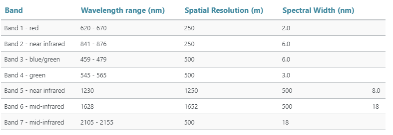

# MODIS数据简介与处理

基础遥感数据的知识可以参考[这里](https://www.earthdatascience.org/courses/use-data-open-source-python/multispectral-remote-sensing/intro-multispectral-data/)简单回顾下。

中分辨率成像光谱仪（MODIS）仪器是一个基于卫星的仪器，持续收集地球表面的数据。MODIS以几种空间分辨率收集光谱信息，包括250米、500米和1000米。后面的例子将使用500米空间分辨率的MODIS数据。MODIS有36个波段，介绍上主要以前7个波段为主。

中分辨率成像光谱仪MODIS在公开的遥感数据中具有最好的时间分辨率，每24小时一次，覆盖了整个地球。
