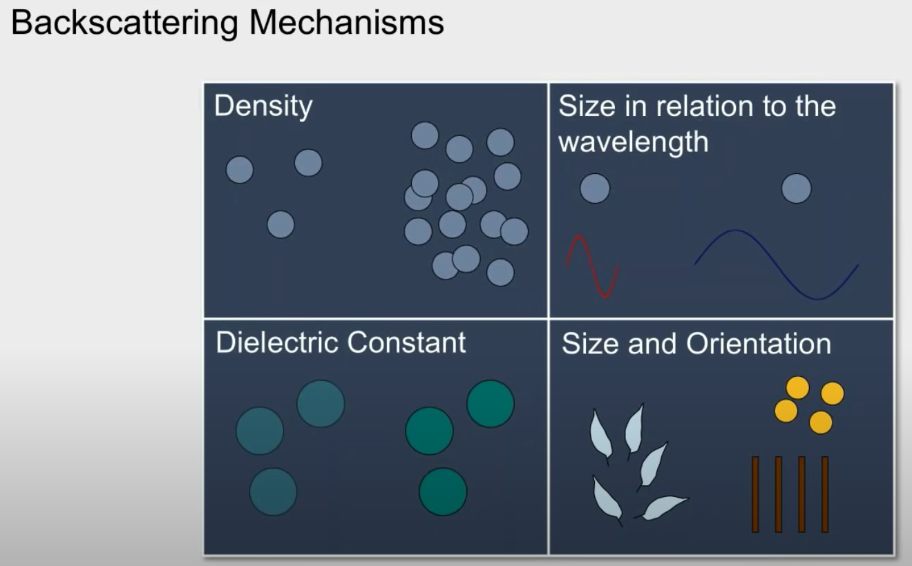
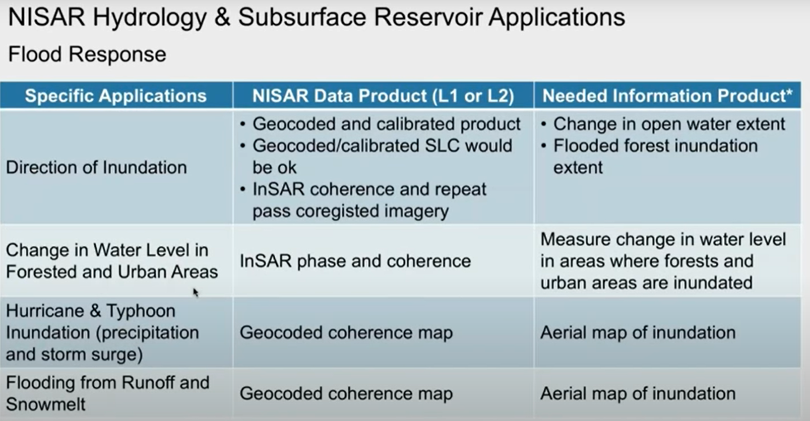

# SMAP 数据

SMAP也是水文相关文献中常用到的数据，这里根据以下资料简单了解下其背景知识。

- [NASA ARSET: Basics of Synthetic Aperture Radar (SAR)](https://www.youtube.com/watch?v=Xemo2ZpduHA)
- [SMAP | Soil Moisture Active Passive](https://smap.jpl.nasa.gov/)

## SAR

SMAP卫星的观测设备中包含了 合成孔径雷达，即 SAR。

首先结合电磁波谱谈谈为什么需要微波观测

- 光学传感器测量反射的太阳光，所以只能在白天工作
- 当有云的时候，可见光 和 红外光传感器也无法成像
- 而微波是可以穿透云层和植被的，且白天晚上都能运作

雷达、合成孔径雷达（SAR）和LIDAR 都是主动传感器。

雷达（即微波的传感器）相比于 光学传感器的优缺点如下：

- 优点
    - 几乎所有天气都可工作
    - 白天夜晚都可以
    - 能穿透 vegetation canopy
    - 能穿透土壤
    - minimal atmospheric effects
    - sensitivity to **dielectric** properties（liquid vs. frozen water）
    - sensitivity to **structure**
- 缺点
    - 信息内容和光学传感器不同，有时比较难解释
    - speckle effects （graininess in the image）
    - effects of topography
    
一个直观的例子：

雷达的观测是不会被火山喷发的灰烬挡住的。

一些基本概念：

Down looking vs. Side Looking Radar

如果是垂直着观测的话，因为反射波回来的时间是一样的，所以没法区分是从哪反射的，而side looking 则可以。

雷达测量的是反射波的强度，即幅值，以及相位，即一个点在一个周期波上的位置

雷达参数：

首先是波长：等于光速除以频率。常见的波段的名称及对应波长及频率如下所示，其中带括号标识的是常用于SAR的波段。

波长选择的重要因素是penetration，越长的波长穿透forest canopy 和 soil 的能力越强。

第二个重要参数是polarization。polarization 由H和V确定：

- HH: horizontal transmit, horizontal receive 
- HV: horizontal transmit, vertical receive
- VH: vertical transmit, horizontal receive
- VV: vertical transmit, vertical receive

Quad-Pol Mode 就是指所有四种polarization 都能测量

不同的polarization 能确定观测物体的物理属性。

第三个参数是incidence angle，是指雷达波照射和地球表面平面之间的角度。

接下来一个重要概念：radar backscatter

它包含了地球表面的信息，是这些东西驱动了雷达信号的反射。反射is driven by：

- 频率或波长：雷达参数
- polarization：雷达参数
- incidence angle：雷达参数
- dielectric constant：surface参数
- surface roughness relative to the wavelength：surface 参数

不同材料由不同的dielectric属性：

不同表面粗糙度会使波的接触反射不同：

显然水面比较平，所以反射的波大都回不到传感器，因此在图像上表示就是较暗的区域。

下面是关于雷达信号geometric 和 radiometric distortion的内容。

倾斜的原因可以看下面的示意图，因为是倾斜的looking的，所以成像的时候会有下面的现象：

既然这样地话，图像就是需要进行校正地，如下图所示，是一个校正前后的效果图：

雷达还会有shadow，影响观测：

这就是topography的影响，所以还需要对这周radiometric distortion校正。一个示例如下：

最后一块，谈下speckle。speckle是图像上的噪音，降低了图像的质量。

为了减少speckle，需要multi-look processing。将雷达beam分成几个更窄的sub-beams，每个sub-beam是一个look，这些looks 一起可以i帮助减少speckle

还有可以通过spatial filtering的方法来做speckle reduction。是一种平滑的处理。

关于SAR，NASA-ISRO SAR mission 预计会于2021年执行，可能的应用有：

下面再补充下Polarimetric SAR和InSAR。

## Mission

SMAP卫星是2015年1月发射的一颗极地轨卫星，其在轨观测的是地球表面任一地区the amount of water in the top 5 cm (2 inches) of soil。

The topsoil layer is the one in which **the food we eat grows and where other vegetation lives**.土壤含水量以多种方式间接影响我们。SMAP设计是三年观测期，每两三天一次。SMAP可以测量地球上任一点没有被水覆盖或冻住的地方。它还能区分冰冻或解冻的土地。Where the ground is not frozen, SMAP measures **the amount of water** found **between the minerals, rocky material, and organic particles found in soil** everywhere in the world (SMAP measures **liquid water in the top layer of ground** but is **not able to measure the ice**.)

SMAP会生成全球土壤含水量图。有助于碳循环和水循环的研究。天气和气候研究也用得到SMAP数据，比如蒸发水受土壤含水量影响，土壤含水量也是理解大气和地表水热能交换的关键。 Frequent and reliable soil moisture measurements from SMAP will help improve the predictive capability of weather and climate models.

## Observatory

SMAP是一个遥感观测台，它携带两个仪器，**绘制土壤湿度图**，并**确定同一地区的冻融状态**。土壤含水量是通过**radar and radiometer测量的组合**来绘制的，而冻融测图是利用雷达系统测量的独特特性来完成的。 radar and radiometer都有一个共同的天线和馈电组件，但是它们在SMAP内部的电子器件是不同的。当SMAP  radar and radiometer 相结合时，将提供高精度、高分辨率的全球土壤湿度和冻融状态地图。
（注：radiometer有时特指红外辐射检测计，但也可指检测其它各种波长的电磁辐射的检测计，比如这里是检测radio wave 无线电波的）

雷达将**无线电波**（无线电波在电磁光谱中的波长是最长的）脉冲发送到地球上的一个地点，并测量几微秒后返回的回声。回声的强度和“形状”可以被解释为表明土壤的湿度水平，即使是通过中等水平的植被。由于雷达主动地发送和接收无线电波，这就是SMAP中的“主动”的来源。

radiometer探测从同一小区域发射的无线电波。发射强度是当地地面温度的一个指标。由于辐射计被动地进行这些温度测量，这就是SMAP中的“被动”的来源。

雷达和辐射计共用的大型天线是SMAP最突出的特征。它的工作原理就像一个卫星天线，只是要大得多，反射器收集所有的无线电波，把它们集中到馈喇叭里。馈角像一个漏斗，收集来自雷达的回波和来自辐射计的表面发射，并将它们发送到雷达和辐射计电子设备处理图像。进料喇叭是一个大圆锥体，在飞船外部可见。天线反射器是一个直径6米(约20英尺)的网状天线。

为了实现对地面的大覆盖，天线以每分钟14.6转(每4秒转一圈)的速度旋转。SMAP的轨道运动与天线的自旋相结合，在一系列重叠的回路中扫过一小片视场，形成一条1000公里(621英里)宽的带状区域。这种大面积的覆盖使得SMAP能够**每2到3天重复制作完整的土壤湿度地图**。土壤湿度地图将间隔10公里(6.2英里)，而冻融地图可以区分小至3公里(1.9英里)的区域。

SMAP的轨道距离地球表面685公里(426英里)。因为地球是在SMAP轨道运行时自转的，所以每条轨道的轨迹会相互偏移，8天后，同样的轨迹会重复。在2到3天的时间里(**在两极2天，在赤道3天**)，斯韦格斯带之间的空隙被填满，就可以绘制一张全球湿度和冻土地图。SMAP的两个仪器采集的数据从一极传到另一极。该轨道的方向是这样的，它穿过地球的赤道明暗界线。(明暗界线是白天和黑夜的分界线，在日出或日落时都是如此。)

## Data

SMAP 的数据产品信息可以参考：https://smap.jpl.nasa.gov/data/

SMAP数据产品通过两个由NASA指定的数据中心，即阿拉斯加卫星设施（ASF）和国家冰雪数据中心（NSIDC），公开提供。ASF专门研究SAR数据，而NISDC专门研究冰冻圈科学和陆地微波数据。

- 1级雷达数据在 ASF DAAC
- L1 TB级和L2-L4级产品在 NSIDC DAAC

以下是SMAP数据产品表，按级别排序。

产品信息大体如下。

- 对1B和1C级数据产品进行了校准，并且对地面雷达反向散射横截面和亮度温度的仪器进行了地理定位。L1B_TB_E数据产品是在[EASE-2网格](https://nsidc.org/data/ease)上插入的校准亮度温度。
- 2级产品是根据1级产品和辅助信息在固定的地球网格上对土壤水分进行地球物理检索；2级产品以半轨道输出。
- 3级产品是2级表层土壤水分和冻结/融化状态数据的日常合成。
- 第4级产品是表面和根部区域的土壤水分和碳净生态系统交换的模型得出的增值数据产品，它们支持关键的SMAP应用程序，并且更直接地解决了驱动科学的问题。

SMAP任务总计已生成24个可分发的数据产品，分别代表四个数据处理级别。

- 1级产品包含与仪器相关的数据，并以基于SMAP卫星半轨道的颗粒形式出现。最北端和最南端的轨道位置划定了一半轨道边界。
- 2级产品包含基于仪器数据的地球物理检索结果，并且也显示在半轨道颗粒中。
- 3级产品是整个UTC一天中2级地球物理检索的每日全球综合信息。
- 4级产品包含使用SMAP数据的地球物理模型的输出。

雷达和辐射计数据流产生了五种L2土壤水分产物。

- L2_SM_A是一种高分辨率的研究型土壤水分产品，主要基于雷达测量结果，并发布在3 km处。
- L2_SM_P是从辐射计亮度温度测量值中得出的土壤湿度，并发布在36 km处。
- L2_SM_P_E是从Backus-Gilbert内插辐射计亮度温度测量值中得出的土壤水分，并张贴在9 km处。
- L2_SM_AP是有源和无源（雷达和辐射计）的组合产品，可产生9 km分辨率的土壤湿度估算值。
- L2_SM_SP是Sentinel-1主动和SMAP被动（雷达和辐射计）产品的组合，可在3 km的分辨率下估算土壤湿度。

仅雷达的土壤湿度（L2_SM_A）是从高分辨率的雷达反向散射数据（L1C_S0_HiRes）得出的高分辨率（3 km）的土壤湿度估计值。尽管L2_SM_A数据产品不太可能像L2_SM_P和L2_SM_AP产品一样准确，但它会以较高的空间分辨率生成有用的土壤湿度信息。L2_SM_A在处理的早期阶段会产生总计3 km的雷达反向散射值。该数据集，以及根据雷达数据生成的水体和冻结/融化标志，在数据处理期间可作为其他输入提供给其他产品。

组合的雷达/辐射计土壤水分产品L2_SM_AP发布在9 km EASE2网格上，该网格与其他SMAP产品使用的36 km和3 km网格一致。它既使用了3 km的高分辨率雷达后向散射，又使用了36 km的辐射计亮度温度数据。L2_SM_AP合并两个数据流，以产生9公里处的分类亮度温度。用于从分解的9 km亮度温度估算土壤湿度的检索算法，使用的方法与仅使用L2_SM_P辐射计的土壤湿度产品相同。L2_SM_AP的辅助数据输入和实现可能与L2_SM_P使用的数据不同，这是因为9 km和36 km处的空间分辨率不同。

L3_FT_A是基于雷达数据的SMAP冻结/解冻产品，它由3 km的极地EASE2网格上45N纬度以北的北方陆地地区的每日景观冻结/解冻状态合成。它是使用AM（下降）和PM（上升）天桥从高分辨率雷达数据（L1C_S0_HiRes半轨道）得出的。L1C_S0_HiRes AM数据还将用于生成冻结/解冻二进制状态标志，以用于L2 / 3_SM产品算法。L3_FT_P和L3_FT_P_E是分别来自L1C_TB和L1C_TB_E产品的冻结/解冻产品。

L1B_TB_NRT和L2_SM_P_NRT是近时产品，与L1B_TB和L2_SM_P对应，是为需要延迟3小时以下的运营用户使用而生成的。它们是使用最新的可用辅助数据以及航天器和天线姿态数据创建的，以减少延迟。它们不如高质量产品L1B_TB和L2_SM_P准确，因此不建议科学用户使用。

SMAP测量可直接感测土壤顶部5 cm处的土壤水分。但是，SMAP的一些关键应用需要了解土壤柱顶部1 m的根区土壤水分，而SMAP不能直接测量。作为其基线任务的一部分，SMAP项目一直在生产模型衍生的增值4级数据产品，以填补这一空白，并提供根据SMAP表面观测资料并与之一致的根区土壤水分的估算值。通过将SMAP观测值与来自地面同化模型的估计值合并到数据同化系统中来获得此类估计值。同化系统的地表模型部分由基于观测的气象强迫数据（包括降水）驱动，降水是土壤水分的最重要驱动因素。该模型还囊括了关键陆地表面过程的知识，包括土壤水分在地表和根区储层之间的垂直转移。最后，该模型在时间和空间上对SMAP观测值进行内插和外推，以9 km的分辨率对土壤湿度进行3小时估算。因此，SMAP L4_SM产品基于SMAP观测和来自各种来源的补充信息，可提供全面一致的陆地表面水文状况图。

L4_C算法利用每日的土壤湿度和温度输入以及辅助的土地覆被分类和植被总初级生产力（GPP）输入来计算全球植物园中二氧化碳与大气的净生态系统交换（NEE）纬度以北45N以北的区域）。碳NEE是衡量植物自养和异养呼吸吸收碳与损失碳之间平衡的基本量度。

上面的表列出了SMAP基准数据产品的几个重要特征。其中包括：

- 产品简称-这些名称提供了一种区分产品的简便方法
- 非常简短的产品说明–其他SMAP项目文档提供了每个数据产品的格式和内容的完整规范；SMAP DAAC已将这些文档提供给用户社区
- 产品空间分辨率或网格发布–某些1级产品的分辨率基于雷达或辐射计仪器的瞬时视场（IFOV）的大小，而更高级别产品的分辨率则取决于所选的网格间距
- 产品对用户社区的延迟–延迟衡量的是获取数据产品中第一个元素到该产品可在一个SMAP数据中心使用的时间。尽管该项目正在使用表2中列出的延迟来构建数据处理系统，但SMAP项目将尽其所能尽早交付产品。

SMAP科学数据产品将使用科学算法软件在科学数据系统生产系统上生成。科学软件基于算法理论基础文档（ATBD）中描述的每种产品的算法。

SMAP数据管理受NASA的地球科学数据政策（于1991年通过）管理。美国国家航空航天局（NASA）已制定了政策实施，实践和术语，地球科学任务将其用于遵守政策宗旨。

NASA地球科学数据政策。产品对用户社区的潜伏期是从天文台观察获取仪器数据到SMAP数据中心向公众提供产品的时间之间的时间度量。向科学团队和社区交付数据产品的SMAP数据延迟要求是：

- 1级产品（获取后12小时内）
- 2级产品（获取后24小时内）
- 3级产品（获取后50小时内）
- 4级产品（土壤水分在7天之内，碳净生态系统交换在14天之内）

数据级别定义：SMAP数据级别定义遵循NASA地球观测系统数据和信息系统（EOSDIS）的标准术语。

Data_product_level_table如下：

关于数据成熟度的描述可以参考：[Data Maturity Levels](https://science.nasa.gov/earth-science/earth-science-data/data-maturity-levels/)

SMAP任务通过两个NASA指定的地球科学数据中心，阿拉斯加卫星设施（用于1级雷达产品）和国家冰雪数据中心（用于所有其他产品）向公众提供了科学数据产品。

SMAP将与数据中心协调数据产品版本的发布，并确保质量控制信息和数据产品验证状态的完整性和准确性。在发射90天后进行的轨道飞行调试（IOC）阶段之后的科学任务中，有一个校准和验证（Cal / Val）阶段。1级产品的Cal / Val阶段持续时间为6个月，2级至4级产品的Cal / Val阶段持续时间为12个月。

1级产品的初始“ beta”版本是在IOC之后的3个月内发布的。IOC后六个月发布了2级至4级beta产品。在Cal / Val阶段结束时，确定数据产品达到“已验证”水平。

在向数据中心首次发布Beta版数据之后，后续版本将遵循数据产品表（上方）中显示的延迟。延迟定义为在SMAP天文台获取数据与将数据传输到数据中心之间的正常运行条件下的平均时间。

可通过以下链接找到SMAP手册中的详细产品信息：

- 土壤水分数据产品 [Soil Moisture Data Products](https://smap.jpl.nasa.gov/system/internal_resources/details/original/178_SMAP_Handbook_FINAL_1_JULY_2014_Web.pdf#page=57)
- L4_SM增值土壤水分产品 [The Value-Added L4_SM Soil Moisture Product](https://smap.jpl.nasa.gov/system/internal_resources/details/original/178_SMAP_Handbook_FINAL_1_JULY_2014_Web.pdf#page=95)
- 碳循环数据产品 [Carbon Cycle Data Products](https://smap.jpl.nasa.gov/system/internal_resources/details/original/178_SMAP_Handbook_FINAL_1_JULY_2014_Web.pdf#page=107)

SMAP科学数据系统（SDS）将从SMAP天文台下载的雷达和辐射计仪器数据处理成科学数据产品，提供给科学界进行研究和应用。SDS旨在根据需要及时处理和分发数据产品，以实现任务目标。SDS设施包括专用于操作数据生产的计算机硬件，以及供SMAP科学算法开发团队使用以增强算法准确性和性能的硬件。

SDS的主要操作功能是：

- 摄取仪器和辅助数据以生成1级到4级科学数据产品。
- 支持科学数据产品的校准和验证
- 向项目，科学和飞行工程团队提供数据访问
- 使用完善的算法重新生成科学数据产品
- 管理并向SMAP数据中心提供经过验证的产品
- 维护SDS生产和测试平台系统

科学数据系统主要位于加利福尼亚州帕萨迪纳市的喷气推进实验室（JPL）中。JPL负责实施软件以生成1级雷达仪器数据产品以及2级和3级地球物理数据产品。位于马里兰州格林贝尔特的戈达德太空飞行中心（GSFC）装有SDS的组件，并负责实施生成4级地球物理数据产品的软件。JPL和GSFC共同开发了1级辐射计仪器数据产品。

土壤水分主动/被动（SMAP）科学数据系统（SDS）为科学算法开发团队（ADT）和CalVal团队提供了两种环境。SDS测试平台和脱机算法分级和输入系统（OASIS）。

SDS Testbed是一个完整的开发环境，并用作鼓励在多个项目元素之间共享工具和数据的集中工具。测试平台支持算法软件的开发和增强，并提供评估当前输出产品并提供算法校正和改进见解的研究与分析工具。

第二种环境是脱机算法登台和输入系统（OASIS），它是SDS生产系统的灵活独立实例，可以生成大量评估产品。OASIS用于通过更新算法对数据进行中等规模的重新处理。所有数据流都在本地软件和目录的控制下。它包括其自己的独立且独立的任务寿命存储，该存储被镜像到用于分析Cal / val的Research＆Analysis系统。OASIS提供了新算法/新算法的快速产品周转，可以使用30个节点在七（7）天之内处理45天的1级雷达产品，并可以处理五（5）个月的2级和3级数据。七（7）个处理日使用13个节点。

目前，测试平台托管超过100 GB的数据，以验证SMAP任务输出。这些数据集的来源包括原位，机载和星载仪器。该测试平台托管了来自欧洲土壤水分海洋盐度（SMOS）任务的一组数据，这些数据用于SMAP算法的开发和验证。

SMAP团队使用测试平台来实施和评估替代算法方法。这些算法的当前版本可以提取数据集的多个版本以及从现场验证活动中收集的数据。

处理所需的多个辅助数据集位于测试台上。输出数据产品将转换为SMAP将用于分布式数据产品的HDF5标准格式。在软件开发阶段，可以将包含标准HDF5中SMAP数据产品的模型数据集提供给潜在用户。

该设计跟踪由仪器记录的物理过程，并通过将仪器数据转换为地球物理量的算法进行建模。SMAP科学家计划为测试台上每个图解的物理过程生成组件，并使用这些组件来测试检索算法。

该测试平台体系结构当前包括一个分发门户。该门户提供对驻留在测试床上的SMAP数据产品子集的访问。当前只能使用SMAP科学团队的成员访问该门户。

SDS操作数据已通过DAAC自动分发，以存档和分发给用户。

- [国家冰雪数据中心SMAP数据](https://nsidc.org/data/smap/smap-data.html)
- [阿拉斯加卫星设施SMAP数据](https://asf.alaska.edu/data-sets/sar-data-sets/smap/smap-data-and-imagery/)
