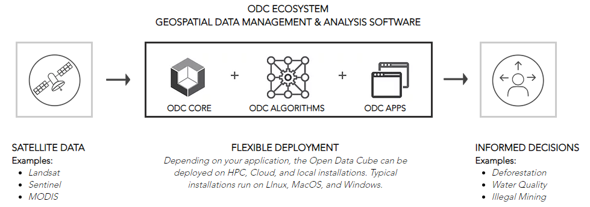

# ML for EO Market Map 简介

在medium上面看到了一篇文章：[Machine Learning for Earth Observation Market Map](https://medium.com/radiant-earth-insights/machine-learning-for-earth-observation-market-map-d3a1f3936cb3)，其介绍了 ML FOR EO MARKET MAP，个人觉得值得关注，因此，收集一些相关资料。

构建机器学习应用包括许多相对独立的步骤：从访问 Earth observation（EO）数据，标记图像，生成训练数据到创建开发模型和运行分析。不同sectors的众多机构提供了发展这些机器学习应用的方案和服务。

有哪些能帮助构建机器学习应用，识别数据中的模式，或运行众包组织？哪些能提供软件或平台来帮助开发机器学习模型？openEO的网站给出了一个列表：https://www.radiant.earth/infographic/ml-for-eo-market-map/

包括商业和非商业组织，分为5个类型；

1. Data Analysis and Services -- 使用EO构建地理空间应用机器学习模型和分析解决方案的组织
2. Analytics Platforms -- 提供处理EO数据和构建定制应用的软件或平台的组织
3. Labeling Platforms -- 提供生成遥感图像标签及构建训练数据分类的解决方案的组织
4. Competition Platforms -- 帮助将训练数据集的运行工作转移到外包的建模方案的组织
5. Data Access and Storage -- 提供访问卫星图像和地理空间训练数据来帮助机器学习分析的组织

这里我稍微记录下一些个人相对感兴趣且之前没怎么听说的非商业组织的基本信息。

## 哥白尼

[EARTH ONLINE](https://earth.esa.int/eogateway/) 是European Space Agency欧洲航天局EO数据在线平台。

[Copernicus](https://www.copernicus.eu/en/about-copernicus) 即哥白尼，也是一个重要的EO项目，提供卫星观测和站点数据。其由European Commission 管理，由欧盟成员国，ESA等机构共同实现。

哥白尼中的卫星数据主要包括两组missions：

6个sentinels家族的mission和约30个欧洲美国等不同国际组织的 Contributing Missions。

sentinel由1，2，3，6是专用卫星，4和5是 EUMETSAT气象卫星，5P是5的之前一个卫星，也是一个专用卫星。

ESA负责哥白尼计划的进展以及sentinel-1，-2，-5P卫星的运行，也传输sentinel-3的land mission

EUMETSAT负责sentinel-3 卫星的运行，以及marine mission的传输。还operate和deliver sentinel-4和5仪器以及6卫星的产品。

## DRIVENDATA

DrivenData是一个将数据科学和众包方面的前沿实践应用到一些世界上最大的社会挑战以及承担这些挑战的组织中的机构。他们举办在线挑战赛，通常持续2-3个月，全球的数据科学家们在这里竞争，为那些困难的预测问题提出最好的统计模型，从而产生影响。

有些类似于 Kaggle。

## Open Data Cube

开放数据立方体(ODC)是一个开源的地理空间数据管理和分析软件项目，可以帮助利用卫星数据的强大功能。ODC的核心是一组Python库和PostgreSQL数据库，它们可以帮助处理地理空间栅格数据。GitHub在这里：https://github.com/opendatacube

ODC寻求通过提供开放和免费的开发架构来增加全球地球观测卫星数据的价值和影响。ODC项目寻求建立一个社区来开发、维持和发展这项技术及其应用的广度和深度，以造福社会。

## Pangeo

Pangeo首先是一个促进 开放，可复制和可扩展的科学 的社区。该社区提供文档，开发和维护软件，以及部署计算基础架构，以使科学研究和编程变得更加容易。Pangeo软件生态系统涉及开源工具，例如xarray，iris，dask，jupyter和许多其他软件包。并没有一个被称为“pangeo”的软件包，Pangeo项目是科学家，软件和计算基础架构之间的协调点。在此网站上，科学家们可以找到使用这些工具访问数据和进行分析的指南（请阅读[科学家指南](https://pangeo.io/quickstart.html#quickstart)，浏览[Pangeo Gallery](http://gallery.pangeo.io/)并了解[软件包](https://pangeo.io/packages.html#packages)。那些对构建基础结构感兴趣的人可以找到有关在HPC或云集群上部署Pangeo环境的说明（了解[技术架构](https://pangeo.io/architecture.html#architecture)或阅读[部署设置指南](https://pangeo.io/setup_guides/index.html#setup-guides)）。有关更多一般信息，阅读[关于Pangeo](https://pangeo.io/about.html#about).

Pangeo社区的目标是促进围绕海洋/大气层/陆地/气候科学的开源科学Python生态系统的协作。

通过特定领域的地球科学软件包来支持开发。
提高这些工具的可伸缩性，以处理HPC和云平台上的PB级数据集。

可以在Pangeo Gallery中找到使用Pangeo的科学应用程序和详细教程 。比如GCM的模型和数据的使用，CMIP6的数据等。

## OpenEO

openEO中open表示开源软件，EO是Earth observation

openEO 也是欧盟的一个项目。是一个开源的EO数据Infrastructure和前端应用的接口。因为EO数据变得越来越大，很难在本地计算机上分析了。同时，其数据组织方式也相对复杂，不便于分析。一种解决方案就是将数据存储到云端，并在后端执行计算处理，然后浏览结果。那么如何做到这一点？

openEO 开发了一个开放的应用程序接口来以一种简单一致的方法联系客户端的R，Python，和Javascript程序到大EO云端。

使用这些API，可以：

- 每个client能work with 每个后端
- 能比较后端的capacity，cost和results

这个和google earth engine有些类似。

通过在本地使用python代码可以调用后端计算程序，最后在前端自己本地得以保存和展示结果。
