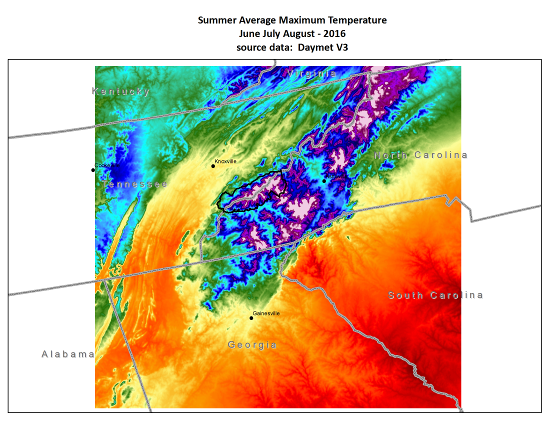

# Daymet Data

ornldaac有相应教程：[ornldaac/daymet_netcdf_season-avg](https://github.com/ornldaac/daymet_netcdf_season-avg)。

不过还是推荐 HyRiver 的工具：[pydaymet](https://github.com/cheginit/pydaymet)

## Overview

HyRiver的教程daymet.ipynb 比较详细地给出了使用 pydaymet 的示例。

ornldaacd的教程比较细节，说明如何使用Python netCDF4 和 numpy modules 以用N-dimensional array objects处理netCDF file format的数据集. Python numpy array的方法可以打开读取a gridded multidimentional netCDF file也可以按时间范围取其中的子集。这个示例是用了daymet的一个maximum temperature variables数据集 ，该数据集包括daily gridded meteorologic data. 

- 第一个示例daymet_netCDF_season-avg.ipynb是创建一个夏季平均最大气温的例子，并将结果存储到一个新的netCDF文件；
- 第二个例子daymet_netcdf_season-avg-loopyrs.ipynb是浓缩了介绍性信息，并演示了如何循环遍历一年以上的数据。

## Daymet数据源

Spatial subsets of the North American Daymet dataset daily data: https://daymet.ornl.gov.

For these tutorials, 空间数据集从ORNL DAAC's THREDDS netCDF Subset Service (NCSS)获取. A tutorial of the NCSS is available [here](https://daymet.ornl.gov/web_services.html) under the "Gridded Subsets" tab: . 

手动下载：

You can download the 2015 maximum temperature Daymet subset data used in these tutorials by pasting the following HTTP GET NCSS Request URL into a browser:\
https://thredds.daac.ornl.gov/thredds/ncss/ornldaac/1328/2015/daymet_v3_tmax_2015_na.nc4?var=lat&var=lon&var=tmax&north=36.61&west=-85.37&east=-81.29&south=33.57&disableProjSubset=on&horizStride=1&time_start=2015-01-01T12%3A00%3A00Z&time_end=2015-12-31T12%3A00%3A00Z&timeStride=1&accept=netcdf

Daymet subset data for 2016 can be downloaded by updating the URL above to the 2016 dataset path and changing to 2016 in the time_start and time_end parameters.
