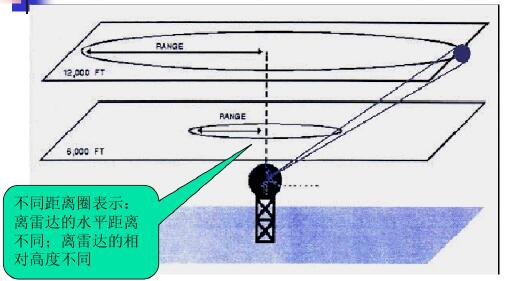

# 对天气雷达的认识

在应用雷达数据之前，需要对雷达测雨的基本原理和过程有一个简单的了解。主要参考资料有：

[Understanding Weather Radar](https://www.wunderground.com/prepare/understanding-radar)；
[雷达资料](http://data.cma.cn/data/cdcindex/cid/227aa07a9079550a.html)；

## 基本介绍

天气雷达是探测降水系统的主要手段，是对强对流天气（冰雹、大风、龙卷和暴洪）进行监测和预警的主要工具之一。
降水强度由地面雷达根据降水反射的雷达波测量。
天气雷达的基本构成包括产生高频脉冲的发射机、发射和接收脉冲的天线、放大回波脉冲信号的接收机及显示器等。
天气雷达发射脉冲形式的电磁波，当电磁波脉冲遇到降水物质（雨滴、雪花和冰雹等）时，大部分能量会继续前进，而一小部分能量被降水物质向四面八方散射，其中向后散射的能量回到雷达天线，被雷达所接收。
根据雷达接收的降水系统回波的特征可以判别降水系统的特征（降水强弱、有无冰雹、龙卷和大风等）。

局部雷达基本反射率产品是以dBZ（分贝）为单位测量的回波强度(反射率)的展示。“反射率”是相对于距离雷达天线1米远的参考功率密度的遇到降水后返回给雷达接收机的传输功率。
在天线的几个不同仰角(倾斜角)上可以得到基本反射率图像;
基本反射率产品的最大范围是距离雷达位置143英里(230公里)。图像不会显示超过143英里的回声，即使降水可能发生在更远的地方。要确定降水是否发生在更远的地方，需要连接到邻近的雷达。
此外，雷达图像不会显示来自雷达波束外降水的回波，这要么是因为降水在雷达上方过高，要么是因为降水距离地表太近而位于雷达波束下方。

我国新一代天气雷达是多普勒雷达，分为S波段（波长约10cm），C波段（波长约5cm）、X波段（波长约3cm）。
其中投入业务运行的以S波段与C波段雷达为主，X波段雷达个别情况下应用于地形影响的探测盲区以及局地天气服务业务。
新一代天气雷达除了测量雷达的回波强度外，还可以测量降水目标物沿雷达径向的运动速度（称为径向速度）和速度谱宽（速度脉动程度的度量）。
中国气象数据网站提供天气雷达资料主要为中国新一代天气雷达（CINRAD）组网所布置的多普勒雷达基数据以及图像产品资料。

## 多普勒天气雷达如何工作

雷达发出短脉冲的能量，如果脉冲击中一个物体(雨滴、雪花、虫子、鸟等)，大部分能量会继续前进，而一小部分能量被降水物质向四面八方散射，其中向后散射的能量回到雷达天线，被雷达所接收。
这个反射信号在雷达的监听期间被雷达接收。
计算机分析返回的雷达波的强度、到达目标和返回所需的时间以及脉冲的频移。
返回信号的频率通常根据雨滴(或虫子、灰尘等)的运动而变化。
多普勒效应是以发现它的奥地利物理学家克里斯蒂安·多普勒命名的。比如火车经过时，鸣笛声的“多普勒效应”。
当火车接近时，组成哨子的声波被压缩，使得音高比火车静止时高。
同样，当火车远离你时，声波被拉伸，降低了汽笛的音调。火车运行得越快，经过你所在位置时，汽笛的音调变化就越大。

同样的效果也发生在大气中，来自多普勒雷达的能量脉冲击中一个物体并反射回雷达。
雷达的计算机测量能量反射脉冲的频率变化，然后将这种变化转换为目标的速度，无论是朝向雷达还是远离雷达。

有关物体朝向或远离雷达运动的信息可以用来估计风速。
这种“看到”风的能力能够探测到龙卷风等极端天气的形成，使我们能够提前发出相关警报。

美国国家气象局(National Weather Service)的148台WSR-88D多普勒雷达可以探测到距离雷达约90英里范围内的大部分降水，以及约155英里范围内的强降雨或强降雪。
然而，小雨，小雪，或小雨从浅云天气系统不一定检测到。

雷达采用体积扫描的方式进行探测，根据规定时间内具体仰角的不同有不同的体扫模式。扫描示意图如下图所示。比如：VCP11：规定5min内对14个具体仰角的扫描。

天气雷达的局限性：
波束中心的高度随距离的增加而增加；波束宽度随距离的增加而展宽。因此雷达对远距离目标的探测能力降低。
存在静锥区使得雷达对非常近的目标物的探测能力受限。

## 雷达产品

雷达产品有基数据、物理量产品和反演识别产品。

雷达产品的显示方式：
新一代雷达采用体积扫描VOL的方式进行探测。体积扫描是雷达按不同的仰角全方位扫描的方式。获取的数据可以用PPI、RHI、VCS和RCS等方式显示。解释如下：

PPI是平面位置显示。雷达以固定仰角，天线以全方位扫描的方式获取数据，通过以雷达站为中心的极坐标形式，采用不同色标来表示数据的大小和方向。
PPI上可以显示强度R、径向速度V、速度谱宽W等各种物理量。

实际生产系统中，雷达回波图通常是CAPPI图，即雷达等高面位置显示产品。具体的理论上的分析可以查阅相关文献，简单阐述一下个人理解。因为雷达扫射是有仰角的，即使是0度仰角，由于降雨其PPI的图各个位置的高度都不一样，而降雨在垂直层面上是有物理变化的，因此有必要将PPI的图转换为等高的图，就是CAPPI（关于怎么转，就不做讨论了）。
